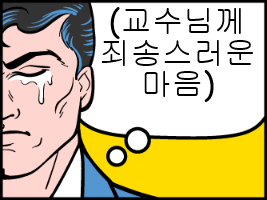
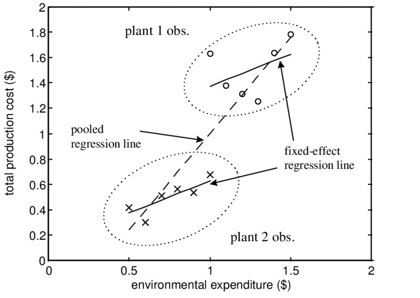

#Pooled_Regression #Error_Component_Model

(이것은 차마 교수님의 가르침을 받는 학생이라 할 수 없는 형편없는 지식을 만회하기 위한 하찮은 노력이다)

# Panel Data & Error Component Model

## 1. What is Panel Data?

|            | Time Series                                                  | Panel Data                                                   |
| ---------- | ------------------------------------------------------------ | ------------------------------------------------------------ |
| Definition | A dataset consisting of observations of one individual at multiple time intervals | A dataset consisting of observations of multiple individuals obtained at multiple time intervals |
| Main Focus | Focuses on a single individual at multiple time intervals    | Focuses on multiple individuals at multiple time intervals   |
| Example    | Profit of an individual over a period of ten years           | Profit of set of individuals over a period of ten years      |

Reference: [Difference Between Time Series and Panel Data, Compare the Difference Between Similar Terms](https://www.differencebetween.com/difference-between-time-series-and-panel-data/)

Time Series(시계열 데이터)란 단일 객체(one individual)에 대한 일정 기간 동안의 관찰 데이터를 의미한다. 

**Panel Data**는 복수개의 객체에 대한 일정 기간 동안의 관찰 데이터로서, 같은 기간에 대한 Time Series들의 집합이라고 할 수 있을 것이다.

### Difference between Cross-Sectional Data

Distinguishing feature relative to **cross-sectional** (횡단면 데이터) is the presence of **multiple observations for each individual**

## 2. Pooled Regression

패널데이터에 별도 작업 없이 Regression을 실행할 때, 이를 **Pooled Regression**이라고 한다.

Pooled Regression에서도 **Strict Mean Independence**를 가정한다; 이는 Estimator의 Unbiasedness를 만족시키기 위함이다.

(Strict Mean Independence는 Pairwise Mean Independence보다 강한 가정이다.)

$$
\displaylines{\text{Strict Mean Independence) }\quad E(e_{it}|X_{it})=0\newline
\text{Pairwise Mean Independence) } \quad E[X_{it}e_{it}]=0
}
$$

### Derivation of Pooled Regression Estimator

$$
\displaylines{Y_i=X_i*\beta+e_i\newline
E(e_{it}|X_i)=0 \; \text{(strict independence)}}
$$

$\hat\beta_{pool}$은 일반 OLS estimator의 공식을 사용하여 유도한다.

$$
\displaylines{\hat\beta_{pool}=( \Sigma X'X)^{-1} (\Sigma X'Y)}
$$

Estimator는 Strict Mean Independence를 통해 unbiased 하며 증명은 아래와 같다.

$$
\displaylines{\hat\beta_{pool}=( \Sigma X'X)^{-1} (\Sigma X'X)\beta + ( \Sigma X'X)^{-1} (\Sigma X'e)\newline
E(\hat\beta_{pool}|X) =\beta + (\Sigma X'X)^{-1} (\Sigma X' E(e_i|X_i)) = \beta\;  ;\;\text{unbiased}}
$$

Estimator의 Variance는 위와 같이 구할 수 있는데, 아래와 같이 Variance의 Homoskedasticity를 가정한다면, $\sigma^2(\Sigma X'X)^{-1}\$라는 간단한 공식을 유도할 수 있다.

$$
\displaylines{Var(\hat\beta_{pool} | X)=Var(\Sigma (X'X)^{-1}(\Sigma X'e)|X) = (\Sigma X'X)^{-1}[\Sigma X'Var(e|X)X](\Sigma X'X)^{-1}\newline
(since\quad Var(Ae)=A*Var(e)*A')\newline\newline
if\quad Var(e|X)=\sigma^2_e*I_T\;;\quad \text{homoskedastic}\newline
Var(\hat\beta_{pool}|X)=(\Sigma X'X)^{-1}(\Sigma X' I_T X)\sigma^2(\Sigma X'X)^{-1}\newline
=\sigma^2(\Sigma X'X)^{-1}\; ;\text{classical (default at Stata)}}
$$

하지만 실제 준실험이나, 현장에서는 robust 하지 않을 가능성이 다수일텐데, 이를 보완하기 위해 Cluster-robust covariance estimator를 사용한다.

$$
\displaylines{\text {Cluster-robust Covariance Matrix estimator}\\
\hat V_{pool}=(\Sigma X'X)^{-1}(\Sigma X'ee'X)(\Sigma X'X)^{-1}}
$$

## 3. One-Way Error Component Model

> 패널데이터를 pooled regression하는건 메시가 동네축구 하는것(?)

~~그렇다고 한다. (난 메시도 아닌데)~~

Image Reference: [Fixed Effects versus Pooled Estimator](https://www.researchgate.net/figure/Fixed-Effects-versus-Pooled-Estimator_fig1_4807439)

Pooled Regression의 한계와 Error Component Model의 필요성을 보여주는 예시는 위 사진으로 설명해볼 수 있다.

그림의 예시는 Plant 1&2의 두 종류의 객체(individual)들로 이루어진 Panel Data를 scatter plot 한 것이다. 단순하게 Plant 1과 2가 각각 ***아보카도***와 ***사과***라고 해보자.

가로축은 두 Plant를 키우는데 지출되는 Environmental Expenditure, 그리고 세로축은 Total Production Cost임을 확인할 수 있다.

아보카도와 사과에 대해 두 individual의 구분 없이 Pooled Regression을 진행하게 되면, 점선과 같은 추세선을 얻게 될 것이다. 예상할 수 있다시피 Env. Exp.가 커질수록 Total Cost도 함께 증가하는 갖는 양의 기울기를 보이고 있다.

하지만 아보카도와 사과는 두 종류의 객체 속성이 다르기 때문에 (그 정확한 차이를 우리가 모두 밝혀낼수는 없으나) 두 원으로 표시된 것과 같이 scattered된 점들의 위치가 사뭇 다른 것을 확인할 수 있다.

이런 상황 속에서 아보카도와 사과라는 두 종류의 객체 속성을 구분할 수 있도록 하고, 각각에 대해서 OLS 등을 통한 추세선을 그려보면 점선의 추세선과는 사뭇 다른 것을 확인할 수 있을 것이다. 만약 기존의 Pooled Regression을 진행한다면, 대표적으로, Env. Exp.가 1에 해당하는 각 점 두개를 확인했을때 Plant 1(아보카도)에겐 너무나 적은 지출이, 거의 동일선 상의 Plant 2의 마지막 점(사과)에게는 너무나 많은 지출이 이루어진다는 것을 볼 수 있다. 사과와 아보카도를 동일하게 케어하진 않지 않는가.

위의 비유처럼 Panel Data는 서로 다른 객체들의 속성을 고려하면서 분석이 되어야 진정한 효과의 정도(기울기)를 확인할 수 있는 매우 큰 잠재력을 숨기고 있는 데이터라고 할 수 있다.

서론이 길었으나, Pooled Regression의 한계를 보완하기 위해 우리는 객체의 속성을 구분 짓기 위한 작업이 필요하다. 이것이 **Error Component Model** 이다.

$e_{it}$에 대해서 **Error Component Structure**를 사용한다.

$$
\displaylines{y_{it}=X_{it}'\beta+e_{it}\newline
e_{it}=u_i+\epsilon_{it}}
$$

*where $u$ is individual-specific effect, and $\epsilon$ is idiosyncratic (i.i.d.) errors*

즉, u가 앞서 언급되었던 각 객체(individual)의 차이를 나타내는 항이 되고, 이를 제외한 진짜 에러들을 $\epsilon$의 항으로 나타내는 것이다.

$$
\displaylines{\text{Vector Notation;}\quad e_i=1_Tu_i+\epsilon_i}
$$

각 notation 별로 아래와 같은 수식들을 생각해볼 수 있다.

$1_T$는 1의 원소 T개로 이루어진 single column matrix인데 

$$
\displaylines{y_{it}=X_{it}'\beta+e_{it}\newline
Y_{it}=X_{it}'\beta+u_i+\epsilon_{it}\newline
Y_i=X_i\beta+1_Tu_i+\epsilon_i}
$$

### Random Effect

Random Effect는 앞선 u와 $\epsilon$이 conditionally mean zero, uncorrelated, and homoskedastic 이라 가정하는 것이다.

(사실상 Panel Data 상의 모든 객체의 차이들을 완벽하게 파악해서, $\epsilon$ 항은 idiosyncratic(기이한) 에러 텀임을 뜻하는 것이다)

$$
\displaylines{
\text{Random Effects Specification} \quad
\begin{cases}
E[\epsilon|X]=0\newline
E[\epsilon^2|X]=\sigma_\epsilon^2\newline
E[\epsilon_{it}\epsilon_{ij}|X]=0\newline
E[u|X]=0\newline
E[u^2|X]=\sigma_u^2\newline
E[u\epsilon|X]=0\newline
\end{cases}
}
$$

Random Effect를 만족하는 Error Component Structure의 Regression을 **Random Effects Regression Model** 이라고 한다.

### GLS

본 Error Component Model에서 일반적인 Estimator는 GLS로부터 구해진 것이다. 아래에서 GLS를 통한 Estimator를 유도해보자.

GLS를 사용하는 이유는 다음 포스팅에서 서술되겠지만, u가 높은 가능성으로 X와 correlate 되어있기 때문에, u가 포함된 e가 결국 X와 상관관계를 갖고 있기 때문이다.

#### Derivation of $\hat\beta_{GLS}$

​	

$$
\displaylines{Y_i=X_i\beta+e_i=X_i\beta+1_Tu_i+\epsilon_i\newline
E(e_i|X_i)=0\newline
Var(e_i|X_i)=1_t1_t'\sigma_u^2+I_t^2\sigma^2_\epsilon=\Omega\newline\newline

\hat\beta_{GLS}=(\Sigma X'\Omega^{-1}X)^{-1}(\Sigma X'\Omega^{-1}y)=(\Sigma X'\Omega^{-1}X)^{-1}(\Sigma X'\Omega^{-1}(X\beta+e)))\newline
=\beta+(\Sigma X'\Omega^{-1}X)^{-1}(\Sigma X'\Omega^{-1}e)}
$$

#### Expectation of $\hat\beta_{GLS}$ at Random Effect Assumption

Random Effect를 만족하는 상황에서는, $ \hat\beta_{GLS}$는 unbiased를 만족한다.

$$
\displaylines{E(\hat\beta_{GLS}|X)=\beta+E((\Sigma X'\Omega^{-1}X)^{-1}(\Sigma X'\Omega^{-1}e)|X)\newline
=\beta+(\Sigma X'\Omega^{-1}X)^{-1}(\Sigma X'\Omega^{-1}E(e|X))\newline
=\beta\; ; \text{unbiased}}
$$

#### Variance of  $\hat\beta_{GLS}$ at Random Effect Assumption

Random Effect를 만족하는 상황에서는, $ \hat\beta_{GLS}$의 분산은 Homoskedasticity를 통해 아래와 같이 유도된다.

$$
\displaylines{Var(\hat\beta_{GLS}|X)=(\Sigma X'\Omega^{-1}X)^{-1}(\Sigma X'\Omega^{-1}\Omega \Omega^{-1}X)(\Sigma X'\Omega^{-1}X)^{-1}\newline
=(\Sigma X'\Omega^{-1}X)^{-1}}
$$

#### Comparison with a Pooled Estimator

$$
\displaylines{Var(\hat\beta_{pool}|X)=(\Sigma X'X)^{-1}(\Sigma X'Var(e|X)X)(\Sigma X'X)^{-1}\newline
=(\Sigma X'X)^{-1}(\Sigma X'\Omega X)(\Sigma X'X)^{-1}}
$$

$$
V_{GLS}\leq V_{pool}
$$

위 부등식의 증명은 숙제란다. 등식 성립 조건은 $Var(u)=0$이다.*

*만약 u의 분산이 0이고, 이로 인해 $\Omega$가 $\epsilon$으로만 이루어져있다면, GLS와 Pooled Estimator의 분산은 동일하다.

$$
\displaylines{\text{if}\quad \sigma_u^2=0,\,\quad \Omega=\sigma_\epsilon^2I_T\newline
\text{then, }\quad V_{GLS}=(\Sigma X'\Omega^{-1}X)^{-1}=\sigma^2_\epsilon(\Sigma X'X)^{-1}\newline
V_{pool}=(\Sigma X'X)^{-1}(\Sigma X'\Omega X)(\Sigma X'X)^{-1}=(\Sigma X'X)^{-1}\sigma^2}
$$

하지만 Pooled Regression에서 언급한 바와 마찬가지로 실제 상황에선 u와 $\epsilon$에 대해 주어진 정보가 제한적일 가능성이 높기 때문에, **feasible GLS estimator**가 replacing the unknown variance of u and $\epsilon$. 

이에 대해선 너무 복잡해 다루지 않는다. ~~다행이다~~
