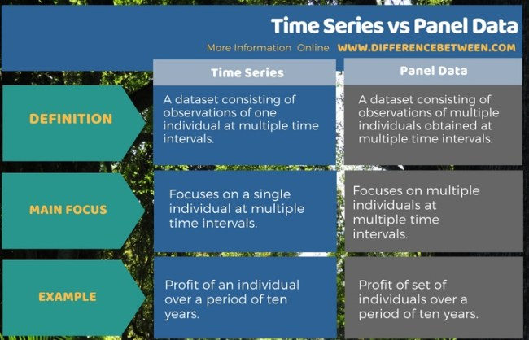

응용계량경제학 필기노트

(이것은 차마 교수님의 가르침을 받는 학생이라 할 수 없는 형편없는 지식을 만회하기 위한 하찮은 노력이다)

# Panel Data & Error Component Model

## 1. What is Panel Data?

Image Reference: [Difference Between Time Series and Panel Data, Compare the Difference Between Similar Terms](https://www.differencebetween.com/difference-between-time-series-and-panel-data/)

Time Series(시계열 데이터)란 단일 객체(one individual)에 대한 일정 기간 동안의 관찰 데이터를 의미한다. 

**Panel Data**는 복수개의 객체에 대한 일정 기간 동안의 관찰 데이터로서, 같은 기간에 대한 Time Series들의 집합이라고 할 수 있을 것이다.

### Difference between Cross-Sectional Data

Distinguishing feature relative to **cross-sectional** (횡단면 데이터) is the presence of **multiple observations for each individual**

## 2. Pooled Regression

패널데이터에 별도 작업 없이 Regression을 실행할 때, 이를 **Pooled Regression**이라고 한다.

Pooled Regression에서도 **Strict Mean Independence**를 가정한다; 이는 Estimator의 Unbiasedness를 만족시키기 위함이다.

(Strict Mean Independence는 Pairwise Mean Independence보다 강한 가정이다.)

$$
\displaylines{Strict\, Mean\, Independence)\quad E(e_{it}|X_{it})=0\newline
Pairwise\, Mean \,Independence) \quad E[X_{it}e_{it}]=0
}
$$

### Derivation of Pooled Regression Estimator

$$
\displaylines{Y_i=X_i*\beta+e_i\newline
E(e_{it}|X_i)=0 \; (strict \, independence)}
$$

$\hat\beta_{pool}$은 일반 OLS estimator의 공식을 사용하여 유도한다.

$$
\displaylines{\hat\beta_{pool}=( \Sigma X'X)^{-1} (\Sigma X'Y)}
$$

Estimator는 Strict Mean Independence를 통해 unbiased 하며 증명은 아래와 같다.

$$
\displaylines{\hat\beta_{pool}=( \Sigma X'X)^{-1} (\Sigma X'X)\beta + ( \Sigma X'X)^{-1} (\Sigma X'e)\newline
E(\hat\beta_{pool}|X) =\beta + (\Sigma X'X)^{-1} (\Sigma X' E(e_i|X_i)) = \beta\;  ;\;unbiased}
$$

Estimator의 Variance는 위와 같이 구할 수 있는데, 아래와 같이 Variance의 Homoskedasticity를 가정한다면, $\sigma^2(\Sigma X'X)^{-1}\$라는 간단한 공식을 유도할 수 있다.

$$
\displaylines{Var(\hat\beta_{pool} | X)=Var(\Sigma (X'X)^{-1}(\Sigma X'e)|X) = (\Sigma X'X)^{-1}[\Sigma X'Var(e|X)X](\Sigma X'X)^{-1}\newline
(since\quad Var(Ae)=A*Var(e)*A')\newline\newline
if\quad Var(e|X)=\sigma^2_e*I_T\;;\quad homoskedastic\newline
Var(\hat\beta_{pool}|X)=(\Sigma X'X)^{-1}(\Sigma X' I_T X)\sigma^2(\Sigma X'X)^{-1}\newline
=\sigma^2(\Sigma X'X)^{-1}\; ;classical \; (default\,at\,Stata)}
$$

하지만 실제 준실험이나, 현장에서는 robust 하지 않을 가능성이 다수일텐데, 이를 보완하기 위해 Cluster-robust covariance estimator를 사용한다.

$$
Cluster-robust\, Covariance\, Matrix\, estimator)\quad\hat V_{pool}=(\Sigma X'X)^{-1}(\Sigma X'ee'X)(\Sigma X'X)^{-1}
$$

## 3. One-Way Error Component Model

> 패널데이터를 pooled regression하는건 메시가 동네축구 하는것(?)

그렇다고 한다. (난 메시도 아닌데)

$e_{it}$에 대해서 **Error Component Structure**를 사용한다.

$$
\displaylines{y_{it}=X_{it}'\beta+e_{it}\newline
e_{it}=u_i+\epsilon_{it}}
$$

where $u$ is individual-specific effect, and $\epsilon$ is idiosyncratic (i.i.d.) errors

$$
\displaylines{Vector\, Notation)\quad
e_i=1_Tu_i+\epsilon_i}
$$

각 notation 별로 아래와 같은 수식들을 생각해볼 수 있다.

$$
\displaylines{y_{it}=X_{it}'\beta+e_{it}\newline
Y_{it}=X_{it}'\beta+u_i+\epsilon_{it}\newline
Y_i=X_i\beta+1_Tu_i+\epsilon_i}
$$

### Random Effect

Random Effect는 앞선 u와 $\epsilon$이 conditionally mean zero, uncorrelated, and homoskedastic 이라 가정하는 것이다.

$$
\displaylines{
<Random\; Effects\; Specification>\newline\newline
E[\epsilon|X]=0\newline
E[\epsilon^2|X]=\sigma_\epsilon^2\newline
E[\epsilon_{it}\epsilon_{ij}|X]=0\newline
E[u|X]=0\newline
E[u^2|X]=\sigma_u^2\newline
E[u\epsilon|X]=0\newline
}
$$

Random Effect를 만족하는 Error Component Structure의 Regression을 **Random Effects Regression Model** 이라고 한다.

### GLS

본 Model에서 일반적인 Estimator는 GLS로부터 구해진 것이다. 아래에서 GLS를 통한 Estimator를 유도해보자.

#### Derivation of $\hat\beta_{GLS}$

​	

$$
\displaylines{Y_i=X_i\beta+e_i=X_i\beta+1_Tu_i+\epsilon_i\newline
E(e_i|X_i)=0\newline
Var(e_i|X_i)=1_t1_t'\sigma_u^2+I_t^2\sigma^2_\epsilon=\Omega\newline\newline

\hat\beta_{GLS}=(\Sigma X'\Omega^{-1}X)^{-1}(\Sigma X'\Omega^{-1}y)=(\Sigma X'\Omega^{-1}X)^{-1}(\Sigma X'\Omega^{-1}(X\beta+e)))\newline
=\beta+(\Sigma X'\Omega^{-1}X)^{-1}(\Sigma X'\Omega^{-1}e)}
$$

Random Effect를 만족하는 상황에서 $ \hat\beta_{GLS}$는 unbiased를 만족한다.

#### Expectation of $\hat\beta_{GLS}$ at Random Effect Assumption

$$
\displaylines{E(\hat\beta_{GLS}|X)=\beta+E((\Sigma X'\Omega^{-1}X)^{-1}(\Sigma X'\Omega^{-1}e)|X)\newline
=\beta+(\Sigma X'\Omega^{-1}X)^{-1}(\Sigma X'\Omega^{-1}E(e|X))\newline
=\beta\; ; unbiased}
$$

Random Effect를 만족하는 상황에서 $ \hat\beta_{GLS}$의 분산은 Homoskedasticity를 통해 아래와 같이 유도된다.

#### Variance of  $\hat\beta_{GLS}$ at Random Effect Assumption

$$
\displaylines{Var(\hat\beta_{GLS}|X)=(\Sigma X'\Omega^{-1}X)^{-1}(\Sigma X'\Omega^{-1}\Omega \Omega^{-1}X)(\Sigma X'\Omega^{-1}X)^{-1}\newline
=(\Sigma X'\Omega^{-1}X)^{-1}}
$$

#### Comparison with a Pooled Estimator

$$
\displaylines{Var(\hat\beta_{pool}|X)=(\Sigma X'X)^{-1}(\Sigma X'Var(e|X)X)(\Sigma X'X)^{-1}\newline
=(\Sigma X'X)^{-1}(\Sigma X'\Omega X)(\Sigma X'X)^{-1}}
$$

$$
V_{GLS}\leq V_{pool}
$$

위 부등식의 증명은 숙제란다.

Error Term에서 u의 분산이 0이고, 이로 인해 $\Omega$가 $\epsilon$으로만 이루어진다면, GLS와 Pooled Estimator의 분산은 동일하다.

$$
\displaylines{if\quad \sigma_u^2=0,\,\quad \Omega=\sigma_\epsilon^2I_T\newline
then,\quad V_{GLS}=(\Sigma X'\Omega^{-1}X)^{-1}=\sigma^2_\epsilon(\Sigma X'X)^{-1}\newline
V_{pool}=(\Sigma X'X)^{-1}(\Sigma X'\Omega X)(\Sigma X'X)^{-1}=(\Sigma X'X)^{-1}\sigma^2}
$$

하지만 Pooled Regression에서 언급한 바와 마찬가지로 실제 상황에선 u와 $\epsilon$에 대해 주어진 정보가 제한적일 가능성이 높기 때문에, **feasible GLS estimator**가 replacing the unknown variance of u and $\epsilon$. 이에 대해선 너무 복잡해 다루지 않음.
