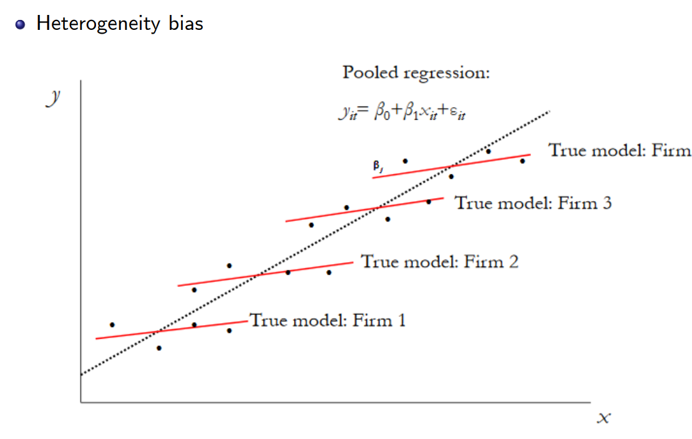

응용계량경제학 필기노트

웃으면 복이 와요.  ~~복이 와야 웃는거 아닌가요.~~ 

~~Reverse Causality~~

# Fixed Effect

*$u_i$ as time-invariant unobserved missing variable*

이전 포스트에서 우리는 **(One-way) Error Component Model**을 통해 Pooled Regression 대신 각 개체의 속성을 구분지어 정확한 효과의 정도를 파악하기 위한 e as error term의 u와 $\epsilon$의 구분 작업을 진행하였다.

$u$는 높은 확률로 $X_{it}$와 correlate 되어있을 가능성이 높은데, 예시를 들어보면 꽤나 직관적인 이해가 가능하다. 

ex. 학력(혹은 연봉)과 개인(individual)의 능력 간의 상관관계 (능력이 높은 사람의 학력이 높은 경향)

이때 u와 X의 상관관계로 인한 [Endogeneity Problem](https://youtu.be/zi0VTf3PFTM)이 발생한다.

X와 u의 Correlation은 Pooled와 Random Effect Estimators 모두 편향성을 갖게하는데, 이 때의 u를 **fixed effect** 라고 정의한다. 

다시 한번 아래 사진을 통해 예시와 함께 설명해보자.

Image Reference: [Introduction Describe what panel data is (slidetodoc.com)](https://slidetodoc.com/introduction-describe-what-panel-data-is-and-the/)

Firm 1부터 4까지의 전체 데이터를 가지고 Pooled Regression을 진행하게 되면 점선과 같은 추세선 및 Estimator를 얻을 것이다.

하지만 각 Firm 별로 실제 적용되는 붉은 선 상으로 표현된 Estimator의 기울기는 Pooled Estimator보다 작은 것을 알 수 있다.

이는 개별 회사들에 대한 u; fixed effect가 존재하기 때문이며 이를 감안하는 모델을 구하기 위한 작업이 필요할 것이다.

본 과정에선 아래의 두개의 가정 조건 중 (아래의 strict mean indep. 조건이 위의 조건보다 강한 조건) 위의 **strict exogenous** 조건만이라도 만족한다고 가정한다.

$$
\displaylines{E[X_{it}\epsilon_{it}]=0\newline
E[\epsilon_{it}|X_{i}]=0}
$$

$\beta$가 u에 영향을 받지 않기 위한 작업, 즉 예시와 같은 붉은선의 estimator를 구하기 위한 각 객체 간 서로 다른 차이를 없애주는 작업이 필요하며, 이는 즉 u를 제거하는 것이다.

대표적인 작업으로는 **Within-Transformation** 라고 한다. ~~그것말고도 주구장창 설명하ㅈ~~

## A) Within-Transformation

**Within-Transformation**은 쉽게 말해, 각 객체(individual)별로 개별 평균을 각각 빼줌으로서, 모든 객체들을 하나의 중심으로 모으는, 일종의 영점조절을 하는 것이다.

### Individual Specific Mean & Demeaned Values

$$
\bar Y_i=(1'_T1_T)^{-1} 1'_TY_i=1/T*\Sigma Y_{it}
$$

Observations들의 평균인 **Individual Specific Mean**와의 차이를 **Demeaned Values / Deviations from individual means**라고 부른다.

$$
\displaylines{\dot Y_i=Y_i-1_T\bar Y_i\newline
=Y_i-1_T(1'_T1_T)^{-1}1'_TY_i\newline
=M_TY_i\newline\newline
M_T\;is\, an\, idempotent\, matrix}
$$

동일하게 X에 대해서도 유도할 수 있다.

$$
\dot X=M_TX_i
$$

그렇다면 X와 Y의 Demeaned Values를 가지고 Model를 생성하면, u가 사라지는 것을 확인할 수 있을 것이다.

$$
\displaylines{from \quad Y_i=X_i\beta+1_Tu_i+\epsilon_i\newline
\dot Y=\dot X\beta+\dot\epsilon\newline
Since \quad M_T1_T=0}
$$

이 Within-Transformation에서 얻을 수 있는 직관 중 하나는, Individual Speicific mean은 곧, Individual마다 각기 다른 Intercept (ex. OLS의 $\beta_0$)가 따로 있다는 뜻이다. 그리고 그것이 개별 객체(i as individual)의 $u_i$이다.

### Derivation of Fixed Effect Estimator

Within-Transformation을 통해 영점조절이 끝나면, 우리는 아래와 같은 식을 얻을 수 있고, 본 식에서 OLS를 돌리면 (Within-Transformation) Fixed Effect Estimator를 얻을 수 있는것이다. ~~참 멀리 돌아왔다.~~

$$
\displaylines{\dot Y_i=\dot X_i\beta+\dot\epsilon_i\newline
after\;OLS,\quad \hat\beta_{fe}=(\Sigma \dot X'\dot X)^{-1}(\Sigma \dot X'\dot y)=(\Sigma X'M_T'M_TX)^{-1}(\Sigma X'M_T'M_Ty)\newline
= (\Sigma X'M_TX)^{-1}(\Sigma X'M_Ty)\quad (M\; is\; idempotent \, and \, symmetric)\newline
=\beta+0+ (\Sigma X'M_TX)^{-1}(\Sigma X'M_T\epsilon)}
$$

### Expectation of $\hat\beta_{fe}$

$$
\displaylines{E(\hat\beta_{fe}|X)=\beta+(\Sigma X'M_TX)^{-1}(\Sigma X'M_TE(\epsilon|X))=0\quad\newline
with\;assumption\;of\;strict\;mean\;indep.}
$$

### Variance of $\hat\beta_{fe}$

$$
let\;E(\epsilon_i'\epsilon_i|X_i)=\Sigma_i
$$

$$
\displaylines{Var(\hat\beta_{fe}|X)=(\Sigma X'M_TX)^{-1}(\Sigma X'M_T\Sigma M_TX)(\Sigma X'M_TX)^{-1}\newline
=(\Sigma \dot X'\dot X)^{-1}(\Sigma \dot X'\Sigma \dot X)(\Sigma \dot X'\dot X)^{-1}\newline\newline
if\quad \Sigma=\sigma_\epsilon^2I_T\;(homoskedastic),\quad V_{fe}^0=\sigma_\epsilon^2(\Sigma \dot X'\dot X)^{-1}\newline
V_{fe}^0>= V_{pool}}
$$

*Robust, but low efficiency*

Fixed Effect Estimator는 앞선 Estimator 대비 굉장히 Robust하다. 하지만 대신 Efficiency가 낮아진다는 단점이 있는데, 이를 잘 밸런싱하는 것이 필요할 것이다.

## B) Differenced Estimator

Transformation의 목적은 결국 X와 상관관계를 갖는 u를 제거하기 위함이며, Within-Transformation 이외에도 다양한 방법을 통한 Estimators들이 존재한다.

Differenced Estimator는 시간축을 기준으로 t-1과 t의 차이 $\Delta$를 이용해 u를 제거하는 방식이다.

(u는 time-invariant, 즉 t에 따라 변하지 않는 객체 간 속성의 차이 뿐이기 때문이다.)

$$
\displaylines{\Delta Y_{it}=Y_{it}-Y_{it-1} \quad for\;t=2,...,T\newline
then,\quad \Delta Y=\Delta X'\beta+\Delta\epsilon\newline
then,\quad \hat\beta_\Delta=(\Sigma \Delta X'\Delta X)^{-1}(\Sigma \Delta X'\Delta y)\newline\newline
we\;can\;find\;out\;for\;T=2,\quad \hat\beta_{fe}=\hat\beta_\Delta}
$$

*One can show that the differenced estimator is less efficient than within-transformation estimator.*

Within-Transformation Estimator보다도 Efficiency가 낮다고 알려져있다.

## C) Dummy Variable Regression

각 객체 별 i개의 원소로 이루어진 u를 Dummy Variable을 통해 나타낼 수도 있다.

[Frisch–Waugh–Lovell theorem (Wikipedia)](https://en.wikipedia.org/wiki/Frisch–Waugh–Lovell_theorem)을 통해 multivariate regression solution을 적용하여 $\tilde \beta$를 구하는 것이다.

$$
\displaylines{Y_{it}=X_{it}'\beta+u_1D_1+u_2D_2+...+u_ND_N+\epsilon_{it}\newline
D_i \;is\; dummy\; variable\;(0\,or\,1)\newline}
$$

$$
\displaylines{in\; FWL\; theorem,\; 1)\; reg\; Y\; on\; X_1\; ->\; resdiual\; Y\newline
2)\; reg\; X_2\; on\; X_1\; ->\; residual\; X_2\newline
3)\; reg\; residual\; y\; on\; residual\; X_2\; ->\; \tilde \beta}
$$

$$
\displaylines{then\; by\; FWL\; theorem,\; 1)\; reg\; Y\; on\; D\; ->\; resdiual\; \dot Y\newline
2)\; reg\; X\; on\; D\; ->\; residual\; \dot X\newline
3)\; reg\; residual\; \dot Y\; on\; residual\; \dot X\; ->\; \tilde \beta}
$$

## Cluster-Robust Covariance

*allows $\epsilon$ to be heteroskedastic and serially correlated across t is the cluster-robust covariance matrix estimator*

$$
\hat V_{fe}^{cluster}=(\dot X'\dot X)^{-1}(\Sigma\dot X'\epsilon'\epsilon\dot X)(\dot X'\dot X)^{-1}
$$

## D) Between Estimator

~~아직 안끝났다~~

Within-Transformation은 각 객체별 Individual Specific Mean을 구하여 빼주었다면, 아예 Mean으로 이루어진 regression 식을 통해 $\beta$를 구하는것이다.

많은 행들을 통째로 평균을 내어 단순 회귀식을 돌렸기 때문에, 연구를 비롯한 각 데이터 분석에서 주요한 estimator가 될 수는 없겠지만 빠르고 간단하게 탐색하기 위한 교두보가 될 수 있는 estimator라고 할 수 있다. 

$$
\displaylines{\bar Y=\bar X'\beta+u+\epsilon\newline
\hat\beta_{be}=(\Sigma\bar X \bar X')^{-1}(\Sigma \bar X \bar Y)\newline
V_{be}=Var(\hat\beta_{be}|X)=(\Sigma\bar X \bar X')^{-1}(\sigma^2_u+\sigma^2_\epsilon/T)
\newline\newline
for \;simple\;understand}
$$

## ***Hausman Test*** for Random vs Fixed Effects

지금까지 우리는 Error Component Model에서 Random Effect의 상황과, Fixed Effect 상황 상의 Estimators를 구해보았다. 

Random Effect의 조건(무려 6가지)에 비해 Fixed Effect의 조건은 1가지로 약한편이다.

특히 Random Effect의 조건 중 강력한 가정은 Strict Mean Independence이다. ~~기억하라고~~

$$
E[u|X]=0
$$

Fixed Effect는 위 조건을 굳이 만족시키지 않아도 된다. 하지만 그 조건이 만족된다면 Random Effect가 효과적이면서도 Robustness를 만족할 것이다.

곧, 이는 Random Effect의 조건이 훨씬 Fixed Effect에 비해 강한 assumption이며, RE가 FE의 special case 라고 할 수 있다.

각 분석 상황에서 Random Effect 혹은 Fixed Effect 조건 어느 곳에 더 가까운지 확인하는 가설검정이 **Hausman Test**이다.

$$
\displaylines{H_0:\;RE \quad \hat\beta_{RE} \simeq \hat\beta_{FE}\newline
H_1:\;FE \quad \hat\beta_{RE}\neq \hat\beta_{FE}\newline
\newline
H=(\hat\beta_{FE}-\hat\beta_{RE})'(\hat V_{FE}-\hat V_{RE})(\hat\beta_{FE}-\hat\beta_{RE})}
$$

하지만 최근 연구동향은 Robustness를 훨씬 중요하게 생각한다. 따라서 Fixed Effect Estimator를 일단 일차적으로 필수 이용하고, Hausman test등을 통해 상황에 따라 Random Effect Estimator를 사용하는 것이 좋겠다.

## Two-Way Error Components

당연히 One-Way Error Component Model만 있는 것은 아니다.

One-way에서 분리된 에러텀 u는 time-invariant한 개체 간 차이를 나타내는 요소, 즉 t와는 무관하다.

**Two-Way Error Components Model**에서 새로이 분리되는 **$v_t$**는 시간에 영향을 받는 에러텀에 해당한다.

$$
Y_{it}=X_{it}'\beta+v_t+u_i+\epsilon_{it}
$$

***$u_i$ is an unobserved individual-specific effect, $v_t$ is an unobserved time-specific effect, and $\epsilon_{it}$ is an idiosyncratic error***

v는 시간에 따른 모든 individual에게 영향을 미치는 (ex. 경기동향, 인플레이션, 금리 등) 요소 등이 포함된다. 

Two-Way Error Components Model에선 보통 u에 대해선 Within-Transformation을 통해 처리하고, v에 대해선 Dummy Variable Representation을 진행하는 편이다.

자세한 Derivation은 ~~하기 싫다~~ Stata 레퍼런스[(Stata16): Two-way Error Component Models (YouTube)](https://www.youtube.com/watch?v=Te4WRpxxS04)에서 확인할 수 있다.

## Dynamic Panel Models

지금까지의 모델은 **Static Panel Model**에 해당한다. 하지만 우리는 쉽게 dynamic 한것이 우리를 더 잘 반영하는 모델임을 예상할 수 있다. 	

**Dynamic Panel Model**은 즉슨, 현재 시점의 행동 혹은 결정이 이전 과거로부터 의존 및 영향을 받는 것을 반영한 모델이다.

Dynamic Panel Model에 대한 자세한 내용은 기초를 다진 후 ~~먼~~ 미래의 포스트를 통해 기약하자.

## Example 

이론이 길었다. 실습으로 넘어가보자. 다음 포스팅에서.
