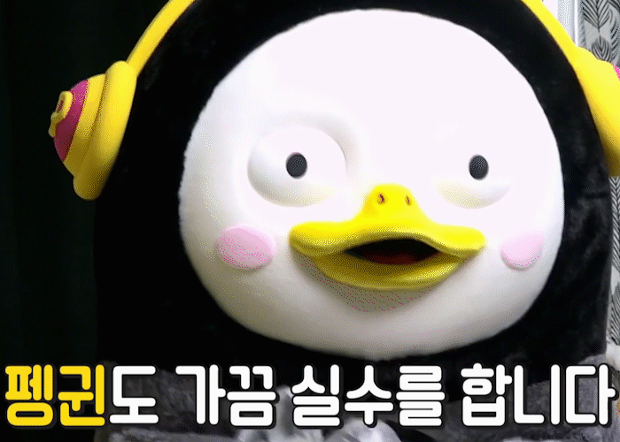

응용계량경제학 필기노트

*"S stands for Sㅣㄹ습  ~~Sㅣㄹ수~~"*

미국 주별 주세율에 따른 음주운전 사고률 및  사상자수를 분석해보자.

$u_i$ : 각 individual에 Y를 향해 영향을 미치는 확인되지 못한 변수들 (주별 음주문화에 대한 문화 및 규제 등) --> state **fixed effect**

$v_t$: 모든 individual에 대해 영향을 미치는 요소; 차량 안전기능의 발전, 미국 연방 안전규제의 강화 등 --> time **fixed effect**

