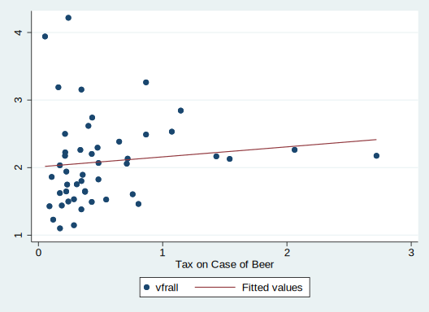
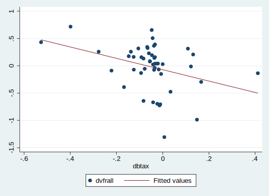

응용계량경제학 필기노트


*"S stands for 실습  ~~실수~~"*


# Practice Fixed Effect Models

미국 주별 주세율에 따른 음주운전 사고률 및  사상자수를 분석해보자.


$u_i$ : 각 individual에 Y를 향해 영향을 미치는 확인되지 못한 변수들 (주별 음주문화에 대한 문화 및 규제 등) --> state **fixed effect**

$v_t$: 모든 individual에 대해 영향을 미치는 요소; 차량 안전기능의 발전, 미국 연방 안전규제의 강화 등 --> time **fixed effect**


```python
import stata_setup
stata_setup.config("C:/Program Files/Stata17", "se")
```


      ___  ____  ____  ____  ____ ®
     /__    /   ____/   /   ____/      17.0
    ___/   /   /___/   /   /___/       SE—Standard Edition
    
     Statistics and Data Science       Copyright 1985-2021 StataCorp LLC
                                       StataCorp
                                       4905 Lakeway Drive
                                       College Station, Texas 77845 USA
                                       800-STATA-PC        https://www.stata.com
                                       979-696-4600        stata@stata.com
    
    Stata license: Unlimited-user network, expiring 20 Mar 2022
    Serial number: 401709302059
      Licensed to: Joonhee Lee
                   KAIST
    
    Notes:
          1. Unicode is supported; see help unicode_advice.
          2. Maximum number of variables is set to 5,000; see help set_maxvar.


```python
import os
os.chdir("C:/Users/2joon/OneDrive/바탕 화면/응용계량경제학/실습/")

# import pandas as pd
# fatality=pd.read_stata("data/fatality.dta")
# sidextract=pd.read_stata("data/mus08psidextract.dta")
```


```python
%%stata
* "C:/Users/2joon/OneDrive/바탕 화면/응용계량경제학/실습/"
dir
```


    . * "C:/Users/2joon/OneDrive/바탕 화면/응용계량경제학/실습/"
    . dir
      <dir>   3/14/22 14:51  .                 
      <dir>   3/14/22 14:39  ..                
      <dir>   3/14/22 14:30  data              
     526.6k   3/02/22 21:22  data (1).zip      
     813.2k   3/02/22 21:22  data (2).zip      
      82.6k   3/02/22 21:22  data.zip          
      <dir>   3/14/22 15:30  results           
    
    . 


```python
%%stata
set more off
version 13
clear all // removes data and value labels from memory
```


    . set more off
    
    . version 13
    
    . clear all // removes data and value labels from memory
    
    . 


```python
%%stata
* Read in Data
use data/fatality.dta, clear
desc
```


    . * Read in Data
    . use data/fatality.dta, clear
    
    . desc
    
    Contains data from data/fatality.dta
     Observations:           336                  
        Variables:            43                  29 Dec 2010 19:38
    -------------------------------------------------------------------------------
    Variable      Storage   Display    Value
        name         type    format    label      Variable label
    -------------------------------------------------------------------------------
    state           byte    %9.0g      sid        State ID (FIPS) Code
    year            int     %9.0g                 Year
    spircons        float   %9.0g                 Spirits Consumption
    unrate          float   %9.0g                 Unemployment Rate
    perinc          float   %9.0g                 Per Capita Personal Income
    emppop          float   %9.0g                 Employment/Population Ratio
    beertax         float   %9.0g                 Tax on Case of Beer
    sobapt          float   %9.0g                 % Southern Baptist
    mormon          float   %9.0g                 % Mormon
    mlda            float   %9.0g                 Minimum Legal Drinking Age
    dry             float   %9.0g                 % Residing in Dry Counties
    yngdrv          float   %9.0g                 % of Drivers Aged 15-24
    vmiles          float   %9.0g                 Ave. Mile per Driver
    breath          byte    %9.0g                 Prelim. Breath Test Law
    jaild           byte    %9.0g                 Mandatory Jail Sentence
    comserd         byte    %9.0g                 Mandatory Community Service
    allmort         int     %9.0g                 # of Vehicle Fatalities (#VF)
    mrall           float   %9.0g                 Vehicle Fatality Rate (VFR)
    allnite         int     %9.0g                 # of Night-time VF (#NVF)
    mralln          float   %9.0g                 Night-time VFR (NFVR)
    allsvn          int     %9.0g                 # of Single VF (#SVN)
    a1517           int     %9.0g                 #VF, 15-17 year olds
    mra1517         float   %9.0g                 VFR, 15-17 year olds
    a1517n          byte    %9.0g                 #NVF, 15-17 year olds
    mra1517n        float   %9.0g                 NVFR, 15-17 year olds
    a1820           int     %9.0g                 #VF, 18-20 year olds
    a1820n          int     %9.0g                 #NVF, 18-20 year olds
    mra1820         float   %9.0g                 VFR, 18-20 year olds
    mra1820n        float   %9.0g                 NVFR, 18-20 year olds
    a2124           int     %9.0g                 #VF, 21-24 year olds
    mra2124         float   %9.0g                 VFR, 21-24 year olds
    a2124n          int     %9.0g                 #NVF, 21-24 year olds
    mra2124n        float   %9.0g                 NVFR, 21-24 year olds
    aidall          float   %9.0g                 # of alcohol-involved VF
    mraidall        float   %9.0g                 Alcohol-Involved VFR
    pop             float   %9.0g                 Population
    pop1517         float   %9.0g                 Population, 15-17 year olds
    pop1820         float   %9.0g                 Population, 18-20 year olds
    pop2124         float   %9.0g                 Population, 21-24 year olds
    miles           float   %9.0g                 total vehicle miles (millions
    unus            float   %9.0g                 U.S. unemployment rate
    epopus          float   %9.0g                 U.S. Emp/Pop Ratio
    gspch           float   %9.0g                 GSP Rate of Change
    -------------------------------------------------------------------------------
    Sorted by: 
    
    . 


```python
%%stata
***** Summary Statistics *****
sum year state
tab state
tab state, nolabel
```


    . ***** Summary Statistics *****
    . sum year state
    
        Variable |        Obs        Mean    Std. dev.       Min        Max
    -------------+---------------------------------------------------------
            year |        336        1985    2.002983       1982       1988
           state |        336     30.1875    15.30985          1         56
    
    . tab state
    
       State ID |
    (FIPS) Code |      Freq.     Percent        Cum.
    ------------+-----------------------------------
             AL |          7        2.08        2.08
             AZ |          7        2.08        4.17
             AR |          7        2.08        6.25
             CA |          7        2.08        8.33
             CO |          7        2.08       10.42
             CT |          7        2.08       12.50
             DE |          7        2.08       14.58
             FL |          7        2.08       16.67
             GA |          7        2.08       18.75
             ID |          7        2.08       20.83
             IL |          7        2.08       22.92
             IN |          7        2.08       25.00
             IA |          7        2.08       27.08
             KS |          7        2.08       29.17
             KY |          7        2.08       31.25
             LA |          7        2.08       33.33
             ME |          7        2.08       35.42
             MD |          7        2.08       37.50
             MA |          7        2.08       39.58
             MI |          7        2.08       41.67
             MN |          7        2.08       43.75
             MS |          7        2.08       45.83
             MO |          7        2.08       47.92
             MT |          7        2.08       50.00
             NE |          7        2.08       52.08
             NV |          7        2.08       54.17
             NH |          7        2.08       56.25
             NJ |          7        2.08       58.33
             NM |          7        2.08       60.42
             NY |          7        2.08       62.50
             NC |          7        2.08       64.58
             ND |          7        2.08       66.67
             OH |          7        2.08       68.75
             OK |          7        2.08       70.83
             OR |          7        2.08       72.92
             PA |          7        2.08       75.00
             RI |          7        2.08       77.08
             SC |          7        2.08       79.17
             SD |          7        2.08       81.25
             TN |          7        2.08       83.33
             TX |          7        2.08       85.42
             UT |          7        2.08       87.50
             VT |          7        2.08       89.58
             VA |          7        2.08       91.67
             WA |          7        2.08       93.75
             WV |          7        2.08       95.83
             WI |          7        2.08       97.92
             WY |          7        2.08      100.00
    ------------+-----------------------------------
          Total |        336      100.00
    
    . tab state, nolabel
    
       State ID |
    (FIPS) Code |      Freq.     Percent        Cum.
    ------------+-----------------------------------
              1 |          7        2.08        2.08
              4 |          7        2.08        4.17
              5 |          7        2.08        6.25
              6 |          7        2.08        8.33
              8 |          7        2.08       10.42
              9 |          7        2.08       12.50
             10 |          7        2.08       14.58
             12 |          7        2.08       16.67
             13 |          7        2.08       18.75
             16 |          7        2.08       20.83
             17 |          7        2.08       22.92
             18 |          7        2.08       25.00
             19 |          7        2.08       27.08
             20 |          7        2.08       29.17
             21 |          7        2.08       31.25
             22 |          7        2.08       33.33
             23 |          7        2.08       35.42
             24 |          7        2.08       37.50
             25 |          7        2.08       39.58
             26 |          7        2.08       41.67
             27 |          7        2.08       43.75
             28 |          7        2.08       45.83
             29 |          7        2.08       47.92
             30 |          7        2.08       50.00
             31 |          7        2.08       52.08
             32 |          7        2.08       54.17
             33 |          7        2.08       56.25
             34 |          7        2.08       58.33
             35 |          7        2.08       60.42
             36 |          7        2.08       62.50
             37 |          7        2.08       64.58
             38 |          7        2.08       66.67
             39 |          7        2.08       68.75
             40 |          7        2.08       70.83
             41 |          7        2.08       72.92
             42 |          7        2.08       75.00
             44 |          7        2.08       77.08
             45 |          7        2.08       79.17
             46 |          7        2.08       81.25
             47 |          7        2.08       83.33
             48 |          7        2.08       85.42
             49 |          7        2.08       87.50
             50 |          7        2.08       89.58
             51 |          7        2.08       91.67
             53 |          7        2.08       93.75
             54 |          7        2.08       95.83
             55 |          7        2.08       97.92
             56 |          7        2.08      100.00
    ------------+-----------------------------------
          Total |        336      100.00
    
    . 


```python
%%stata
gen vfrall=10000*mrall 
// fatality rate per 10K in the population
```


    . gen vfrall=10000*mrall 
    
    . // fatality rate per 10K in the population
    . 


```python
%%stata
sum vfrall beertax
```


        Variable |        Obs        Mean    Std. dev.       Min        Max
    -------------+---------------------------------------------------------
          vfrall |        336    2.040444    .5701938     .82121    4.21784
         beertax |        336     .513256    .4778442   .0433109   2.720764


```python
%%stata
gen dvfrall=vfrall-vfrall[_n-6] // disparity between 6 yrs
gen dbtax=beertax-beertax[_n-6]
```


    . gen dvfrall=vfrall-vfrall[_n-6] // disparity between 6 yrs
    (6 missing values generated)
    
    . gen dbtax=beertax-beertax[_n-6]
    (6 missing values generated)
    
    . 


### Figure 10.1


```python
%%stata
twoway (scatter vfrall beertax if year==1982) (lfit vfrall beertax if year==1982)
```


​    

​    


```python
%%stata
graph export results/figure10_1.png, as(png) replace
```

    file results/figure10_1.png written in PNG format


### Figure 10.2


```python
%%stata
twoway (scatter dvfrall dbtax if year==1988) (lfit dvfrall dbtax if year==1988)
graph export results/figure10_2.png, as(png) replace
```


    . twoway (scatter dvfrall dbtax if year==1988) (lfit dvfrall dbtax if year==198
    > 8)
    
    . graph export results/figure10_2.png, as(png) replace
    file results/figure10_2.png written in PNG format
    
    . 



    


### Equation Table 10.1


```python
%%stata
// Data transformations, create dummy variables, etc.
xtset state year
```


    . // Data transformations, create dummy variables, etc.
    . xtset state year
    
    Panel variable: state (strongly balanced)
     Time variable: year, 1982 to 1988
             Delta: 1 unit
    
    . 


```python
%%stata
// minimum legal drinking age
tab mlda
gen da18=(mlda<19)
gen da19=(mlda>=19)*(mlda<20)
gen da20=(mlda>=20)*(mlda<21)
gen da21=(mlda>=21)
```


    . // minimum legal drinking age
    . tab mlda
    
        Minimum |
          Legal |
       Drinking |
            Age |      Freq.     Percent        Cum.
    ------------+-----------------------------------
             18 |         12        3.57        3.57
           18.5 |          3        0.89        4.46
             19 |         49       14.58       19.05
          19.16 |          1        0.30       19.35
          19.25 |          2        0.60       19.94
           19.5 |          2        0.60       20.54
          19.67 |          6        1.79       22.32
             20 |         20        5.95       28.27
          20.25 |          1        0.30       28.57
          20.33 |          2        0.60       29.17
           20.5 |          6        1.79       30.95
             21 |        232       69.05      100.00
    ------------+-----------------------------------
          Total |        336      100.00
    
    . gen da18=(mlda<19)
    
    . gen da19=(mlda>=19)*(mlda<20)
    
    . gen da20=(mlda>=20)*(mlda<21)
    
    . gen da21=(mlda>=21)
    
    . 


```python
%%stata
// real income per capita in $1000
gen incperc=perinc/1000

// log real income per capita in $1000
gen lincperc = ln(incperc)

// averager vehicle miles per driver
sum vmiles
gen vmilespd=vmiles/1000
```


    . // real income per capita in $1000
    . gen incperc=perinc/1000
    
    . 
    . // log real income per capita in $1000
    . gen lincperc = ln(incperc)
    
    . 
    . // averager vehicle miles per driver
    . sum vmiles
    
        Variable |        Obs        Mean    Std. dev.       Min        Max
    -------------+---------------------------------------------------------
          vmiles |        336    7890.754    1475.659   4576.346   26148.27
    
    . gen vmilespd=vmiles/1000
    
    . 


```python
%%stata
// gen vmilespd=vmiles/1000
replace vmilespd=vmiles/10000
drop vmilespd
gen vmilespd=vmiles/1000
```


    . // gen vmilespd=vmiles/1000
    . replace vmilespd=vmiles/10000
    (336 real changes made)
    
    . drop vmilespd
    
    . gen vmilespd=vmiles/1000
    
    . 


```python
%%stata
// mandatory jail or community service
tab jaild
tab comserd
gen jailcom = (jaild==1) | (comserd==1)
```


    . // mandatory jail or community service
    . tab jaild
    
      Mandatory |
           Jail |
       Sentence |      Freq.     Percent        Cum.
    ------------+-----------------------------------
              0 |        241       71.94       71.94
              1 |         94       28.06      100.00
    ------------+-----------------------------------
          Total |        335      100.00
    
    . tab comserd
    
      Mandatory |
      Community |
        Service |      Freq.     Percent        Cum.
    ------------+-----------------------------------
              0 |        273       81.49       81.49
              1 |         62       18.51      100.00
    ------------+-----------------------------------
          Total |        335      100.00
    
    . gen jailcom = (jaild==1) | (comserd==1)
    
    . 


```python
%%stata
help tab
```


    Tables of frequencies
    ---------------------
    
        See
    
            tabulate oneway       for one-way tables of frequencies
    
            tabulate twoway       for two-way tables of frequencies
    
        and see
    
            tabulate, summarize() for one- and two-way tables of summary
                                    statistics
    . 


```python
%%stata
// year dummies
gen y82=(year==1982)
gen y83=(year==1983)
gen y84=(year==1984)
gen y85=(year==1985)
gen y86=(year==1986)
gen y87=(year==1987)
gen y88=(year==1988)
```


    . // year dummies
    . gen y82=(year==1982)
    
    . gen y83=(year==1983)
    
    . gen y84=(year==1984)
    
    . gen y85=(year==1985)
    
    . gen y86=(year==1986)
    
    . gen y87=(year==1987)
    
    . gen y88=(year==1988)
    
    . 


```python
%%stata
// macro
global agedum "da18 da19 da20"
global controls "jailcom vmilespd unrate lincperc"
global yeardum "y83 y84 y85 y86 y87 y88"
```


    . // macro
    . global agedum "da18 da19 da20"
    
    . global controls "jailcom vmilespd unrate lincperc"
    
    . global yeardum "y83 y84 y85 y86 y87 y88"
    
    . 

## Col

### Col(1)

```python
%%stata
***** col(1) *****
reg vfrall beertax, r
dis "Adjusted Rsquared = " e(r2_a) //dis for display // normal r2 and adjusted r2_a
```


    . ***** col(1) *****
    . reg vfrall beertax, r
    
    Linear regression                               Number of obs     =        336
                                                    F(1, 334)         =      47.59
                                                    Prob > F          =     0.0000
                                                    R-squared         =     0.0934
                                                    Root MSE          =     .54374
    
    ------------------------------------------------------------------------------
                 |               Robust
          vfrall | Coefficient  std. err.      t    P>|t|     [95% conf. interval]
    -------------+----------------------------------------------------------------
         beertax |   .3646054   .0528524     6.90   0.000     .2606399     .468571
           _cons |   1.853308   .0471297    39.32   0.000     1.760599    1.946016
    ------------------------------------------------------------------------------
    
    . dis "Adjusted Rsquared = " e(r2_a) //dis for display // normal r2 and adjuste
    > d r2_a
    Adjusted Rsquared = .09064833
    
    . 


```python
%%stata
* ssc install outreg2 // install outreg2 only once
outreg2 using results/table10_1.xls, replace se label dec(3) excel
```


    . * ssc install outreg2 // install outreg2 only once
    . outreg2 using results/table10_1.xls, replace se label dec(3) excel
    results/table10_1.xls
    dir : seeout
    
    . 

### Col(2)

```python
%%stata
***** col(2) *****
xtreg vfrall beertax, fe vce(cluster state)
dis "Rsquared = "e(r2)
dis "Adjusted Rsquared = "e(r2_a)
outreg2 using results/table10_1.xls, append se label dec(3) excel
```


    . ***** col(2) *****
    . xtreg vfrall beertax, fe vce(cluster state)
    
    Fixed-effects (within) regression               Number of obs      =       336
    Group variable: state                           Number of groups   =        48
    
    R-sq:  Within  = 0.0407                         Obs per group: min =         7
           Between = 0.1101                                        avg =       7.0
           Overall = 0.0934                                        max =         7
    
                                                    F(1,47)            =      5.05
    corr(u_i, Xb)  = -0.6885                        Prob > F           =    0.0294
    
                                     (Std. err. adjusted for 48 clusters in state)
    ------------------------------------------------------------------------------
                 |               Robust
          vfrall | Coefficient  std. err.      t    P>|t|     [95% conf. interval]
    -------------+----------------------------------------------------------------
         beertax |  -.6558736   .2918556    -2.25   0.029    -1.243011   -.0687358
           _cons |   2.377075   .1497966    15.87   0.000     2.075723    2.678427
    -------------+----------------------------------------------------------------
         sigma_u |   .7147146
         sigma_e |  .18985942
             rho |  .93408484   (fraction of variance due to u_i)
    ------------------------------------------------------------------------------
    
    . dis "Rsquared = "e(r2)
    Rsquared = .04074462
    
    . dis "Adjusted Rsquared = "e(r2_a)
    Adjusted Rsquared = .0378726
    
    . outreg2 using results/table10_1.xls, append se label dec(3) excel
    results/table10_1.xls
    dir : seeout
    
    . 


```python
%%stata
* Get overall Adjusted Rsquared
qui areg vfrall beertax , absorb(state)
dis "Adjusted Rsquared = "e(r2_a)
```


    . * Get overall Adjusted Rsquared
    . qui areg vfrall beertax , absorb(state)
    
    . dis "Adjusted Rsquared = "e(r2_a)
    Adjusted Rsquared = .88912864
    
    . 


### Col(3)

```python
%%stata
***** col(3) *****
xtreg vfrall beertax $yeardum, fe vce(cluster state)
test $yeardum
outreg2 using results/table10_1.xls, append se label dec(3) excel


* Get (only) overall Adjusted Rsquared
qui areg vfrall beertax $yeardum, absorb(state)
dis "Adjusted Rsquared = "e(r2_a)
```


    . ***** col(3) *****
    . xtreg vfrall beertax $yeardum, fe vce(cluster state)
    
    Fixed-effects (within) regression               Number of obs      =       336
    Group variable: state                           Number of groups   =        48
    
    R-sq:  Within  = 0.0803                         Obs per group: min =         7
           Between = 0.1101                                        avg =       7.0
           Overall = 0.0876                                        max =         7
    
                                                    F(7,47)            =      4.36
    corr(u_i, Xb)  = -0.6781                        Prob > F           =    0.0009
    
                                     (Std. err. adjusted for 48 clusters in state)
    ------------------------------------------------------------------------------
                 |               Robust
          vfrall | Coefficient  std. err.      t    P>|t|     [95% conf. interval]
    -------------+----------------------------------------------------------------
         beertax |  -.6399799   .3570783    -1.79   0.080    -1.358329    .0783691
             y83 |  -.0799029   .0350861    -2.28   0.027    -.1504869   -.0093188
             y84 |  -.0724206   .0438809    -1.65   0.106    -.1606975    .0158564
             y85 |  -.1239763   .0460559    -2.69   0.010    -.2166288   -.0313238
             y86 |  -.0378645   .0570604    -0.66   0.510    -.1526552    .0769262
             y87 |  -.0509021   .0636084    -0.80   0.428    -.1788656    .0770615
             y88 |  -.0518038   .0644023    -0.80   0.425    -.1813645    .0777568
           _cons |    2.42847   .2016885    12.04   0.000     2.022725    2.834215
    -------------+----------------------------------------------------------------
         sigma_u |  .70945965
         sigma_e |  .18788295
             rho |  .93446372   (fraction of variance due to u_i)
    ------------------------------------------------------------------------------
    
    . test $yeardum
    
     ( 1)  y83 = 0
     ( 2)  y84 = 0
     ( 3)  y85 = 0
     ( 4)  y86 = 0
     ( 5)  y87 = 0
     ( 6)  y88 = 0
    
           F(  6,    47) =    4.22
                Prob > F =    0.0018
    
    . outreg2 using results/table10_1.xls, append se label dec(3) excel
    results/table10_1.xls
    dir : seeout
    
    . 
    . 
    . * Get (only) overall Adjusted Rsquared
    . qui areg vfrall beertax $yeardum, absorb(state)
    
    . dis "Adjusted Rsquared = "e(r2_a)
    Adjusted Rsquared = .891425
    
    . 


### Col(4)

```python
%%stata
***** col(4) *****
* Professor has said this is main analysis
xtreg vfrall beertax $agedum $controls $yeardum, fe vce(cluster state)
test $yeardum
test $agedum
test unrate lincperc
outreg2 using results/table10_1.xls, append se label dec(3) excel


* Get (only) overall Adjusted Rsquared
qui areg vfrall beertax $agedum $controls $yeardum, absorb(state)
dis "Adjusted Rsquared = "e(r2_a)
```


    . ***** col(4) *****
    . * Professor has said this is main analysis
    . xtreg vfrall beertax $agedum $controls $yeardum, fe vce(cluster state)
    
    Fixed-effects (within) regression               Number of obs      =       336
    Group variable: state                           Number of groups   =        48
    
    R-sq:  Within  = 0.3893                         Obs per group: min =         7
           Between = 0.3253                                        avg =       7.0
           Overall = 0.2308                                        max =         7
    
                                                    F(14,47)           =      9.36
    corr(u_i, Xb)  = -0.8431                        Prob > F           =    0.0000
    
                                     (Std. err. adjusted for 48 clusters in state)
    ------------------------------------------------------------------------------
                 |               Robust
          vfrall | Coefficient  std. err.      t    P>|t|     [95% conf. interval]
    -------------+----------------------------------------------------------------
         beertax |  -.4466235   .2970631    -1.50   0.139    -1.044237    .1509903
            da18 |   .0277959    .069616     0.40   0.691    -.1122535    .1678452
            da19 |  -.0184999   .0498377    -0.37   0.712    -.1187606    .0817607
            da20 |   .0315219   .0505042     0.62   0.536    -.0700796    .1331233
         jailcom |   .0384395   .1030087     0.37   0.711    -.1687873    .2456662
        vmilespd |   .0082268   .0068391     1.20   0.235    -.0055318    .0219854
          unrate |   -.063193   .0132019    -4.79   0.000    -.0897518   -.0366342
        lincperc |   1.816135   .6356176     2.86   0.006     .5374376    3.094833
             y83 |  -.0981126   .0309256    -3.17   0.003     -.160327   -.0358983
             y84 |  -.2873902   .0476249    -6.03   0.000    -.3831991   -.1915812
             y85 |  -.3785719   .0517855    -7.31   0.000    -.4827509   -.2743929
             y86 |  -.3440043   .0649891    -5.29   0.000    -.4747455   -.2132631
             y87 |  -.4457708   .0798079    -5.59   0.000    -.6063235    -.285218
             y88 |  -.5333494   .0914651    -5.83   0.000    -.7173534   -.3493454
           _cons |  -1.800134   1.725493    -1.04   0.302    -5.271378     1.67111
    -------------+----------------------------------------------------------------
         sigma_u |   .9008353
         sigma_e |  .15504324
             rho |  .97123018   (fraction of variance due to u_i)
    ------------------------------------------------------------------------------
    
    . test $yeardum
    
     ( 1)  y83 = 0
     ( 2)  y84 = 0
     ( 3)  y85 = 0
     ( 4)  y86 = 0
     ( 5)  y87 = 0
     ( 6)  y88 = 0
    
           F(  6,    47) =   10.13
                Prob > F =    0.0000
    
    . test $agedum
    
     ( 1)  da18 = 0
     ( 2)  da19 = 0
     ( 3)  da20 = 0
    
           F(  3,    47) =    0.35
                Prob > F =    0.7870
    
    . test unrate lincperc
    
     ( 1)  unrate = 0
     ( 2)  lincperc = 0
    
           F(  2,    47) =   29.63
                Prob > F =    0.0000
    
    . outreg2 using results/table10_1.xls, append se label dec(3) excel
    results/table10_1.xls
    dir : seeout
    
    . 
    . 
    . * Get (only) overall Adjusted Rsquared
    . qui areg vfrall beertax $agedum $controls $yeardum, absorb(state)
    
    . dis "Adjusted Rsquared = "e(r2_a)
    Adjusted Rsquared = .92606318
    
    . 


### Col(5)

```python
%%stata
***** col(5) *****
xtreg vfrall beertax $agedum jailcom vmilespd $yeardum, fe vce(cluster state)
test $yeardum
test $agedum
outreg2 using results/table10_1.xls, append se label dec(3) excel


* Get (only) overall Adjusted Rsquared
qui areg vfrall beertax $agedum jailcom vmilespd $yeardum, absorb(state)
dis "Adjusted Rsquared = "e(r2_a)
```


    . ***** col(5) *****
    . xtreg vfrall beertax $agedum jailcom vmilespd $yeardum, fe vce(cluster state)
    
    Fixed-effects (within) regression               Number of obs      =       336
    Group variable: state                           Number of groups   =        48
    
    R-sq:  Within  = 0.1091                         Obs per group: min =         7
           Between = 0.0715                                        avg =       7.0
           Overall = 0.0535                                        max =         7
    
                                                    F(12,47)           =      2.93
    corr(u_i, Xb)  = -0.6614                        Prob > F           =    0.0041
    
                                     (Std. err. adjusted for 48 clusters in state)
    ------------------------------------------------------------------------------
                 |               Robust
          vfrall | Coefficient  std. err.      t    P>|t|     [95% conf. interval]
    -------------+----------------------------------------------------------------
         beertax |  -.6896516   .3516553    -1.96   0.056    -1.397091    .0177876
            da18 |   -.010234   .0822108    -0.12   0.901    -.1756208    .1551529
            da19 |  -.0755829   .0674433    -1.12   0.268    -.2112613    .0600956
            da20 |  -.1000421   .0557489    -1.79   0.079    -.2121944    .0121103
         jailcom |   .0852625   .1115222     0.76   0.448    -.1390912    .3096162
        vmilespd |   .0174372   .0105175     1.66   0.104    -.0037213    .0385958
             y83 |  -.0898624   .0359589    -2.50   0.016    -.1622024   -.0175225
             y84 |  -.0945423   .0465842    -2.03   0.048    -.1882577    -.000827
             y85 |  -.1501237   .0513194    -2.93   0.005     -.253365   -.0468825
             y86 |  -.0783351    .062327    -1.26   0.215    -.2037208    .0470507
             y87 |  -.1062804   .0751299    -1.41   0.164    -.2574222    .0448615
             y88 |  -.1198721   .0776908    -1.54   0.130    -.2761659    .0364217
           _cons |   2.343289   .2037982    11.50   0.000       1.9333    2.753278
    -------------+----------------------------------------------------------------
         sigma_u |  .71067924
         sigma_e |  .18657627
             rho |  .93552089   (fraction of variance due to u_i)
    ------------------------------------------------------------------------------
    
    . test $yeardum
    
     ( 1)  y83 = 0
     ( 2)  y84 = 0
     ( 3)  y85 = 0
     ( 4)  y86 = 0
     ( 5)  y87 = 0
     ( 6)  y88 = 0
    
           F(  6,    47) =    3.48
                Prob > F =    0.0062
    
    . test $agedum
    
     ( 1)  da18 = 0
     ( 2)  da19 = 0
     ( 3)  da20 = 0
    
           F(  3,    47) =    1.41
                Prob > F =    0.2521
    
    . outreg2 using results/table10_1.xls, append se label dec(3) excel
    results/table10_1.xls
    dir : seeout
    
    . 
    . 
    . * Get (only) overall Adjusted Rsquared
    . qui areg vfrall beertax $agedum jailcom vmilespd $yeardum, absorb(state)
    
    . dis "Adjusted Rsquared = "e(r2_a)
    Adjusted Rsquared = .89292998
    
    . 


### Col(6)

```python
%%stata
***** col(6) *****
xtreg vfrall beertax mlda $controls $yeardum, fe vce(cluster state)
test $yeardum
test unrate lincperc
outreg2 using results/table10_1.xls, append se label dec(3) excel


* Get (only) overall Adjusted Rsquared
qui areg vfrall beertax mlda $controls $yeardum, absorb(state)
dis "Adjusted Rsquared = "e(r2_a)
```


    . ***** col(6) *****
    . xtreg vfrall beertax mlda $controls $yeardum, fe vce(cluster state)
    
    Fixed-effects (within) regression               Number of obs      =       336
    Group variable: state                           Number of groups   =        48
    
    R-sq:  Within  = 0.3862                         Obs per group: min =         7
           Between = 0.3169                                        avg =       7.0
           Overall = 0.2243                                        max =         7
    
                                                    F(12,47)           =     10.37
    corr(u_i, Xb)  = -0.8400                        Prob > F           =    0.0000
    
                                     (Std. err. adjusted for 48 clusters in state)
    ------------------------------------------------------------------------------
                 |               Robust
          vfrall | Coefficient  std. err.      t    P>|t|     [95% conf. interval]
    -------------+----------------------------------------------------------------
         beertax |  -.4575373   .3066488    -1.49   0.142    -1.074435    .1593604
            mlda |  -.0019043    .021452    -0.09   0.930    -.0450601    .0412516
         jailcom |   .0390828   .1032093     0.38   0.707    -.1685475    .2467131
        vmilespd |   .0089705   .0070953     1.26   0.212    -.0053034    .0232444
          unrate |  -.0626238   .0132193    -4.74   0.000    -.0892176   -.0360301
        lincperc |   1.787585   .6427265     2.78   0.008     .4945857    3.080584
             y83 |  -.0984904   .0309842    -3.18   0.003    -.1608227   -.0361582
             y84 |  -.2865042   .0468372    -6.12   0.000    -.3807285   -.1922799
             y85 |  -.3771813   .0512666    -7.36   0.000    -.4803164   -.2740463
             y86 |  -.3423973    .064462    -5.31   0.000    -.4720781   -.2127165
             y87 |  -.4407279   .0795409    -5.54   0.000    -.6007435   -.2807124
             y88 |  -.5295262   .0911118    -5.81   0.000    -.7128195   -.3462328
           _cons |  -1.692205   1.884055    -0.90   0.374    -5.482434    2.098023
    -------------+----------------------------------------------------------------
         sigma_u |  .89646524
         sigma_e |   .1548665
             rho |  .97102143   (fraction of variance due to u_i)
    ------------------------------------------------------------------------------
    
    . test $yeardum
    
     ( 1)  y83 = 0
     ( 2)  y84 = 0
     ( 3)  y85 = 0
     ( 4)  y86 = 0
     ( 5)  y87 = 0
     ( 6)  y88 = 0
    
           F(  6,    47) =   10.29
                Prob > F =    0.0000
    
    . test unrate lincperc
    
     ( 1)  unrate = 0
     ( 2)  lincperc = 0
    
           F(  2,    47) =   31.97
                Prob > F =    0.0000
    
    . outreg2 using results/table10_1.xls, append se label dec(3) excel
    results/table10_1.xls
    dir : seeout
    
    . 
    . 
    . * Get (only) overall Adjusted Rsquared
    . qui areg vfrall beertax mlda $controls $yeardum, absorb(state)
    
    . dis "Adjusted Rsquared = "e(r2_a)
    Adjusted Rsquared = .92623165
    
    . 


### Col(7)

```python
%%stata
***** col(7) *****
// 1982 & 1988 only
keep if (year==1982) | (year==1988)

xtreg vfrall beertax $agedum $controls y82, fe vce(cluster state)
test y82
test unrate lincperc
outreg2 using results/table10_1.xls, append se label dec(3) excel


* Get (only) overall Adjusted Rsquared
qui areg vfrall beertax $agedum $controls y82, absorb(state)
dis "Adjusted Rsquared = "e(r2_a)
```


    . ***** col(7) *****
    . // 1982 & 1988 only
    . keep if (year==1982) | (year==1988)
    (240 observations deleted)
    
    . 
    . xtreg vfrall beertax $agedum $controls y82, fe vce(cluster state)
    
    Fixed-effects (within) regression               Number of obs      =        96
    Group variable: state                           Number of groups   =        48
    
    R-sq:  Within  = 0.6602                         Obs per group: min =         2
           Between = 0.0570                                        avg =       2.0
           Overall = 0.0174                                        max =         2
    
                                                    F(9,47)            =      9.66
    corr(u_i, Xb)  = -0.7492                        Prob > F           =    0.0000
    
                                     (Std. err. adjusted for 48 clusters in state)
    ------------------------------------------------------------------------------
                 |               Robust
          vfrall | Coefficient  std. err.      t    P>|t|     [95% conf. interval]
    -------------+----------------------------------------------------------------
         beertax |  -.9243052   .3401936    -2.72   0.009    -1.608686    -.239924
            da18 |   .0381225   .1010417     0.38   0.708    -.1651472    .2413922
            da19 |  -.0640815   .0967913    -0.66   0.511    -.2588004    .1306374
            da20 |  -.1116419   .1232082    -0.91   0.369    -.3595048     .136221
         jailcom |   .0882319   .1633587     0.54   0.592    -.2404034    .4168672
        vmilespd |    .124593   .0486033     2.56   0.014     .0268157    .2223702
          unrate |  -.0908368   .0209474    -4.34   0.000    -.1329775   -.0486962
        lincperc |   .9965689   .6759079     1.47   0.147    -.3631824     2.35632
             y82 |   .7506921    .122253     6.14   0.000     .5047509    .9966334
           _cons |  -.7700099   1.910715    -0.40   0.689    -4.613873    3.073853
    -------------+----------------------------------------------------------------
         sigma_u |  .87773825
         sigma_e |  .18814166
             rho |  .95607306   (fraction of variance due to u_i)
    ------------------------------------------------------------------------------
    
    . test y82
    
     ( 1)  y82 = 0
    
           F(  1,    47) =   37.71
                Prob > F =    0.0000
    
    . test unrate lincperc
    
     ( 1)  unrate = 0
     ( 2)  lincperc = 0
    
           F(  2,    47) =   25.11
                Prob > F =    0.0000
    
    . outreg2 using results/table10_1.xls, append se label dec(3) excel
    results/table10_1.xls
    dir : seeout
    
    . 
    . 
    . * Get (only) overall Adjusted Rsquared
    . qui areg vfrall beertax $agedum $controls y82, absorb(state)
    
    . dis "Adjusted Rsquared = "e(r2_a)
    Adjusted Rsquared = .90031607
    
    . 


