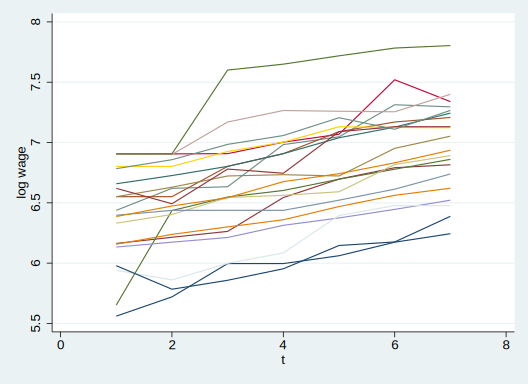
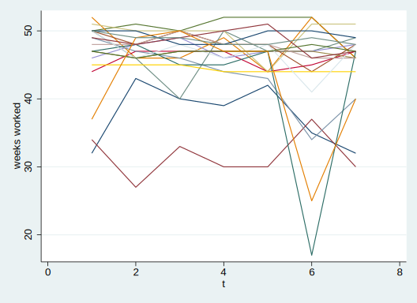
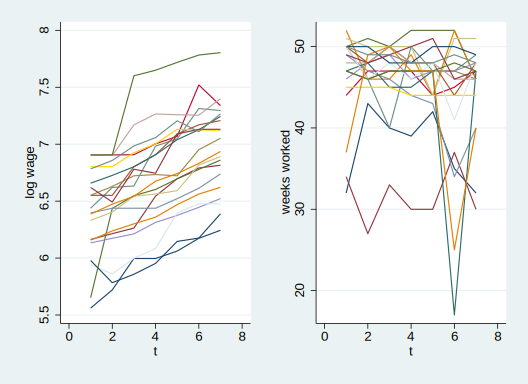
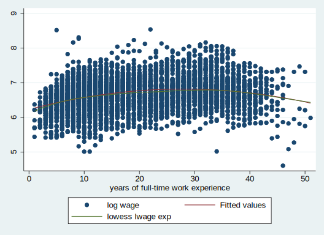
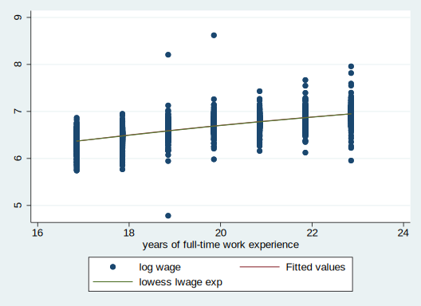

응용계량경제학 필기노트


# Cameron and Trivedi, "Microeconometrics Using Stata"

[Jupyter Notebook with Stata](https://youtu.be/VGRDR3J346M)


```python
import os
os.chdir("C:/Users/2joon/OneDrive/바탕 화면/응용계량경제학/실습/")
import stata_setup
stata_setup.config("C:/Program Files/Stata17", "se")
```


      ___  ____  ____  ____  ____ ®
     /__    /   ____/   /   ____/      17.0
    ___/   /   /___/   /   /___/       SE—Standard Edition
    
     Statistics and Data Science       Copyright 1985-2021 StataCorp LLC
                                       StataCorp
                                       4905 Lakeway Drive
                                       College Station, Texas 77845 USA
                                       800-STATA-PC        https://www.stata.com
                                       979-696-4600        stata@stata.com
    
    Stata license: Unlimited-user network, expiring 20 Mar 2022
    Serial number: 401709302059
      Licensed to: Joonhee Lee
                   KAIST
    
    Notes:
          1. Unicode is supported; see help unicode_advice.
          2. Maximum number of variables is set to 5,000; see help set_maxvar.


```python
%%stata
* "C:/Users/2joon/OneDrive/바탕 화면/응용계량경제학/실습/"
dir
```


    . * "C:/Users/2joon/OneDrive/바탕 화면/응용계량경제학/실습/"
    . dir
      <dir>   3/16/22 14:50  .                 
      <dir>   3/15/22 18:15  ..                
      <dir>   3/14/22 22:30  data              
      <dir>   3/16/22 14:31  data (1)          
     526.6k   3/02/22 21:22  data (1).zip      
     813.2k   3/02/22 21:22  data (2).zip      
      82.6k   3/02/22 21:22  data.zip          
      <dir>   3/14/22 15:31  results           
    
    . 


```python
%%stata
*set more off
version 13
clear all // removes data and value labels from memory
```


    . *set more off
    . version 13
    
    . clear all // removes data and value labels from memory
    
    . 


```python
import pandas as pd
pd.read_stata('data/mus08psidextract.dta')
```


<div>
<style scoped>
    .dataframe tbody tr th:only-of-type {
        vertical-align: middle;
    }


    .dataframe tbody tr th {
        vertical-align: top;
    }
    
    .dataframe thead th {
        text-align: right;
    }

</style>

<table border="1" class="dataframe">
  <thead>
    <tr style="text-align: right;">
      <th></th>
      <th>exp</th>
      <th>wks</th>
      <th>occ</th>
      <th>ind</th>
      <th>south</th>
      <th>smsa</th>
      <th>ms</th>
      <th>fem</th>
      <th>union</th>
      <th>ed</th>
      <th>...</th>
      <th>id</th>
      <th>t</th>
      <th>tdum1</th>
      <th>tdum2</th>
      <th>tdum3</th>
      <th>tdum4</th>
      <th>tdum5</th>
      <th>tdum6</th>
      <th>tdum7</th>
      <th>exp2</th>
    </tr>
  </thead>
  <tbody>
    <tr>
      <th>0</th>
      <td>3.0</td>
      <td>32.0</td>
      <td>0.0</td>
      <td>0.0</td>
      <td>1.0</td>
      <td>0.0</td>
      <td>1.0</td>
      <td>0.0</td>
      <td>0.0</td>
      <td>9.0</td>
      <td>...</td>
      <td>1.0</td>
      <td>1.0</td>
      <td>1</td>
      <td>0</td>
      <td>0</td>
      <td>0</td>
      <td>0</td>
      <td>0</td>
      <td>0</td>
      <td>9.0</td>
    </tr>
    <tr>
      <th>1</th>
      <td>4.0</td>
      <td>43.0</td>
      <td>0.0</td>
      <td>0.0</td>
      <td>1.0</td>
      <td>0.0</td>
      <td>1.0</td>
      <td>0.0</td>
      <td>0.0</td>
      <td>9.0</td>
      <td>...</td>
      <td>1.0</td>
      <td>2.0</td>
      <td>0</td>
      <td>1</td>
      <td>0</td>
      <td>0</td>
      <td>0</td>
      <td>0</td>
      <td>0</td>
      <td>16.0</td>
    </tr>
    <tr>
      <th>2</th>
      <td>5.0</td>
      <td>40.0</td>
      <td>0.0</td>
      <td>0.0</td>
      <td>1.0</td>
      <td>0.0</td>
      <td>1.0</td>
      <td>0.0</td>
      <td>0.0</td>
      <td>9.0</td>
      <td>...</td>
      <td>1.0</td>
      <td>3.0</td>
      <td>0</td>
      <td>0</td>
      <td>1</td>
      <td>0</td>
      <td>0</td>
      <td>0</td>
      <td>0</td>
      <td>25.0</td>
    </tr>
    <tr>
      <th>3</th>
      <td>6.0</td>
      <td>39.0</td>
      <td>0.0</td>
      <td>0.0</td>
      <td>1.0</td>
      <td>0.0</td>
      <td>1.0</td>
      <td>0.0</td>
      <td>0.0</td>
      <td>9.0</td>
      <td>...</td>
      <td>1.0</td>
      <td>4.0</td>
      <td>0</td>
      <td>0</td>
      <td>0</td>
      <td>1</td>
      <td>0</td>
      <td>0</td>
      <td>0</td>
      <td>36.0</td>
    </tr>
    <tr>
      <th>4</th>
      <td>7.0</td>
      <td>42.0</td>
      <td>0.0</td>
      <td>1.0</td>
      <td>1.0</td>
      <td>0.0</td>
      <td>1.0</td>
      <td>0.0</td>
      <td>0.0</td>
      <td>9.0</td>
      <td>...</td>
      <td>1.0</td>
      <td>5.0</td>
      <td>0</td>
      <td>0</td>
      <td>0</td>
      <td>0</td>
      <td>1</td>
      <td>0</td>
      <td>0</td>
      <td>49.0</td>
    </tr>
    <tr>
      <th>...</th>
      <td>...</td>
      <td>...</td>
      <td>...</td>
      <td>...</td>
      <td>...</td>
      <td>...</td>
      <td>...</td>
      <td>...</td>
      <td>...</td>
      <td>...</td>
      <td>...</td>
      <td>...</td>
      <td>...</td>
      <td>...</td>
      <td>...</td>
      <td>...</td>
      <td>...</td>
      <td>...</td>
      <td>...</td>
      <td>...</td>
      <td>...</td>
    </tr>
    <tr>
      <th>4160</th>
      <td>3.0</td>
      <td>50.0</td>
      <td>0.0</td>
      <td>0.0</td>
      <td>0.0</td>
      <td>1.0</td>
      <td>0.0</td>
      <td>1.0</td>
      <td>0.0</td>
      <td>12.0</td>
      <td>...</td>
      <td>595.0</td>
      <td>3.0</td>
      <td>0</td>
      <td>0</td>
      <td>1</td>
      <td>0</td>
      <td>0</td>
      <td>0</td>
      <td>0</td>
      <td>9.0</td>
    </tr>
    <tr>
      <th>4161</th>
      <td>4.0</td>
      <td>49.0</td>
      <td>0.0</td>
      <td>0.0</td>
      <td>0.0</td>
      <td>1.0</td>
      <td>0.0</td>
      <td>1.0</td>
      <td>0.0</td>
      <td>12.0</td>
      <td>...</td>
      <td>595.0</td>
      <td>4.0</td>
      <td>0</td>
      <td>0</td>
      <td>0</td>
      <td>1</td>
      <td>0</td>
      <td>0</td>
      <td>0</td>
      <td>16.0</td>
    </tr>
    <tr>
      <th>4162</th>
      <td>5.0</td>
      <td>50.0</td>
      <td>0.0</td>
      <td>0.0</td>
      <td>0.0</td>
      <td>1.0</td>
      <td>0.0</td>
      <td>1.0</td>
      <td>0.0</td>
      <td>12.0</td>
      <td>...</td>
      <td>595.0</td>
      <td>5.0</td>
      <td>0</td>
      <td>0</td>
      <td>0</td>
      <td>0</td>
      <td>1</td>
      <td>0</td>
      <td>0</td>
      <td>25.0</td>
    </tr>
    <tr>
      <th>4163</th>
      <td>6.0</td>
      <td>50.0</td>
      <td>0.0</td>
      <td>0.0</td>
      <td>0.0</td>
      <td>1.0</td>
      <td>0.0</td>
      <td>1.0</td>
      <td>0.0</td>
      <td>12.0</td>
      <td>...</td>
      <td>595.0</td>
      <td>6.0</td>
      <td>0</td>
      <td>0</td>
      <td>0</td>
      <td>0</td>
      <td>0</td>
      <td>1</td>
      <td>0</td>
      <td>36.0</td>
    </tr>
    <tr>
      <th>4164</th>
      <td>7.0</td>
      <td>50.0</td>
      <td>0.0</td>
      <td>0.0</td>
      <td>0.0</td>
      <td>1.0</td>
      <td>0.0</td>
      <td>1.0</td>
      <td>0.0</td>
      <td>12.0</td>
      <td>...</td>
      <td>595.0</td>
      <td>7.0</td>
      <td>0</td>
      <td>0</td>
      <td>0</td>
      <td>0</td>
      <td>0</td>
      <td>0</td>
      <td>1</td>
      <td>49.0</td>
    </tr>
  </tbody>
</table>
<p>4165 rows × 22 columns</p>

</div>


```python
%%stata
* Read in Data
use data/mus08psidextract.dta, clear
desc
```


    . * Read in Data
    . use data/mus08psidextract.dta, clear
    (PSID wage data 1976-82 from Baltagi and Khanti-Akom (1990))
    
    . desc
    
    Contains data from data/mus08psidextract.dta
     Observations:         4,165                  PSID wage data 1976-82 from
                                                    Baltagi and Khanti-Akom (1990)
        Variables:            22                  26 Nov 2008 17:15
                                                  (_dta has notes)
    -------------------------------------------------------------------------------
    Variable      Storage   Display    Value
        name         type    format    label      Variable label
    -------------------------------------------------------------------------------
    exp             float   %9.0g                 years of full-time work
                                                    experience
    wks             float   %9.0g                 weeks worked
    occ             float   %9.0g                 occupation; occ==1 if in a
                                                    blue-collar occupation
    ind             float   %9.0g                 industry; ind==1 if working in a
                                                    manufacturing industry
    south           float   %9.0g                 residence; south==1 if in the
                                                    South area
    smsa            float   %9.0g                 smsa==1 if in the Standard
                                                    metropolitan statistical area
    ms              float   %9.0g                 marital status
    fem             float   %9.0g                 female or male
    union           float   %9.0g                 if wage set be a union contract
    ed              float   %9.0g                 years of education
    blk             float   %9.0g                 black
    lwage           float   %9.0g                 log wage
    id              float   %9.0g                 
    t               float   %9.0g                 
    tdum1           byte    %8.0g                 t== 1.0000
    tdum2           byte    %8.0g                 t== 2.0000
    tdum3           byte    %8.0g                 t== 3.0000
    tdum4           byte    %8.0g                 t== 4.0000
    tdum5           byte    %8.0g                 t== 5.0000
    tdum6           byte    %8.0g                 t== 6.0000
    tdum7           byte    %8.0g                 t== 7.0000
    exp2            float   %9.0g                 
    -------------------------------------------------------------------------------
    Sorted by: id  t
    
    . 


```python
%stata summarize
```


        Variable |        Obs        Mean    Std. dev.       Min        Max
    -------------+---------------------------------------------------------
             exp |      4,165    19.85378    10.96637          1         51
             wks |      4,165    46.81152    5.129098          5         52
             occ |      4,165    .5111645    .4999354          0          1
             ind |      4,165    .3954382    .4890033          0          1
           south |      4,165    .2902761    .4539442          0          1
    -------------+---------------------------------------------------------
            smsa |      4,165    .6537815     .475821          0          1
              ms |      4,165    .8144058    .3888256          0          1
             fem |      4,165     .112605    .3161473          0          1
           union |      4,165    .3639856    .4812023          0          1
              ed |      4,165    12.84538    2.787995          4         17
    -------------+---------------------------------------------------------
             blk |      4,165    .0722689    .2589637          0          1
           lwage |      4,165    6.676346    .4615122    4.60517      8.537
              id |      4,165         298    171.7821          1        595
               t |      4,165           4     2.00024          1          7
           tdum1 |      4,165    .1428571    .3499691          0          1
    -------------+---------------------------------------------------------
           tdum2 |      4,165    .1428571    .3499691          0          1
           tdum3 |      4,165    .1428571    .3499691          0          1
           tdum4 |      4,165    .1428571    .3499691          0          1
           tdum5 |      4,165    .1428571    .3499691          0          1
           tdum6 |      4,165    .1428571    .3499691          0          1
    -------------+---------------------------------------------------------
           tdum7 |      4,165    .1428571    .3499691          0          1
            exp2 |      4,165     514.405    496.9962          1       2601


```python
%%stata
* check organization of dataset
list id t exp wks occ in 1/3, clean
* reshape: wide -> long
```


    . * check organization of dataset
    . list id t exp wks occ in 1/3, clean
    
           id   t   exp   wks   occ  
      1.    1   1     3    32     0  
      2.    1   2     4    43     0  
      3.    1   3     5    40     0  
    
    . * reshape: wide -> long
    . 


```python
%%stata 
* declare individual identifier and time identifier
xtset id t
```


    . * declare individual identifier and time identifier
    . xtset id t
    
    Panel variable: id (strongly balanced)
     Time variable: t, 1 to 7
             Delta: 1 unit
    
    . 


```python
%%stata 
* panel description of dataset
xtdescribe
```


    . * panel description of dataset
    . xtdescribe
    
          id:  1, 2, ..., 595                                    n =        595
           t:  1, 2, ..., 7                                      T =          7
               Delta(t) = 1 unit
               Span(t)  = 7 periods
               (id*t uniquely identifies each observation)
    
    Distribution of T_i:   min      5%     25%       50%       75%     95%     max
                             7       7       7         7         7       7       7
    
         Freq.  Percent    Cum. |  Pattern
     ---------------------------+---------
          595    100.00  100.00 |  1111111
     ---------------------------+---------
          595    100.00         |  XXXXXXX
    
    . 


```python
%%stata 
* panel summary statistics: within and between variation
xtsum id t lwage ed exp exp2 wks south tdum1
```


    . * panel summary statistics: within and between variation
    . xtsum id t lwage ed exp exp2 wks south tdum1
    
    Variable         |      Mean   Std. dev.       Min        Max |    Observations
    -----------------+--------------------------------------------+----------------
    id       overall |       298   171.7821          1        595 |     N =    4165
             between |              171.906          1        595 |     n =     595
             within  |                    0        298        298 |     T =       7
                     |                                            |
    t        overall |         4    2.00024          1          7 |     N =    4165
             between |                    0          4          4 |     n =     595
             within  |              2.00024          1          7 |     T =       7
                     |                                            |
    lwage    overall |  6.676346   .4615122    4.60517      8.537 |     N =    4165
             between |             .3942387     5.3364   7.813596 |     n =     595
             within  |             .2404023   4.781808   8.621092 |     T =       7
                     |                                            |
    ed       overall |  12.84538   2.787995          4         17 |     N =    4165
             between |             2.790006          4         17 |     n =     595
             within  |                    0   12.84538   12.84538 |     T =       7
                     |                                            |
    exp      overall |  19.85378   10.96637          1         51 |     N =    4165
             between |             10.79018          4         48 |     n =     595
             within  |              2.00024   16.85378   22.85378 |     T =       7
                     |                                            |
    exp2     overall |   514.405   496.9962          1       2601 |     N =    4165
             between |             489.0495         20       2308 |     n =     595
             within  |             90.44581    231.405    807.405 |     T =       7
                     |                                            |
    wks      overall |  46.81152   5.129098          5         52 |     N =    4165
             between |             3.284016   31.57143   51.57143 |     n =     595
             within  |             3.941881    12.2401   63.66867 |     T =       7
                     |                                            |
    south    overall |  .2902761   .4539442          0          1 |     N =    4165
             between |             .4489462          0          1 |     n =     595
             within  |             .0693042  -.5668667   1.147419 |     T =       7
                     |                                            |
    tdum1    overall |  .1428571   .3499691          0          1 |     N =    4165
             between |                    0   .1428571   .1428571 |     n =     595
             within  |             .3499691          0          1 |     T =       7
    
    . 


```python
%%stata 
* transition probabilities for a variable
xttrans south, freq
```


    . * transition probabilities for a variable
    . xttrans south, freq
    
    residence; |
      south==1 |  residence; south==1
     if in the | if in the South area
    South area |         0          1 |     Total
    -----------+----------------------+----------
             0 |     2,527          8 |     2,535 
               |     99.68       0.32 |    100.00 
    -----------+----------------------+----------
             1 |         8      1,027 |     1,035 
               |      0.77      99.23 |    100.00 
    -----------+----------------------+----------
         Total |     2,535      1,035 |     3,570 
               |     71.01      28.99 |    100.00 
    
    . 


```python
%%stata 
* simple time-series plot for each of 20 individuals
quietly xtline lwage if id<=20, overlay legen(off) saving(lwage, replace)
```


    . * simple time-series plot for each of 20 individuals
    . quietly xtline lwage if id<=20, overlay legen(off) saving(lwage, replace)
    
    . 



    


```python
%stata quietly xtline wks if id<=20, overlay legen(off) saving(wks, replace)
```


​    

​    


```python
%stata graph combine lwage.gph wks.gph, iscale(1)
```


​    

​    


```python
%%stata
erase lwage.gph
erase wks.gph
```


    . erase lwage.gph
    
    . erase wks.gph
    
    . 


```python
%%stata
* scatterplot, quadratic fit and nonparametric regression (lowess)
graph twoway (scatter lwage exp) (qfit lwage exp) (lowess lwage exp)
```


    . * scatterplot, quadratic fit and nonparametric regression (lowess)
    . graph twoway (scatter lwage exp) (qfit lwage exp) (lowess lwage exp)
    
    . 



    


```python
%%stata
* scatterplot for within variation
preserve
xtdata, fe
graph twoway (scatter lwage exp) (qfit lwage exp) (lowess lwage exp)
restore
```


    . * scatterplot for within variation
    . preserve
    
    . xtdata, fe
    
    . graph twoway (scatter lwage exp) (qfit lwage exp) (lowess lwage exp)
    
    . restore
    
    . 



    


```python
%%stata
* macro for a list of explanator variables
global xlist exp exp2 wks ed

* pooled OLS with cluster-robust standard errors
regress lwage $xlist, vce(cluster id)
```


    . * macro for a list of explanator variables
    . global xlist exp exp2 wks ed
    
    . 
    . * pooled OLS with cluster-robust standard errors
    . regress lwage $xlist, vce(cluster id)
    
    Linear regression                               Number of obs     =      4,165
                                                    F(4, 594)         =      72.58
                                                    Prob > F          =     0.0000
                                                    R-squared         =     0.2836
                                                    Root MSE          =     .39082
    
                                       (Std. err. adjusted for 595 clusters in id)
    ------------------------------------------------------------------------------
                 |               Robust
           lwage | Coefficient  std. err.      t    P>|t|     [95% conf. interval]
    -------------+----------------------------------------------------------------
             exp |    .044675   .0054385     8.21   0.000     .0339941     .055356
            exp2 |  -.0007156   .0001285    -5.57   0.000    -.0009679   -.0004633
             wks |    .005827   .0019284     3.02   0.003     .0020396    .0096144
              ed |   .0760407   .0052122    14.59   0.000     .0658042    .0862772
           _cons |   4.907961   .1399887    35.06   0.000     4.633028    5.182894
    ------------------------------------------------------------------------------
    
    . 


```python
%%stata
* pooled OLS with incorrect default standard errors
regress lwage $xlist
```


    . * pooled OLS with incorrect default standard errors
    . regress lwage $xlist
    
          Source |       SS           df       MS      Number of obs   =     4,165
    -------------+----------------------------------   F(4, 4160)      =    411.62
           Model |  251.491445         4  62.8728613   Prob > F        =    0.0000
        Residual |  635.413457     4,160  .152743619   R-squared       =    0.2836
    -------------+----------------------------------   Adj R-squared   =    0.2829
           Total |  886.904902     4,164  .212993492   Root MSE        =    .39082
    
    ------------------------------------------------------------------------------
           lwage | Coefficient  Std. err.      t    P>|t|     [95% conf. interval]
    -------------+----------------------------------------------------------------
             exp |    .044675   .0023929    18.67   0.000     .0399838    .0493663
            exp2 |  -.0007156   .0000528   -13.56   0.000    -.0008191   -.0006121
             wks |    .005827   .0011827     4.93   0.000     .0035084    .0081456
              ed |   .0760407   .0022266    34.15   0.000     .0716754     .080406
           _cons |   4.907961   .0673297    72.89   0.000     4.775959    5.039963
    ------------------------------------------------------------------------------
    
    . 


```python
%%stata
* within or FE estimator with cluster-robust standard errors
xtreg lwage $xlist, fe vce(cluster id)
dis "Rsquared = " e(r2)
```


    . * within or FE estimator with cluster-robust standard errors
    . xtreg lwage $xlist, fe vce(cluster id)
    note: ed omitted because of collinearity
    
    Fixed-effects (within) regression               Number of obs      =      4165
    Group variable: id                              Number of groups   =       595
    
    R-sq:  Within  = 0.6566                         Obs per group: min =         7
           Between = 0.0276                                        avg =       7.0
           Overall = 0.0476                                        max =         7
    
                                                    F(3,594)           =   1059.72
    corr(u_i, Xb)  = -0.9107                        Prob > F           =    0.0000
    
                                       (Std. err. adjusted for 595 clusters in id)
    ------------------------------------------------------------------------------
                 |               Robust
           lwage | Coefficient  std. err.      t    P>|t|     [95% conf. interval]
    -------------+----------------------------------------------------------------
             exp |   .1137879   .0040289    28.24   0.000     .1058753    .1217004
            exp2 |  -.0004244   .0000822    -5.16   0.000    -.0005858   -.0002629
             wks |   .0008359   .0008697     0.96   0.337    -.0008721    .0025439
              ed |          0  (omitted)
           _cons |   4.596396   .0600887    76.49   0.000     4.478384    4.714408
    -------------+----------------------------------------------------------------
         sigma_u |  1.0362039
         sigma_e |  .15220316
             rho |  .97888036   (fraction of variance due to u_i)
    ------------------------------------------------------------------------------
    
    . dis "Rsquared = " e(r2)
    Rsquared = .65662995
    
    . 


```python
%%stata
* dummy variable regression
areg lwage $xlist, absorb(id) vce(cluster id)

* dummy variable regression using factor variables
quietly regress lwage $xlist i.id, vce(cluster id)
estimate table, keep($xlist _cons) b se b(%12.7f)

* use areg, donot use
```


    . * dummy variable regression
    . areg lwage $xlist, absorb(id) vce(cluster id)
    note: ed omitted because of collinearity.
    
    Linear regression, absorbing indicators             Number of obs     =  4,165
    Absorbed variable: id                               No. of categories =    595
                                                        F(3, 594)         = 908.44
                                                        Prob > F          = 0.0000
                                                        R-squared         = 0.9068
                                                        Adj R-squared     = 0.8912
                                                        Root MSE          = 0.1522
    
                                       (Std. err. adjusted for 595 clusters in id)
    ------------------------------------------------------------------------------
                 |               Robust
           lwage | Coefficient  std. err.      t    P>|t|     [95% conf. interval]
    -------------+----------------------------------------------------------------
             exp |   .1137879   .0043514    26.15   0.000     .1052418    .1223339
            exp2 |  -.0004244   .0000888    -4.78   0.000    -.0005988     -.00025
             wks |   .0008359   .0009393     0.89   0.374    -.0010089    .0026806
              ed |          0  (omitted)
           _cons |   4.596396   .0648993    70.82   0.000     4.468936    4.723856
    ------------------------------------------------------------------------------
    
    . 
    . * dummy variable regression using factor variables
    . quietly regress lwage $xlist i.id, vce(cluster id)
    
    . estimate table, keep($xlist _cons) b se b(%12.7f)
    
    -----------------------------
        Variable |    Active     
    -------------+---------------
             exp |    0.1137879  
                 |    0.0043514  
            exp2 |   -0.0004244  
                 |    0.0000888  
             wks |    0.0008359  
                 |    0.0009393  
              ed |    0.1022134  
                 |    0.0046744  
           _cons |    4.3476807  
                 |    0.0443191  
    -----------------------------
                     Legend: b/se
    
    . 
    . * use areg, donot use
    . 


```python
%%stata
* between estimator with default standard errors
xtreg lwage $xlist, be
dis "Rsquared = "e(r2)
```


    . * between estimator with default standard errors
    . xtreg lwage $xlist, be
    
    Between regression (regression on group means)  Number of obs     =      4,165
    Group variable: id                              Number of groups  =        595
    
    R-squared:                                      Obs per group:
         Within  = 0.1357                                         min =          7
         Between = 0.3264                                         avg =        7.0
         Overall = 0.2723                                         max =          7
    
                                                    F(4,590)          =      71.48
    sd(u_i + avg(e_i.)) = .324656                   Prob > F          =     0.0000
    
    ------------------------------------------------------------------------------
           lwage | Coefficient  Std. err.      t    P>|t|     [95% conf. interval]
    -------------+----------------------------------------------------------------
             exp |    .038153   .0056967     6.70   0.000     .0269647    .0493412
            exp2 |  -.0006313   .0001257    -5.02   0.000    -.0008781   -.0003844
             wks |   .0130903   .0040659     3.22   0.001     .0051048    .0210757
              ed |   .0737838   .0048985    15.06   0.000     .0641632    .0834044
           _cons |   4.683039   .2100989    22.29   0.000     4.270407    5.095672
    ------------------------------------------------------------------------------
    
    . dis "Rsquared = "e(r2)
    Rsquared = .32641265
    
    . 


```python
%%stata
* random-effect estimator with cluster-robust se
xtreg lwage $xlist, re vce(cluster id)

dis "Rsquared = "e(r2)
dis "Rsquared = "e(r2_o)
```


    . * random-effect estimator with cluster-robust se
    . xtreg lwage $xlist, re vce(cluster id)
    
    Random-effects GLS regression                   Number of obs     =      4,165
    Group variable: id                              Number of groups  =        595
    
    R-squared:                                      Obs per group:
         Within  = 0.6340                                         min =          7
         Between = 0.1716                                         avg =        7.0
         Overall = 0.1830                                         max =          7
    
                                                    Wald chi2(4)      =    1598.50
    corr(u_i, X) = 0 (assumed)                      Prob > chi2       =     0.0000
    
                                       (Std. err. adjusted for 595 clusters in id)
    ------------------------------------------------------------------------------
                 |               Robust
           lwage | Coefficient  std. err.      z    P>|z|     [95% conf. interval]
    -------------+----------------------------------------------------------------
             exp |   .0888609   .0039992    22.22   0.000     .0810227    .0966992
            exp2 |  -.0007726   .0000896    -8.62   0.000    -.0009481    -.000597
             wks |   .0009658   .0009259     1.04   0.297     -.000849    .0027806
              ed |   .1117099   .0083954    13.31   0.000     .0952552    .1281647
           _cons |   3.829366   .1333931    28.71   0.000     3.567921    4.090812
    -------------+----------------------------------------------------------------
         sigma_u |  .31951859
         sigma_e |  .15220316
             rho |  .81505521   (fraction of variance due to u_i)
    ------------------------------------------------------------------------------
    
    . 
    . dis "Rsquared = "e(r2)
    Rsquared = .
    
    . dis "Rsquared = "e(r2_o)
    Rsquared = .18304568
    
    . 


```python
%%stata
* compare OLS, BE, FE, RE estimators, and methods to compute se
quietly regress lwage $xlist, vce(cluster id)
estimates store OLS_rob
quietly xtreg lwage $xlist, be
estimates store BE
quietly xtreg lwage $xlist, fe
estimates store FE
quietly xtreg lwage $xlist, fe vce(robust)
estimates store FE_rob
quietly xtreg lwage $xlist, re
estimates store RE
quietly xtreg lwage $xlist, re vce(robust)
estimates store RE_rob

estimate table OLS_rob BE FE FE_rob RE RE_rob, ///
b se stats(N r2 f2_o r2_b r2_w sigma_u sigma_e rho) b(%7.4f)
```


    . * compare OLS, BE, FE, RE estimators, and methods to compute se
    . quietly regress lwage $xlist, vce(cluster id)
    
    . estimates store OLS_rob
    
    . quietly xtreg lwage $xlist, be
    
    . estimates store BE
    
    . quietly xtreg lwage $xlist, fe
    
    . estimates store FE
    
    . quietly xtreg lwage $xlist, fe vce(robust)
    
    . estimates store FE_rob
    
    . quietly xtreg lwage $xlist, re
    
    . estimates store RE
    
    . quietly xtreg lwage $xlist, re vce(robust)
    
    . estimates store RE_rob
    
    . 
    . estimate table OLS_rob BE FE FE_rob RE RE_rob, ///
    > b se stats(N r2 f2_o r2_b r2_w sigma_u sigma_e rho) b(%7.4f)
    
    --------------------------------------------------------------------------
        Variable |  OLS_rob       BE          FE        FE_rob        RE      
    -------------+------------------------------------------------------------
             exp |    0.0447      0.0382      0.1138      0.1138      0.0889  
                 |    0.0054      0.0057      0.0025      0.0040      0.0028  
            exp2 |   -0.0007     -0.0006     -0.0004     -0.0004     -0.0008  
                 |    0.0001      0.0001      0.0001      0.0001      0.0001  
             wks |    0.0058      0.0131      0.0008      0.0008      0.0010  
                 |    0.0019      0.0041      0.0006      0.0009      0.0007  
              ed |    0.0760      0.0738   (omitted)   (omitted)      0.1117  
                 |    0.0052      0.0049                              0.0061  
           _cons |    4.9080      4.6830      4.5964      4.5964      3.8294  
                 |    0.1400      0.2101      0.0389      0.0601      0.0936  
    -------------+------------------------------------------------------------
               N |      4165        4165        4165        4165        4165  
              r2 |    0.2836      0.3264      0.6566      0.6566              
            f2_o |                                                            
            r2_b |                0.3264      0.0276      0.0276      0.1716  
            r2_w |                0.1357      0.6566      0.6566      0.6340  
         sigma_u |                            1.0362      1.0362      0.3195  
         sigma_e |                            0.1522      0.1522      0.1522  
             rho |                            0.9789      0.9789      0.8151  
    --------------------------------------------------------------------------
                                                                  Legend: b/se


​    

    --------------------------
        Variable |  RE_rob    
    -------------+------------
             exp |    0.0889  
                 |    0.0040  
            exp2 |   -0.0008  
                 |    0.0001  
             wks |    0.0010  
                 |    0.0009  
              ed |    0.1117  
                 |    0.0084  
           _cons |    3.8294  
                 |    0.1334  
    -------------+------------
               N |      4165  
              r2 |            
            f2_o |            
            r2_b |    0.1716  
            r2_w |    0.6340  
         sigma_u |    0.3195  
         sigma_e |    0.1522  
             rho |    0.8151  
    --------------------------
                  Legend: b/se
    
    . 


```python
%%stata
* Hausman text assuming RE estimator is fully efficient under null hypothesis
hausman FE RE, sigmamore
```


    . * Hausman text assuming RE estimator is fully efficient under null hypothesis
    . hausman FE RE, sigmamore
    
                     ---- Coefficients ----
                 |      (b)          (B)            (b-B)     sqrt(diag(V_b-V_B))
                 |       FE           RE         Difference       Std. err.
    -------------+----------------------------------------------------------------
             exp |    .1137879     .0888609        .0249269        .0012778
            exp2 |   -.0004244    -.0007726        .0003482        .0000285
             wks |    .0008359     .0009658       -.0001299        .0001108
    ------------------------------------------------------------------------------
                              b = Consistent under H0 and Ha; obtained from xtreg.
               B = Inconsistent under Ha, efficient under H0; obtained from xtreg.
    
    Test of H0: Difference in coefficients not systematic
    
        chi2(3) = (b-B)'[(V_b-V_B)^(-1)](b-B)
                = 1513.02
    Prob > chi2 =  0.0000
    
    . 


```python
%%stata
* difference estimator with cluster-robust standard errors
sort id t
regress D.(lwage exp exp2 wks ed), vce(cluster id) noconstant
```


    . * difference estimator with cluster-robust standard errors
    . sort id t
    
    . regress D.(lwage exp exp2 wks ed), vce(cluster id) noconstant
    note: D.ed omitted because of collinearity.
    
    Linear regression                               Number of obs     =      3,570
                                                    F(3, 594)         =    1035.19
                                                    Prob > F          =     0.0000
                                                    R-squared         =     0.2209
                                                    Root MSE          =     .18156
    
                                       (Std. err. adjusted for 595 clusters in id)
    ------------------------------------------------------------------------------
                 |               Robust
         D.lwage | Coefficient  std. err.      t    P>|t|     [95% conf. interval]
    -------------+----------------------------------------------------------------
             exp |
             D1. |   .1170654   .0040974    28.57   0.000     .1090182    .1251126
                 |
            exp2 |
             D1. |  -.0005321   .0000808    -6.58   0.000    -.0006908   -.0003734
                 |
             wks |
             D1. |  -.0002683   .0011783    -0.23   0.820    -.0025824    .0020459
                 |
              ed |
             D1. |          0  (omitted)
    ------------------------------------------------------------------------------
    
    . 

