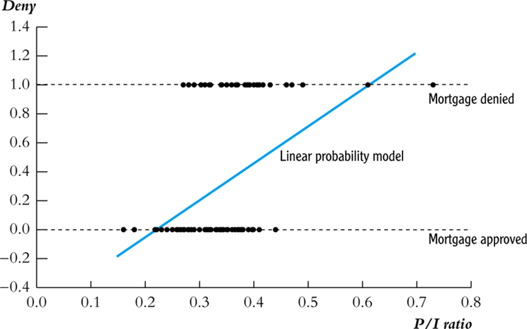
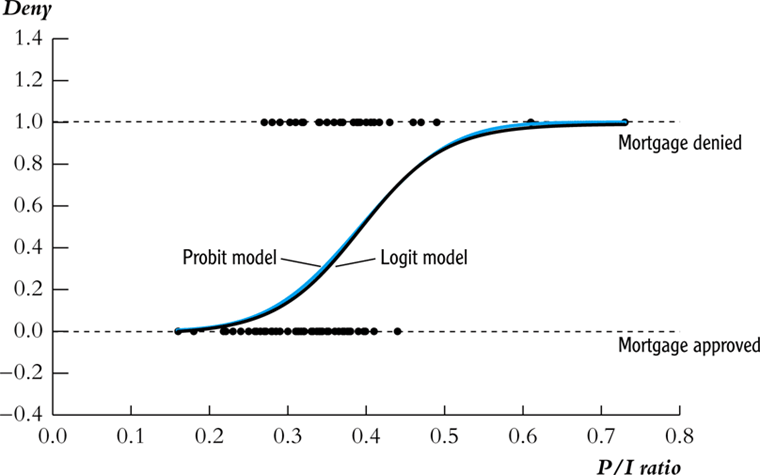

>  #Probit #Logit

> 석사냐 박사냐, 그것이 binary choice다.
>

# Binary Choice

## Limited Dependent Variables

종속변수에 limitation이 있음

제한된 값(ex. 0 or 1 / 1~4)

이번 챕터에서는 종속변수 Y가 0 또는 1의 값만 갖는 binary variable임을 밝힌다.

### Response Probability & Marginal Effect

$$
p(x)=P[Y=1\,|\,X]=E[Y\,|\,X=x] \;\text{: Response Probability}
$$

**Response Probability**의 X로의 Derivative를 **Marginal Effect**라고 부른다.

$$
\frac{\partial}{\partial x}p(x)=\frac{\partial}{\partial x}P[Y=1\,|\,X]=\frac{\partial}{\partial x}E[Y\,|\,X=x]\;\text{: Marginal Effect}
$$

Marginal Effect는 곧, X가 1(단계) 증가할때, Y가 1일 확률이 얼마나 변화하는가. 라는 미시경제학의 marginal 개념과 같은 결이다.

*"Economic applications often focus on the marginal effect."*

우리가 본 모델에서 중점적으로 확인하고자 하는 것은 marginal effect이다.

$$
Y=P(X)+e
$$

여기서, e는 heteroskedastic하며, 즉 classical error라고 할 수 없다.

$$
Var(e|X)=P(X)(1-P(X))
$$

## Binary Choice Models

위 Y와 P(X)의 관계를 설명하는 대표적인 모델들을 알아보자.

### Linear Probability Model

말그대로 OLS

한 줄로 요약하면, *무식하지만 깔끔하고, 그래서 무식하다* 라는 것이다.

장점: 돌리기 쉽고, 해석이 쉽다.

단점: 선형이기 때문에 0과 1이라는 limited dependent variable의 조건에 부합하지 않는다.

$$
\text{marginal effect}\; =\; \beta
$$

### Index Model

Linear 모델의 단점을 보완한 모델이다.

0과 1 사이의 값을 벗어나지 않도록 아래와 같은 transformation by **link function**을 진행하는 것이다. 이를 **single index model**이라고도 불린다.

따라서 본 모델의 marginal effect는 linear model과 달리 $\beta$라는 상수가 아닌 $\beta g(x'\beta)$라는 transformed 값이 marginal effect이다.

transformation을 통해 linear model의 한계였던 함수의 치역이 0과 1 사이라는 조건에 부합시키는 것이 가능하다.

$$
\displaylines{P(x)=G(x'\beta)\newline
0\leq G(u)\leq 1\newline
\text{then, marginal effect :}\;\frac{\partial}{\partial x}P(x)=\beta g(x'\beta)}
$$

#### Probit Model

Normal 분포의 CDF를 이용하는 것이다.

항상 0과 1사이의 값만을 갖는 점을 활용한 모델이다.

#### Logit Model

Logistic Distribution function을 link function으로 이용하는 Index Model이다.

본 link function은 형태가 단순하여 computational power 측면에서 transformation을 진행할때 probit 모델 대비 더 유리한 장점이 있었다.

하지만, 예전에 비해 컴퓨터 파워가 근심거리가 아닌 요즘은 Logit과 Probit 모두 적절히 혼용되고 있다. 

## Latent Variable Interpretation

logit과 probit 등의 index model을 이해하는 것.

$Y^*$, **latent**라는 보이지 않는 변수를 아래와 같이 정의한다. 

$$
\displaylines{Y^*=X'\beta+e \newline
e\; \sim G(e) \newline
Y=1\{Y^*>0\}=1\; (\text{if }\; Y^*>0,\;0\;\text{otherwise})}
$$

해석이 진행되는 경로를 천천히 살펴보자.

먼저 Y=1이라는 event는 곧, $Y^*$, **latent**가 0보다 크다는 것을 의미한다. 이는 다시 곧, $X'\beta +e>0$임을 의미한다.

이때 response probability는 아래와 같을 것이다.

$$
P(x)=P[e>-x'\beta]=1-G(-x'\beta)=G(x'\beta)\quad \because\text{since symmetry}
$$

위의 식에서 우리는 $P(x)=G(x'\beta)$ 임을, e의 분포에 해당하는 link function을 따르는 것을 확인할 수 있다.

대표적인 Index Model에서 probit의 경우, e는 Std. Normal Distribution을 따르게 되고, logit의 경우에는 Std. Logistic Distribution을 따른다는 것을 알 수 있다.

## Likelihood

### Distribution of an individual observation

Y를 베르누이 분포 값이라고 인지할때, 즉 $P[Y=1]=p$이고 $P[Y=0]=1-p$일 때, Y의 prob mass function은 아래와 같을 것이다.

$$
\pi(y)=p^y(1-p)^{1-y},\quad y=0,1
$$

Index model 하에서는, Y가 conditionally Bernoulli를 따르기 때문에, 아래와 같은 prob mass function을 갖는다.

$$
\pi(Y|X)=G(X'\beta)^Y(1-G(X'\beta))^{1-Y}
$$

### Log-likelihood function and MLE

위의 식에 log를 취함으로서 곱셈을 덧셈식으로 간단히 나타낼 수 있다.

$$
\displaylines{l_n(\beta)=\Sigma\,log\,G(X'\beta)^Y(1-G(X'\beta))^{1-Y}\newline\newline
l_n^{probit}(\beta)=\Sigma\,log\,\Phi(X'\beta)^Y(1-\Phi(X'\beta))^{1-Y}\newline
l_n^{logit}(\beta)=\Sigma\,log\,\Lambda(X'\beta)^Y(1-\Lambda(X'\beta))^{1-Y}\newline}
$$

위의 식 하에서, MLE (Maximum Likelihood Estimation)란, the value which maximizes the log-likelihood function, 위의 식의 값을 최대화 시키는 $\beta$로 정의된다.

## Marginal Effects

### Average Marginal Effect

우리는 앞서 Index Model의 marginal effect 식을 확인하였다.

$$
\text{marginal effect :}\;\frac{\partial}{\partial x}P(x)=\beta g(x'\beta)
$$

각 x에 대해 각기 다른 marginal effect 값이 존재하기 때문에, 하나의 대표값으로 **average marginal effect**를 활용한다.

$$
\text{AME (average marginal effect)}=E[\delta(x)]=\beta\, E[g(X'\beta)]
$$

평균값에서의 marginal effect와의 차이를 분명히 하자.

### when X includes nonlinear transformations

$$
\displaylines{For\quad P[Y=1|X=x]=G(\beta_0+\beta_1x+...+\beta_px^p),\newline
\delta(x)=(\beta_1+...+p\beta_px^{p-1})\,g(\beta_0+\beta_1x+...+\beta_px^p)}
$$

## Application to the Boston HMDA Data

*Mortgages(모기지), 주택담보대출을 받을 때 인종에 따른 대출 제공에 차별이 있는가?*

Dependent Variable은 곧, *is the mortgage denied or accepted?* 라는 binary variable 이 될 것이다.

## Remaining Threats to Internal, External Validity

#### Internal Validity

1. OVB
2. Wrong functional form
3. Errors-in-variables bias
4. Sample selection bias
5. Simultaneous causality bias

#### External Validity

90-91년도의 데이터로부터 얻은 결과를 현재에도 적용할수 있을까? 등의 이슈가 있을 것이다.
