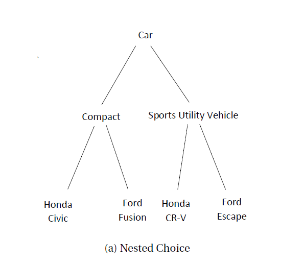

응용계량경제학 필기노트

# Multiple Choice

## Multinomial Response

Y takes values in a finites set,

$$
Y\in \{1,2,...,j\}
$$

선택가능한 옵션들은 **alternatives**라고 부른다.

예를 들어, 한 개인이 서울에서 부산으로 가고자 할 때, 고를 수 있는 옵션은 1: 비행기, 2: 기차, 3: 자가용, 4: 도보(?) 등이 있을 것이다.

The utility of alternative j is assumed to equal

$$
U_j^*=X'\beta_j+\epsilon_j
$$

여기서 $\epsilon_j$는 individual-specific, and contains unobserved factors 들을 포함하는 에러텀이다.

이렇게 정의된 각 alternative의 utility를 기반으로 사용자의 선택을 예측하는 것은 곧,

$$
Y=j,\;if\;U^*_j \geq U^*_l\;(for\;all\;l)
$$

다른 어떤 alternative의 utility보다 j의 utility가 높음을 의미한다.

### Location of $\beta_j$ cannot be identified

앞서 multinomial choice의 alternative가 선택되는 것은 다른 alternatives와의 상대적인 비교를 통해 가장 높은 utility의 alter가 선택되는 것임을 알 수 있었다. 

그렇기 때문에, 곧, $\beta_j$의 절대적인 위치 (location)는 알 수 없다는 것을 뜻하기도 한다.

또 다른 의미로는, 개개인의 특성계수값을 모아놓은 X에 대하여 어떤 상수 $\gamma$를 곱해 더하거나 빼는 것(혹은 전체 utility에 상수를 곱하거나)은 모든 alternative에 동일하게 적용된다 할 때에, 선택에 영향을 줄 수 없음을 뜻한다.

따라서, 우리는 모델을 초기 생성하여 디자인하는데에 있어선, locations들을 normalization 시켜줄 필요성을 느낀다.

첫번째 내지 마지막 번째 등, 특정 alternative의 location을 0으로 함에 따라 normalization을 할 수 있을 것이다.

## Models

### Multinomial Logit

$$
P_j(x)=\frac{exp(x'\beta_j)}{\Sigma \,exp(x'\beta_l)}
$$

alternatives가 두 개 뿐일때, 위의 식은 다시금 binary model의 logit model의 식과 동일하다는 것을 알 수 있다.

#### ㄴLikelihood

곧바로 likelihood에 대해서도 derive를 해보자.

Y의 prob mass function은 아래와 같다.

$$
\displaylines{\pi(Y|X,\beta)=\Pi\, P_j(X|\beta)^{1\{Y=j\}}\newline
l_n(\beta)=\Sigma\Sigma\, 1\{Y_i=j\}\,log\,P_j(X_i|\beta)\newline
\hat\beta=arg\,max\,l_n(\beta)}
$$

본 $\beta$ estimator는 손으로 구할 수 없기 때문에, Stata 상에서는 numerical 한 방법으로 $\hat\beta$를 구해준다. 

#### ㄴMarginal Effect

$$
marginal\; effect\; :\;\frac{\partial}{\partial x}P_j(x)=P_j(x)\,(\beta_j-\Sigma\,\beta_lP_l(x))
$$

Derivation)

$$
\displaylines{P_j(x)=\frac{exp(x'\beta_j)}{\Sigma \,exp(x'\beta_l)}=\frac{exp(x'\beta_j)}{A}\newline
\frac{\partial P_j(x)}{\partial x}=\beta_j exp(x'\beta_j)A^{-1}-exp(x'\beta_j)A^{-1}\Sigma exp(x'\beta_l)\beta_l A^{-1}\newline
=\beta_jP_j-P_j\Sigma P_l\beta_l\newline
=P_j(\beta_j-\Sigma \beta_l P_l)}
$$

### Conditional Logit

교통수단의 비용, 소요시간 등 각각의 alternative 별로 또 다른 attributes들은 어떻게 처리할 것인가? (기존의 multinomial logit의 X는 개개인의 attributes들로 이루어진 벡터였음을 상기하자)

새로이 우리는 alternative-specific regressors를 적용시켜보며, 이를 Conditional Logit Model의 이름으로 발전되어왔다 (McFadden, 1970).

Conditional logit에서는 앞서 언급한 alternative j 별로 다른 특징들을 X에 모두 반영하여 아래와 같은 식을 전개한다.

$$
U_j^*=X_j'\gamma+\epsilon_j
$$

기존의 Multinomial logit과 차이를 비교했을때, Multinomial logit에서는 alternative 별로 $\beta_j$가 달랐다면, Conditional logit에서는 개별 $X_j$가 다르며 $\gamma$는 alternative에 관계 없이 동일하게 유지되는 것을 알 수 있다.

이를 혼용하면 일반적인 아래와 같은 logit 식을 얻을 수 있다.

*allows some regressors X_j to vary across alternatives while other regressors W do not vary across j*

$$
\displaylines{U_j^*=W'\beta_j'+X_j'\gamma+\epsilon_j \newline
\epsilon_j \sim Type\; 1\; Extreme\; Value=exp(-exp(-\epsilon))}
$$

#### ㄴ Likelihood

$$
\displaylines{For \quad P_j(w,x)=\frac{exp(w'\beta_j+x_j'\gamma)}{\Sigma \,exp(w'\beta_l+x_l'\gamma)}\newline\newline
let \quad \theta=(\beta_1,\beta_2,...,\beta_j,\gamma) \newline
then,\quad l_n(\theta)=\Sigma\Sigma\, 1\{Y_i=j\}\,log\,P_j(W_i,X_i|\theta)\newline
\hat\theta=arg\,max\,l_n(\theta)}
$$

본 $\theta$ estimator 또한 손으로 구할 수 없기 때문에, Stata 상에서는 numerical 한 방법으로 $\hat\theta$를 구해준다. 

#### ㄴMarginal Effects

$$
\displaylines{
\delta_{jj}(w,x)= \frac{\partial}{\partial x_j}P_j(w,x)=\gamma P_j(w,x)\,(1-P_j(w,x))\newline

\delta_{jl}(w,x)= \frac{\partial}{\partial x_l}P_j(w,x)=-\gamma P_j(w,x)P_l(w,x)\newline
\newline
AME_{jl}=E[\delta_{jl}(W,X)]
}
$$

Derivation)

$$
\displaylines{

P_j(w,x)=\frac{exp(w'\beta_j+x_j'\gamma)}{\Sigma \,exp(w'\beta_l+x_l'\gamma)}=\frac{exp(w'\beta_j+x_j'\gamma)}{A}\newline\newline
\delta_{jj}(x)=\frac{\partial P_j(w,x)}{\partial x_j}\newline
=\gamma exp(w'\beta_j+x_j'\gamma)A^{-1}-exp(w'\beta_j+x_j'\gamma)A^{-2}exp(w'\beta_j+x_j'\gamma)\newline
=\gamma P_j -P_j^2\gamma =\gamma P_j(1-P_j)\newline\newline

\delta_{jl}(x)=\frac{\partial P_j(w,x)}{\partial x_l}\newline
=-exp(w'\beta_j+x_j'\gamma)A^{-1}exp(w'\beta_l+x_l'\gamma)\gamma A^{-1} \newline
=-\gamma P_jP_l
}
$$

## Independence of Irrelevant Alternatives

Multinomial / Conditional Logit을 사용하는데에 있어 굉장한 threat이 존재하는데, 이는 Independence of Irrelevant Alternatives의 문제이다.

### IIA

서로 다른 두 옵션(alternatives)가 선택될 확률의 상대적인 비율을 계산해보자.

$$
\frac{P_j(W,X)}{P_l(W,X)}=\frac{exp(W'\beta_j+X_j'\gamma)}{exp(W'\beta_l+X_l'\gamma)}
$$

위 식의 값을 결정짓는 변수들은 오롯이 j번째 alternative와 l번째 alternative의 특징들로만 구성 되어있는 것을 확인할 수 있다.

예를 들어 j를 예시의 자동차, l을 기차라고 하자.

하지만 만약 다른 alternative인 k: 비행기의 가격(X_k)이 변화한다고 하자.

이 비행기 가격의 변화가 j와 l의 alternative에 절대적으로 영향을 끼치지 않는다고 단언할 수 있을까? 아니다; 이것이 IIA이다.

IIA를 해결하기 위한 발전된 model 들을 알아보자.

### Nested Logit

이에 대응하는 해결방안 (중 하나)은 alternatives 간에 그룹을 지어주는 것이다. 아래의 그림이 예시가 될 것이다.

*J groups each with $K_j$ alternatives* 라고 일반적인 note가 이루어진다.

$$
U_{jk}^*=W'\beta_{jk}'+X_{jk}'\gamma+\epsilon_{jk}
$$

곧, Nested Logit의 Utility 식은 위와 같이 먼저 j번째 그룹에 대한 아래첨자가 추가되고 그 뒤에 k번째 alternative index가 추가된다고 볼 수 있겠다.

본 모델에서 각 groups 간의 correlation은 없다고 가정한다.

대신, 각 group 내의 alternatives들의 correlation은 dis-similarity parameter, $\tau_j$로 표현된다.

만약, $\tau_j=1$이라면, 이는 곧 그룹 내의 alternatives 간 correlation이 없기 때문에 기존의 conditional logit를 따른다는 것을 의미한다.

모델을 디자인 할 때, 기존의 logit 모델처럼 location의 정규화를 위한 특정 alternative의 location을 0으로 맞춰주는 작업이 필요하다.

*Alternatives with a high(low) degree of substitutability should be placed in the same(different) group.*

$$
Response\;Probability:\;P_{jk}=P_{k|j}P_j
$$

Response Prob은 위와 같은데, 이는 곧 j개의 그룹 중 하나를 선택하고, 그 그룹 내의 k개의 alternatives 중 하나를 고른다는 것을 의미한다고 볼 수 있다.

#### ㄴLimitations

*Typically, there is not a unique obvious structure; consequently any proposed grouping is subject to mis-specification*

