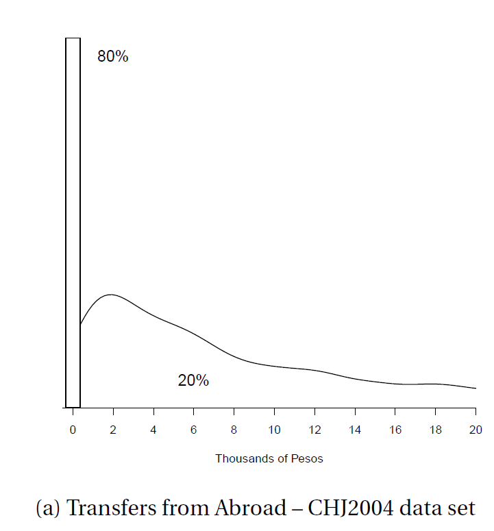
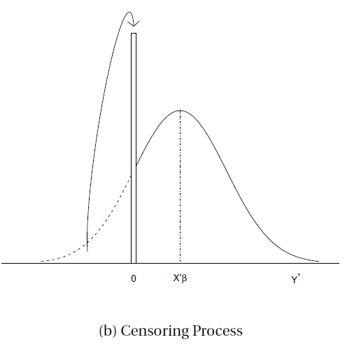
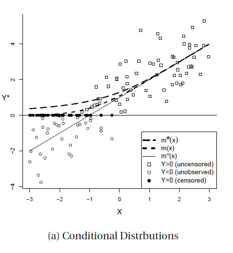

\#Censoring #Tobit #Selection #Heckman's_model

밑바닥 아래의 지하층

# Censoring and Selection

## Censoring

위의 예시 데이터 처럼 0이라는 값에 80%에 육박하는 비중이 몰려있는 상황을 생각해보자.

이 데이터를 어떻게 처리할 것인가? 아래의 그림과 함께 몇가지 옵션을 생각해보자.

1. **Uncensored; m*(x)**: Raw data 상태의 양과 음의 값을 모두 그대로 남겨놓고? 
2. **Censored; m(x)**: 0보다 작은 데이터를 모두 censor하여 0으로 변환시키고? 
3. **Truncated; m#(x)**: 0에 해당하는 데이터들을 모두 버리고(제거하고/자르고)?  

$$
\displaylines{Y^*=X'\beta+e,\quad e \sim N(0,\sigma^2),\quad \frac{e}{\sigma} \sim N(0,1)\newline
\phi(a)=\phi(-a), \quad \Phi(a)=1-\Phi(-a)\newline
E(e|e>\alpha)=\sigma\; \frac{\phi(\alpha/\sigma)}{1- \Phi(\alpha/\sigma)}}
$$

$$
\displaylines{P(Y^*<0|X)=P(e<-X'\beta|X)=\Phi(-X'\beta/\sigma)\newline
P(Y^*>0|X)=1-\Phi(-X'\beta/\sigma)=\Phi(X'\beta/\sigma)}
$$

$$
\displaylines{\text{Then,}\; m^\#(x)=E[Y^\#|X]=E[Y|X,Y>0]\newline
=E[X'\beta+e|X, e>-X'\beta]\newline
=X'\beta+E[e|e>-X'\beta]\newline
=X'\beta+\sigma\; \frac{\phi(-X'\beta/\sigma)}{1- \Phi(-X'\beta/\sigma)}\newline
=X'\beta+\sigma\; \frac{\phi(X'\beta/\sigma)}{\Phi(X'\beta/\sigma)}\newline
\equiv X'\beta+\sigma\lambda(X'\beta/\sigma)}
$$

$$
\displaylines{m(x)=E(Y|X)=0 * \Phi(-X'\beta/\sigma)+\Phi(X'\beta/\sigma)\,m^\#(x)\newline
=\Phi(X'\beta/\sigma)\,m^\#(x) \;\leq m^\#(x)}
$$

$$
\displaylines{Y=max\{Y^*,0\}\geq Y^*\newline
m^*(x)=E(Y^*|X) \leq m(x)=E(Y|X) \leq m^\#(x)
}
$$

위의 그래프를 보면서 정리해보자.

앞서 censoring이라는 것은 본 케이스에선 0 아래의 값들이 0이 되는 것이다. 

0 이상의 값들은 censoring 되지 않는, 곧 uncensored value들이다. 

Truncated 옵션에서는 0 미만의 값들을 0으로 censoring 하는 것이 아닌 아예 missing value 처리하기 때문에, 곧 unobserved value가 될 것이다.

만약 기존의 uncensored value들로만 이루어진(0미만의 값들을 그대로 가져다 쓰는) 모델의 회귀식은 실선(m*(x))과 같은 모습이 나올 것이다.

하지만 censored로 인해 0이 되어버린 값들로 m(x)는 점선과 같은 식을 갖게 되는 것이다.

## Tobit Regression

Tobin(1958)은 censored regression을 maximum likelihood를 통해 새로운 방식을 제안하였다.

Associated Density function

$$
f(y|x)=\Phi(\frac{-x'\beta}{\sigma})^{1\{y=0\}}[\sigma^{-1}\phi(\frac{y-x'\beta}{\sigma})]^{1\{y>0\}}
$$

이때의 likelihood를 최대화 시키는 $\beta와\;\sigma$를 찾는 것이라 할 수 있다.

$$
\displaylines{ln(\beta, \sigma^2)=\Sigma\,log\,f(Y_i|X_i)\newline
=\Sigma(1(Y_i=0)log\Phi(\frac{-X_i'\beta}{\sigma})+1(Y_i>0)log[\sigma^{-1}\phi(\frac{Y_i-X'_i\beta}{\sigma})])\newline
=\Sigma\,log\Phi(\frac{-X'\beta}{\sigma})-\frac{1}{2}\Sigma(log(2\pi\sigma^2)+\sigma^{-1}(Y_i-X'_i\beta)^2)}
$$

본 Associated Density function은 censoring이 일어났다는 것을 감안한 모델이기 때문에 본 likelihood를 통해 나오는 $\beta와\;\sigma$는 앞선 그림의 실선 (m*(x))에 가까운 parameters들이 추정될 것이란 것이다.

## Selection

### Sample Selection Bias

많은 계량경제학 모델은 random sampling임을 가정하지만, 실제로 그럴 가능성은 현저히 낮다.

가장 많이 간과하는 threat은 selection bias 이다.

$$
\displaylines{S=1(X'\gamma+u>0),\; e=\rho u+\epsilon, u\sim N(0,1)\newline

E(Y|X,\; S=1)=X'\beta+E(e|X,S=1)\newline
=X'\beta+E(e|u>-X'\gamma)\newline
=X'\beta+\rho E(u|u>-X'\gamma)
=X'\beta+\rho \frac{\phi(-X'\gamma)}{1-\Phi(-X'\gamma)}\newline
=X'\beta+\rho\frac{\phi(X'\gamma)}{\Phi(X'\gamma)}=X'\beta+\rho\; \lambda(X'\gamma);\;\text{Bias}}
$$

The extent of sample selection bias depends on the magnitude of $\rho$ which is the coefficient from the projection of e on u.
Furthermore, the omitted selection term $\lambda(X'\gamma)$ only impacts estimated marginal effects if the slope coefficients are non-zero.

### Heckman's Model

~~헤크만 아저씨는 어떻게 했는지~~

$$
\displaylines{
Y^*=X'\beta+e\newline
S^*=Z'\gamma+u\newline
S=1\{S^*>0\}\\\\

Y=
\begin{cases}
Y^* & \text{if}\ S=1 \\
missing & \text{if}\ S=0
\end{cases}\newline

}
$$

