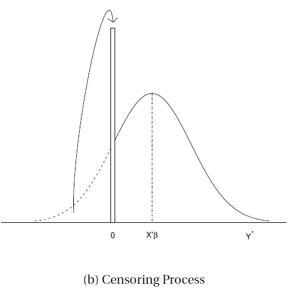
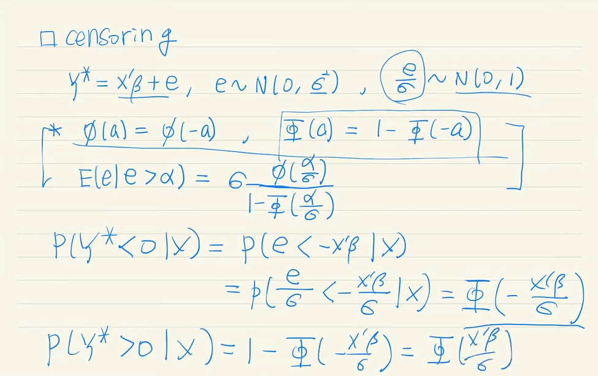

응용계량경제학 필기노트

# Censoring and Selection

## Censoring

위의 예시 데이터 처럼 0이라는 값에 80%에 육박하는 비중이 몰려있는 상황을 생각해보자.

이 데이터를 어떻게 처리할 것인가?

1) 그대로?
2) 0에 해당하는 데이터들을 모두 버리고?

**Censored Regression**은 0이라는 값을 기준으로 0보다 작은 값들을 0으로 치부해버리는 latent $Y^*$ variable을 가정함으로서 **truncated**(잘려진) distribution을 구성하는 것을 의미하며, 대표적으로 Tobin의 Tobit Regression이 있다. 아래와 같은 그림으로 쉽게 이해할 수 있다.

### Tobit Regression

## Selection

