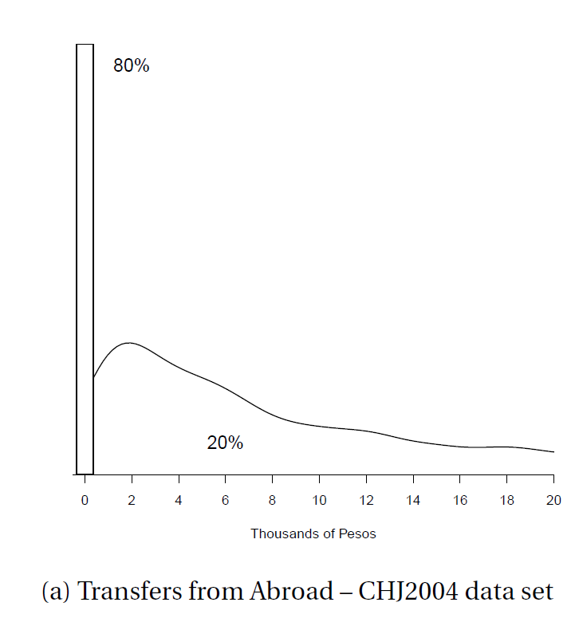

응용계량경제학 필기노트

# Censoring and Selection

## Censoring

위의 예시 데이터 처럼 0이라는 값에 80%에 육박하는 비중이 몰려있는 상황을 생각해보자.

이 데이터를 어떻게 처리할 것인가? 아래의 그림과 함께 몇가지 옵션을 생각해보자.

1) Raw data 상태의 양과 음의 값을 모두 그대로 남겨놓고? (**uncensored; $m^*(x)$**)
2) 0보다 작은 데이터를 모두 censor하여 0으로 변환시키고? (**censored; $m(x)$**)
3) 0에 해당하는 데이터들을 모두 버리고(제거하고/자르고)? (**truncated; $m^#(x)$**)

### Tobit Regression

## Selection

