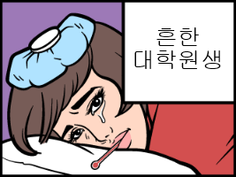
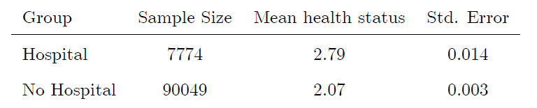

응용계량경제학 필기노트

내가 아는 대학원생은 다들 아프다. ~~This is not a Selection Bias~~

# Treatment Effects and Regression

## Assessing Treatment Effects

*Much of applied econometrics centers around estimating the causal impact of a given treatment*

많은 응용계량경제학의 연구들은 특정 treatment의 효과를 알아보는 것이라고 할 수 있다. 예를 들어, 직역을 해서 환자가 병원에서 받은 치료의 효과, 정책의 효과, 사회현상의 causal inference 등, 다양한 예시가 있을 것이다.  

이러한 Causal Inference는 우리는 방금 언급한 Treatment Effect Estimation, Program Evaluation (특히 정책 효과에 대해) 등으로 부르곤 한다.

## Rubin's Causal Model

루빈은 현대 인과추론(Causal Inference)을 수행하는데 대표적으로 사용되는 Causal Model을 개발하였는데, 크게 두 가지 기반이 되는 basic elements 요소가 있다.

1. **The Notion of Potential Outcomes**
2. **The Assignment Mechanism**

이 두 가지 요소가 여러 복합적인 현실 세계 요소들 사이에서 우리가 정확히 타겟팅하는 treatment의 효과를 찾아낼 수 있게한다. 본 포스팅은 이 두 개의 basic elements들을 narrow down 해볼 것이다.

### 1. The Notion of Potential Outcomes

어떤 treatment의 크기를 측정한다는 것은, 곧 treatment 전후를 비교한다는 뜻이기도 하다. 

그 전후를 각각 binary variable $D_i=0 \;or \;1$이라고 설정해보자; $D_i=0$이라면 ith individual이 treatment를 받지 못한것이고, 1일때에는 받은 것이라고 할 수 있다.

그리고 $Y_i$를 the outcome of interest; 종속변수로서 우리가 treatment를 통해 확인하고자 하는 변수를 Y라고 설정할 것이다. 이는 곧, 아래와 같다.

$$
Y_i=
\begin {cases}
   Y_{1i} & \text{if } D_i=1 & \text{i received the treatment} \\
   Y_{0i} & \text{if } D_i=0 & \text{i did not receive the treatment}
\end {cases}
$$

그렇다면 treatment의 크기는 treatment 전후의 차이, 곧 $Y_{1i}-Y_{0i}$일 것이다.

거시적으로 우리는 나아가 곧 전체 사회 혹은 군집의 평균 Treatment Effect를 알고자 할 것이다. 이는 곧 아래와 같다.

$$
\displaylines
{\text{The (Population) Average Treatment Effect (ATE):} \quad E[Y_{1i}-Y_{0i}] \newline
\text{The (Population) Average Treatment Effect on the Treated (ATT):} \quad E[Y_{1i}-Y_{0i}|D_i=1] \newline}
$$

#### Missing Data Problem

Treatment Effect은 앞선 기본 식처럼 단순한 구조를 갖고 있다.

$$
\text{The (Population) Average Treatment Effect (ATE):} \quad E[Y_{1i}-Y_{0i}]
$$

하지만 이는 곧 우리가 $Y_{1i}$과 $Y_{0i}$를 모두 구해야한다는 것을 의미한다. 그리고 이것은 현실적으로 어렵다. 같은 individual i에 대해 $D_i=0 \;and\; 1$을 모두 측정하는 것은 어렵다는 것이다. 수식으로 이해해보자.

$$
Y_i=Y_{1i}D_i+Y_{0i}(1-D_i)\newline
=Y_{0i}+(Y_{1i}-Y_{0i})D_i
$$

우리가 예를 들어 하나의 시점에만 Y를 측정할 수 있고(대부분의 연구는 이러할 것이며), 이는 곧 개별 individual i에 대해 $D_i$는 고정되어있다는 뜻이다. 따라서,

$$
Y_i^{mis}=
\begin {cases}
   Y_{0i} & \text{if } D_i=1 & \text{i received the treatment} \\
   Y_{1i} & \text{if } D_i=0 & \text{i did not receive the treatment}
\end {cases}
$$

Treatment를 받은 개별에게선 $Y_{0i}$, 받지 않은 상태의 Y를 측정할 수 없고; 반대의 경우도 동일하게 **Missing Data Problem**이 발생한다는 것을 뜻한다.

#### The Temptation and the Seleciton Bias

Missing Data Problem의 한계가 존재한다고 연구와 정책 분석을, Causal Inference가 불가능하란 법도 없는 것이다. 현재의 상태에서 어떻게 최선의 인과분석을 할 수 있을까?

먼저 첫번째 시도해볼법한 Temptation은 individual이 다르더라도 D_i에 따른 그룹별 Y를 비교해보는 것이다. 하지만 아래의 derivation을 통해 우리는 선택편향, **Seleciton Bias**이 발생하는 문제를 마주한다.

$$
\displaylines{
E[Y_i|D_i=1]-E[Y_i|D_i=0]=E[Y_{1i}|D_i=1]-E[Y_{0i}|D_i=0]\newline
=E[Y_{1i}|D_i=1]-E[Y_{0i}|D_i=1]+E[Y_{0i}|D_i=1]-E[Y_{0i}|D_i=0]\newline
=E[Y_{1i}-Y_{0i}|D_i=1]+(\,E[Y_{0i}|D_i=1]-E[Y_{0i}|D_i=0]\,)\newline
\equiv ATT +\text{ Selection Bias}
}
$$

우리가 원하는 결과는 ATT 뿐이었는데, 여기에 Selection Bias라는 항이 추가되었다. 예시를 들어 생각해보자.

우리가 병원에서의 치료; treatment의 효과를 확인하고 싶다고 할때, Missing Data Problem으로 인해 병원치료를 받아보지 않은 그룹($D_i=0$)과 병원치료를 받은 그룹 사이($D_i=0$))의 차이를 통해 treatment effect estmiate을 진행해보자. Angrist와 Pischke의 책에선 아래와 같은 결과를 보이고 있다.

여기서 Y는 Mean Health Status일 것이다(1: excellent ~ 5: poor). 확인을 해보니 Hospital의 Mean Health Status는 No Hospital ($D_i=0$) 그룹의 것이 더 낮았고, 이는 더 좋았다는 것을 의미한다. 해석하면, 병원을 가면 ($D_i=1$) 건강이 나빠진다(?)

이런 결과의 원인은 Selection Bias 때문이다. 앞서 단순 Temptation의 결과는 Treatment Effect, ATT 뿐만 아니라 Selection Bias 항까지 추가되어 나오는 것을 알 수 있다. 따라서 Selection Bias로 인해 병원을 가면 건강이 더 나빠진다는 잘못된 해석이 유도될 수 있다는 것이다.

#### Selection Bias in Regression Context; Endogeneity

$$
\displaylines{\text{Assume }\;Y_{1i}-Y_{0i}=\rho \quad \forall i \newline\newline

Y_i=(Y_{1i}-Y_{0i})D_i+Y_{0i}\newline
=E[Y_{0i}]+(Y_{1i}-Y_{0i})D_i+(Y_{0i}-E[Y_{0i}])\newline
\equiv \alpha + \rho D_i+\eta_i\\\\

\text{Then,}\quad E[Y_i|D_i=1]=\alpha + \rho +E[\eta_i|D_i=1]\newline
E[Y_i|D_i=0]=\alpha + E[\eta_i|D_i=0]\\\\

\text{Then, the Treatment Effect is}\quad E[Y_i|D_i=1]-E[Y_i|D_i=0]=\rho +E[\eta_i|D_i=1]-E[\eta_i|D_i=0]}
$$

위 식은 Regression 맥락에서 Selection Bias를 설명하는 Derivation이다. 

여기서 지적되는 부분은 곧, Regression의 Endogeneity Issue가 없기 위해선 오차항($\epsilon$), 여기서는 $E[\eta_i\|D_i=1]-E[\eta_i\|D_i=0]$ 항이 다른 변수(especially D)와의 correlation이 없어야한다는 것이다. 즉 $E[\eta_i\\|D_i]=0$이어야 한다. 

만약 0이 아닐 경우? 이는 Endogeneity Issue가 존재하는 것이고, $E[\eta_i\|D_i=1]-E[\eta_i\|D_i=0]=E[Y_i\|D_i=1]-E[Y_i\|D_i=0]$이 0이 아니라는 것이며, 즉 앞서 유도된 Selection Bias가 존재한다는 것과 동치이다.

***The goal of applied econometrics is to control for selection bias***

Missing Data Problem으로 시작된 인과추론의 제약은 대표적으로 Selection Bias의 문제로 이어졌다. 

Selection Bias로 자칫 잘못하면 우리는 병원이 더 건강을 악화시키는 곳으로 생각할 수 있으며, 이외에도 다양한 잘못된 추론을 할 것이다. 

곧, 응용계량경제학에서 대다수의 Causal Inference의 목표는 정확한 Treatment Effect Estimation을 위한 Selection Bias를 최소화하는 것이라고 할 수 있다.

### 2. The Assignment Mechanism

현재까지 우리는 Causal Inference의 가장 큰 난관이 Selection Bias임을 이해해보았다. 

Selection Bias를 극복해내기 위해서 Rubin's Causal Model은 두번째 key element로 Assignment Mechanism; i.e., how individual are chosen to receive the treatment (or not)을 내세우고 있다.

세가지 Broad한 옵션들이 있다. 자세한 내용은 아래에서 이어가자.

1. Randomized Experiments
   1. random은 곧 Endogeneity, correlation 등의 문제에서 자유로울 것이다.
   2. 하지만 experiment를 진행하는데에 있어 비용측면에 큰 문제가 있다. 비싸다.
2. Unconfounded Assignments
   1. *selection on observables*; 즉 우리가 관찰하고 있는 여러 변수들 (X) 상에서 selection이 일어났다는 것이다.
   2. 따라서, 우리가 관측하는 X를 모두 control 하면 Bias를 최소화할 수 있을것이라는 접근이다.
   3. ex. Matching, Regression
   4. controversial; 바로 후술되는 selection on unobservables, selection은 관측되지 않는 범주에서 발생할 수 있다는 주장과 충돌되기 때문에, 최근까지도 본 접근을 통한 인과추론 연구들은 많은 논쟁에 시달리고 있다.
3. All other assignment mechanisms (selection on unobservables)
   1. Selection은 우리가 관측할 수 없는 범주에서 일어날 가능성이 높다는 것을 전제로 하는 접근이다.
   2. 그래서 2의 unconfounded assignments처럼 assignment의 형태를 띄지만, 최대한 실험에 가까운, 준하는 성격에 다가가고자 하는 것이다.
   3. quasi-experiments, 준실험이 이 옵션에 해당한다고 볼 수 있다.
   4. ex. IV, DiD, RD, S.C.

#### A. Randomized Experiments

앞서 우리는 Selection Bias의 개념을 공부하였고, 수식으로 $E[\eta_i\|D_i=1]-E[\eta_i\|D_i=0]=E[Y_i\|D_i=1]-E[Y_i\|D_i=0]$임을 보인 바 있다. 

Randomized Experiment에서는 자명히 conditional expectation이 각 조건에 따라 영향을 받지 않기 떄문에 위 Selection Bias가 0이 되는 것을 알 수 있다. 

즉, Randomized Experiment는 모든 경제학자들이 동의하는 Selection Bias가 control되는 최고의 조건이다.

하지만 동시에 자명히, 실제 현실세계에서 randomized experiment를 진행하는 것은 너무나 어렵다는 것을 금방 이해할 수 있다.

예를 들어 어떠한 정책이나 프로모션 등 treatment effect를 확인하고자 하는 그 treatment를 $D_i$처럼 0과 1로 (실험)참가자들을 구분시키는데에 한계가 있다는 것이다.

구분시키는데에 성공하더라도 현대사회에서 manipulated된 두 그룹 사이의 소통을 단절시키는 것 또한 불가능할 것이다. 두 그룹 사이의 interaction이 조금이라도 발생한다면 이것이 randomized experiment의 manipulation이라고 볼 수 있을까?

윤리적, 도의적인 문제도 존재한다. 특히 정책에 대해서 진행을 한다고 하면, 같은 시점 내에서 몇몇 시민들은 정책의 특혜를 받고 어떤 시민들은 배제되는 등, 진행 자체에 대한 세간의 평가도 의식해야 할 것 이다. 

즉, 어렵다.

#### B. Unconfounded Assignments

#### C. All other assignment mechanisms

