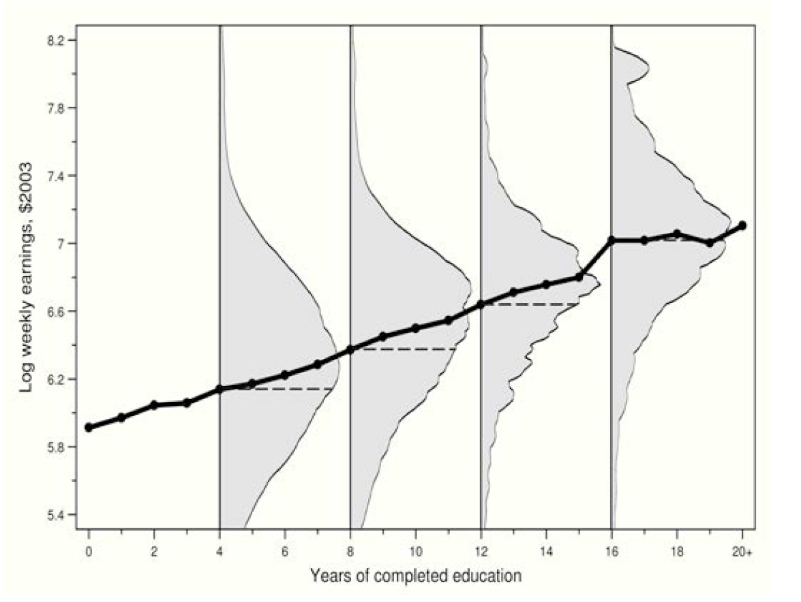

#regression_anatomy #CIA #OVB

조건부

# CEF

~~???: *여러분 공부하는거,, 잘 생각해보시길 바랍니다!*~~

대표적인 CEF이다. 교육연수(X)에 따라 연봉 값(Y)이 달라지는, 즉 X에 따라 Y의 기댓값 E[Y]가 달라지는 $E[Y\|X]$; CEF라고 볼 수 있다.

## Properties of the CEF

결론은 linear CEF 짱짱맨

각 property의 인덱스는 AP의 수식 인덱스를 따름을 알립니다.

### 3.1.1. The CEF-Decomposition Property

Regression 상에서 Y는 곧 X로 1) 설명가능한 항과, 2) 그렇지 못한 항으로 Decomposed 된다는 것이다.

따라서, 그렇지 못한 항, 즉 error-term은 설명가능한 항과는 아무런 correlation이 없어야 하며, 이것은 곧 mean independent; uncorrelated를 의미한다.

$$
\displaylines{\text{The CEF-Decomposition Property}\newline
Y_i=E[Y_i|X_i]+\epsilon_i \newline
i)  \epsilon_i \text{is mean independent of }X_i\,; E[\epsilon|X]=0 \newline
ii)  \epsilon_i  \text{is uncorrelated with any function of} X_i}
$$

pf.

$$
\displaylines{i)\quad For\quad Y=E[Y|X]+\epsilon \newline
Note,\quad E[\epsilon|X]=0 \newline
Then,\quad E[\epsilon|X]=E[Y-E[Y|X]|X]=E[Y|X]-E[Y|X]=0 \newline \newline
ii)\quad let h(X_i) \text{is a function of} X_i\newline
E[h(X)\,\epsilon]=E\{h(X)\,E[\epsilon|X]\}=0, \;\text{since } E[\epsilon|X]=0}
$$

### 3.1.2. The CEF-Prediction Property

Y를 설명하는 가장 좋은 Predictor로서의 X의 함수는 CEF라는 것이다; 여기서 '가장 좋은'이라 함은 MSE가 가장 작은 것을 의미한다.

$$
\displaylines{\text{The CEF-Prediction Property}\newline
E[Y|X]=arg\,min\,E[(Y-m(X))^2]\newline
\text{i.e., the CEF is the minimum mean squared error (MMSE) predictor of }Y_i}
$$

pf.

$$
\displaylines{(Y-m(X))^2=((Y-E[Y|X])+(E[Y|X]-m(X)))^2\newline
=(Y-E[Y|X])^2+2(Y-E[Y|X])(E[Y|X]-m(X))+(E[Y|X]-m(X))^2\newline\newline
\text{The first and second term do not affect; while the last term be minimzed where}\; Y \;\text{equals}\; m(X)}
$$

### 3.1.3. The ANOVA Theorem

3.1.1.의 연장선에서 Y의 분산은 1) X로 설명되는 항과, 2) Residual로 설명되는 항으로 Decompose될 수 있다는 Property이다.

두번째 항이 Residual이라는 것은 쉽게 유추할 수 있다. 분산의 정의를 고려할때, X로 설명되지 않았기 때문에 존재하는 잔차들의 분산이 $V(Y_i\|X_i)$이기 때문.

$$
\displaylines{\text{The  ANOVA  Theorem}\newline
V(Y_i)=V(E[Y_i|X_i])+E[V(Y_i|X_i)]}
$$

pf.

$$
\displaylines{V(Y)=V(E[Y|X]+\epsilon)=V(E[Y|X])+V(\epsilon)\newline
\text{Note, } E[Y|X] \text{ and } \epsilon \text{ are not correlated.}\newline\newline
\text{Then, the  variance  of }  \epsilon  \text{ is}\newline
E[\epsilon^2]=E[E[\epsilon^2|X]]=E[V[Y|X]]\newline
Note, E[\epsilon]\newline
Thus, V(Y)=V(E[Y|X])+E[V[Y|X]]}
$$

### 3.1.4. The Linear CEF Theorem

3.1.2.에서 우리는 Y를 예측(Predict)하는 가장 좋은 함수는 CEF라는 것을 보인 바 있다. 3.1.2. 식의 상에서 m(X)는 X와 관련된 어떠한 임의의 함수도 가능하지만, 우리는 X에 대한 linear function으로, 곧 X'b라는 단순한 모델로 접근해보고자 한다.

3.1.4. The Linear CEF Theorem는 즉 CEF가 선형함수라고 가정하면, 전체 population에 대한 regression function이 동일한 선형함수라는 것이다.

$$
\displaylines{\text{The  Linear  CEF  Theorem  (Regression-justification I)}\newline
\text{Suppose  the  CEF  is  linear;  then  the  population  regression  function  is  it.}}
$$

pf.

$$
\displaylines{\text{Suppose }  E[Y|X]=X'\beta^*;\newline
\text{Since, }  E[X(Y-E[Y|X])]=0 \text{ by CEF-Decomposition property (3.1.1)}\newline
\text{Then, by substitution, } E[X(Y-E[Y|X])]=E[X(Y-X'\beta^*)]=E[XY-XX'\beta^*]=0\newline
\text{Thus, } \beta^*=E[XX']^{-1}E[XY], \text{ which refers }\beta \text{ (the estimator for the population)}}
$$

### 3.1.5. The Best Linear Predictor Theorem

*Regression solves the population least squares problem and is therefore the BLP of Yi given Xi*

즉, 전체 population에 대한 regression은 곧 반대로 CEF에게도 Best Linear Predictor라는 것이다.

$$
\displaylines{\text{The  Best Linear Predictor  Theorem  (Regression-justification II)}\newline

\text{The  function } X'\beta  \text{ is  the  best  linear  predictor  of  }Y \text{ given } X  \text{ in  a  MMSE  Sense.}}
$$

pf.

$$
\displaylines{\beta \text{ is being  defined  for  solving } arg\,\underset b min\,E[(Y-X'b)^2]\newline
\beta=E[XX']^{-1}E[XY]\newline
\text{Derivation  of  the  }\hat\beta  \text{ at the  population  regression  would  not  be  necessary.}}
$$

### 3.1.6. The Regression-CEF Theorem

3.1.4.와 3.1.5.의 결과를 통해 우리는 Regression의 결과인 $\beta$가 CEF에 대해서도 가장 좋은 predictor임을 확인할 수 있다.

$$
\displaylines{\text{The  Regression-CEF  Theorem  (Regression-justification III)}\newline
\text{The  function } X'\beta  \text{ provides the MMSE linear approximation to }E[Y|X],\text{ that is,}\newline
\beta=arg\,\underset b min\,E\{(E[Y|X]-X'b)^2\}}
$$

pf.

$$
\displaylines{(Y-X'b)^2=\{(Y-E[Y|X])+(E[Y|X]-X'b)\}^2\newline
=(Y-E[Y|X])^2+(E[Y|X]-X'b)^2+2(Y-E[Y|X])(E[Y|X]-X'b)\newline\newline}
$$

$$
\displaylines{\text{The  first  term  does  not  involve  b,  and  the  last  term  has  expectation  zero  by  CEF-decomposition  property  (3.1.2).}\newline
\text{Thus,  only  second  term  has  left,  and  the  solution  is  same  as  the  population  least  squares  problem, which is,}\newline
\beta=E[XX']^{-1}E[XY]\newline
}
$$

3.1.6. The Regression-CEF Theorem을 통해, Y라는 전체 population의 거대한 데이터 대신, $E[Y\|X]$에 weightening으로 adjust만 해주면 정확히 동일한 $\beta$를 구할 수 있다는 것이다.

## Regression Anatomy

Anatomy, 즉 Regression을 해부하는 narrow down을 시도하는 것이다.

### Bivariate Reg.

$$
\displaylines{min\underset{a,b} E{[Y_i-a-bx_i]^2}\newline\newline
\text{by F.O.C.,}\; \alpha=E[Y_i-\alpha-bx_i]=0\newline
\beta=E{[Y_i-\alpha-\beta x_i]x_i}=0\newline\newline
\text{Thus,}\;\alpha=E[Y_i]-\beta E[X_i]\newline
\beta=\frac{Cov(x_i,y_i)}{V(x_i)}}
$$

### Multi-variate Case

the k-th non-constant slope coefficient is:

$$
\beta_k=\frac{Cov(Y_i,\tilde x_{ki})}{Var(\tilde x_{ki})}
$$

where $\tilde x_{ki}$ is the residual from regressing $x_{ki}$ on all the other covariates.

## Causality and Endogeneity

***Regression이 인과관계에 대한 인사이트를 줄 수 있는가?***

우리는 앞서 CEF가 MMSE 측면에서 population regression에 가장 좋은 설명력을 가진다는 것을 확인하였다.

하지만, 모든 Regression이 항상 인과관계를 설명해줄 수는 없을 것이다. 후술할 Endogeneity Issues 때문이다.

AP는 아래와 같이 설명하였다.

*"the CEF is causal when it describes differences in **average potential outcomes for a fixed reference population**"*

의역하면 곧, 동일 individual에 대해 treatment가 없고 있고의 차이가 비교된 값들의 평균이어야 하며, 즉 Selection bias가 없어야 한다는 것이다.

Endogeneity Issues는 다음과 같은 원인으로 발생할 수 있다.

- **Omitted Variables (Bias)**
  - Y에 영향을 주는 관측하지 못한 (unobservable) 변수가 regression이 포함되지 않았을때, 
  - 그 상황에서 기존의 X와 correlation이 존재하면 곧 error term과 correlation이 발생하여 OVB가 발생한다.
- Measurement Error
- Simultaneity

최악은, 위의 세가지 이유가 배타적이라 아니라 전부 발생할수도 있다는 점이다.

### OVB Example: The Returns to College

*The classic example of treatment endogeneity in the labor literature is in measuring the returns to college (C_i=0,1)*

$$
\displaylines{
E[Y_i|C_i=1]-E[Y_i|C_i=0]=E[Y_{1i}|C_i=1]-E[Y_{0i}|C_i=0]\newline
=E[Y_{1i}-Y_{0i}|C_i=1]+(\,E[Y_{0i}|C_i=1]-E[Y_{0i}|C_i=0]\,)\newline
\equiv ATT +\text{ Selection Bias}
}
$$

대표적으로 발생할 수 있는 연봉과 학력 수준 사이의 regression 사이의 OV는 *ability* 이다.

ability는 직업과 연봉을 결정짓는 가장 중요한 변수중 하나라고 할 수 있지만, 측정의 어려움 등으로 인해 기존의 회귀식에서 빠진채 진행이 되었다.

그리고 단순한 추측으로 예컨데, 이번 regression 식에서의 측정된 Effect 크기인 ATT + Selection Bias에서는 둘 다 양의 값을 가질 것이라 예상해볼 수 있다.

$$
\text{Selection Bias : }\;E[Y_{0i}|C_i=1]-E[Y_{0i}|C_i=0]>0
$$

본 selection bias 항을 해석해보자면, C라는 조건에 따라, 즉 대학에 간 사람들과 대학에 가지 않은 사람들이, 만약 모두 대학에 가지 않았더라도 연봉의 차이는 존재할 것이라는 유추를 해볼 수 있다. 능력의 차이가 있기 때문이다. 

조금더 설명을 붙여보자면, 학력이 높은 개인들은 능력 또한 높을 것이란 상관관계를 추측해볼 수 있다. 

즉, 능력, *ability*는 Omitted Variable이다.

## Conditional Independence Assumption (CIA)

### At the Binary setting

$$
\displaylines{\text{Randomized Experiment : }\;\{Y_{0i},Y_{1i}\}\perp\!\!\!\perp C_i\newline
\text{CIA : }\;\{Y_{0i},Y_{1i}\}\perp\!\!\!\perp C_i|X_i}
$$

***CIA means that $C_i$ is "as good as randomly assigned,"conditional on $X_i$ , and thus the selection bias vanishes.***

CIA는 오히려 the conditioning variables, $X_i$를 통제함으로써 (regression에 포함시킴으로써) $C_i$의 randomness를 충족시키고 이를 통해 Selection Bias를 제거한 Treatment Effect를 찾자는 것이다.

일종의 Fixed Effect라고 볼 수도 있다.

그렇다면 어떤 변수가 conditioning variables, $X_i$가 될 수 있을까?

***Proxies for known omitted variables are obvious candidates.***

보통 유관한 변수들을 추가한다. 예를 들어, 앞선 예시의 ability라는 측정하기 어려운 OV를 대신하여 X로 IQ를 일종의 프록시(간접변수)로 사용할 수 있을 것이다.

$C_i\|X_i$가 Y와 독립이기 때문에 두번째 행에서 세번째로 넘어갈때에 제약이 없고, Selection Bias가 없는 Treatment Effect의 효과를 확인할 수 있다.

$$
\displaylines{
E[Y_i|X_i,C_i=1]-E[Y_i|X_i,C_i=0]\newline
=E[Y_{1i}|X_i,C_i=1]-E[Y_{0i}|X_i,C_i=0]\newline
=E[Y_{1i}|X_i,C_i=1]-E[Y_{0i}|X_i,C_i=1]\newline
=E[Y_{1i}-Y_{0i}|X_i,C_i=1]=E[Y_{1i}-Y_{0i}|X_i]
}
$$

직접 예시를 통해 해석해보자. 앞선 예시의 IQ를 controlling variable을 통제한다고 하자. 

같은 IQ를 가진 참가자들이 대학을 가고 안가고는 취향 차이라는, Selection Bias를 최대한 통제한다고 볼 수 있을것이다. 

따라서, 두번째 행에서 세번째로 넘어갈때, 대학을 가고 안가고는 IQ가 같은 사람들끼리는 큰 상관이 없기 때문에, 제약이 없다고 가정하며, 이를 통해 우리가 원하는 Treatment Effect를 포착할 수 있다는 것이다.

$$
\text{ATT : }E\{E[Y_{1i}-Y_{0i}|X_i]|C_i=1\}=E[Y_{1i}-Y_{0i}|C_i=1]
$$

IQ와 같이 각 controlling variable 값 별로 treatment effect가 통제된 개별 값이 있기 때문에, ATT는 곧 이에 대해 controlling variable에 대한 분포를 기반한 weigthened average를 통해 구할 수 있다.

조금 더 예를 ~~막~~ 나아가보면, IQ가 예를 들어 100을 평균으로 하는 일종의 정규분포를 따른다면, IQ 별 Treatment Effect를 나열하지 말고 정규분포를 토대로 전체 population의 Treatment Effect를 유추해볼 수 있다는 뜻이다.

### Extending CIA to Non-Binary setting

Treatment가 항상 앞선 예시의 대학을 가고 안가고 처럼 0과 1로만 나누어져 있지는 않을 것이다. 

예를 들어 변수가 교육 연수에 해당한다면, 0부터 일반적으로 12나 16 ~~여기서 멈출걸~~  혹은 20+도 있을 것이다.

Extension에서 Potential outcomes는 아래와 같을 것이다. Extension들의 유도와 해석은 앞선 그것과 동일하다.

$$
\displaylines{Y_{s,i}=f_i(s)\newline
\text{Then, CIA: }\; Y_{si}\perp\!\!\!\perp s_i|X_i\quad \forall s}
$$

$$
\displaylines{
E[f_i(12)|X_i,s_i=12]-E[f_i(11)|X_i,s_i=11]\newline
=E[f_i(12)|X_i,s_i=12]-E[f_i(11)|X_i,s_i=12]\newline
=E[f_i(12)-f_i(11)|X_i,s_i=12]=E[f_i(12)-f_i(11)|X_i]
}
$$

$$
\text{ATT : }E\{E[f_i(12)-f_i(11)|X_i]|s_i=12\}=E[f_i(12)-f_i(11)|s_i=12]
$$

### The Regression Context

$$
\displaylines{Y_{s,i}=f_i(s)=\alpha+\rho s+\eta_i \newline
\text{in the CIA: }\; Y_{si}\perp\!\!\!\perp s_i|X_i\quad \forall s \newline
}
$$

여기서 위 식의 error term인 $\eta$를 자세히 살펴보자 (decompose).

$$
\displaylines{\eta_i=X_i'\gamma+\nu_i \newline
\text{Then, } E[\eta_i|X_i]=X_i'\gamma, \text{ and } E[\nu_i|X_i]=0 \text{ by decomposition property}\\\\

\text{CIA implies: } E[Y_{s,i}|X_i, s_i]=E[Y_{s,i}|X_i]\newline
=\alpha+\rho s+E[\eta_i|X_i]=\alpha+\rho s+X_i'\gamma
\\\\
\text{Thus, } Y_i=\alpha+\rho s+X_i'\gamma+\nu_i \newline
\text{satisfying \;}E[\nu_i|X_i,s_i]=0}
$$

$\eta$는 OVB로 인해 X와 correlation이 있을수도 있고 없을 수도 있다. 

첫번째 파트에서는 $\eta$를 따라서 decompose 하여 X로 설명가능한 부분(correlation 존재)과 그렇지 않은 부분으로 나누었을때를 보여주고 있는 것이다.

두번째 파트에서는 CIA는 X를 통제하기 때문에, 앞선 Y의 식을 유도하며 $\eta$를 X로 설명 가능한 파트만 남겨놓을 수 있다는 걸 보여주고 있다.

따라서 마지막 파트에서는 결국, X로도 설명할 수 없는 $\nu$를 남겨놓고 (mean independence 만족) Y를 X에 대해 완벽하게 decompose할 수 있다는 것을 보이고 있다.

결론적으로, CIA를 통해 기존의 s 뿐만 아니라 X 또한 regression에 포함시켜 진행하면, OVB를 최대한 control 해볼 수 있다는 것이다.

## Omitted Variables Bias (OVB)

$$
\displaylines{Y_{i}=\alpha+\rho s_i+A_i'\gamma +\epsilon_i \newline
\text{by Regression Anatomy, \;}\frac{Cov(Y,s)}{Var(s)}=\rho+\gamma'\delta_{As}\\\\

\frac{Cov(Y,s)}{Var(s)}=\frac{Cov(\alpha+\rho s_i+A_i'\gamma +\epsilon_i, \; s_i)}{Var(s)}\newline
=\frac{\rho Var(s)}{Var(s)}+\frac{\gamma' Cov(A, s)}{Var(s)}\equiv\rho+\gamma'\delta_{As}
}
$$

*where $\delta_{As}$ is the vector of coefficients from regressions of the elements of A on s*

$\rho$만 있어야하는 기본 anatomy에서, $\gamma'\delta_{As}$ 항이 추가 되었다. 이것이 OVB라고 할 수 있다.
