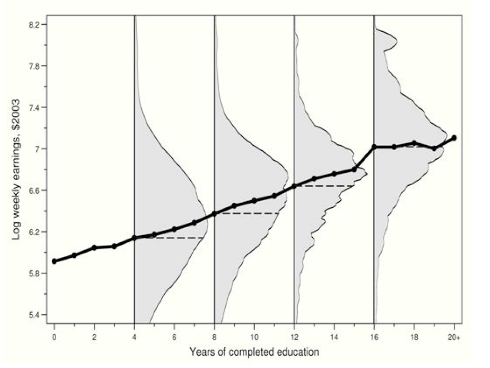

응용계량경제학 필기노트

첫 필기노트와 같은 스티커, 다른 생각.

# Conditional Expectation Function (CEF)

???: *여러분 공부하는거,, 잘 생각해보시길 바랍니다!*

대표적인 CEF이다. 교육연수(X)에 따라 연봉 값(Y)이 달라지는, 즉 X에 따라 Y의 기댓값 E[Y]가 달라지는 $E[Y\|X]$; CEF라고 볼 수 있다.

## Properties of the CEF

결론은 linear CEF 짱짱맨

각 property의 인덱스는 AP의 수식 인덱스를 따름을 알립니다.

### 3.1.1. The CEF-Decomposition Property

Regression 상에서 Y는 곧 X로 1) 설명가능한 항과, 2) 그렇지 못한 항으로 Decomposed 된다는 것이다.

따라서, 그렇지 못한 항, 즉 error-term은 설명가능한 항과는 아무런 correlation이 없어야 하며, 이것은 곧 mean independent; uncorrelated를 의미한다.

$$
\displaylines{\text{The\;CEF-Decomposition\;Property}\newline
Y_i=E[Y_i|X_i]+\epsilon_i \newline
i)\; \epsilon_i\;\text{is\;mean\;independent\;of\;}X_i\,;\;E[\epsilon|X]=0 \newline
ii)\; \epsilon_i\; \text{is\;uncorrelated\;with\;any\;function\;of}\;X_i}
$$

pf.

$$
\displaylines{i)\quad For\quad Y=E[Y|X]+\epsilon \newline
Note,\quad E[\epsilon|X]=0 \newline
Then,\quad E[\epsilon|X]=E[Y-E[Y|X]|X]=E[Y|X]-E[Y|X]=0 \newline \newline
ii)\quad let\;h(X_i)\;is\;a\;function\;of\;X_i\newline
E[h(X)\,\epsilon]=E\{h(X)\,E[\epsilon|X]\}=0,\;since\;E[\epsilon|X]=0}
$$

### 3.1.2. The CEF-Prediction Property

Y를 설명하는 가장 좋은 Predictor로서의 X의 함수는 CEF라는 것이다; 여기서 '가장 좋은'이라 함은 MSE가 가장 작은 것을 의미한다.

$$
\displaylines{\text{The\;CEF-Prediction\;Property}\newline
E[Y|X]=arg\,min\,E[(Y-m(X))^2]\newline
\text{i.e., the CEF is the minimum mean squared error (MMSE) predictor of }Y_i}
$$

pf.

$$
\displaylines{(Y-m(X))^2=((Y-E[Y|X])+(E[Y|X]-m(X)))^2\newline
=(Y-E[Y|X])^2+2(Y-E[Y|X])(E[Y|X]-m(X))+(E[Y|X]-m(X))^2\newline\newline
The\;first\;and\;second\;term\;do\;not\;affect;\;while\;the\;last\;term\;be\;minimzed\;where\;Y\;equals\;m(X)}
$$

### 3.1.3. The ANOVA Theorem

3.1.1.의 연장선에서 Y의 분산은 1) X로 설명되는 항과, 2) Residual로 설명되는 항으로 Decompose될 수 있다는 Property이다.

두번째 항이 Residual이라는 것은 쉽게 유추할 수 있다. 분산의 정의를 고려할때, X로 설명되지 않았기 때문에 존재하는 잔차들의 분산이 $V(Y_i\|X_i)$이기 때문.

$$
\displaylines{\text{The\; ANOVA\; Theorem}\newline
V(Y_i)=V(E[Y_i|X_i])+E[V(Y_i|X_i)]}
$$

pf.

$$
\displaylines{V(Y)=V(E[Y|X]+\epsilon)=V(E[Y|X])+V(\epsilon)\newline
Note,\;E[Y|X]\;and\;\epsilon\;\text{are\;not\;correlated.}\newline\newline
\text{Then,\;the\; variance\; of}\; \epsilon\; \text{is}\newline
E[\epsilon^2]=E[E[\epsilon^2|X]]=E[V[Y|X]]\newline
Note,\;E[\epsilon]\newline
Thus,\;V(Y)=V(E[Y|X])+E[V[Y|X]]}
$$

### 3.1.4. The Linear CEF Theorem

3.1.2.에서 우리는 Y를 예측(Predict)하는 가장 좋은 함수는 CEF라는 것을 보인 바 있다. 3.1.2. 식의 상에서 m(X)는 X와 관련된 어떠한 임의의 함수도 가능하지만, 우리는 X에 대한 linear function으로, 곧 X'b라는 단순한 모델로 접근해보고자 한다.

3.1.4. The Linear CEF Theorem는 즉 CEF가 선형함수라면, 전체 population에 대한 regression function이 동일한 선형함수라는 것이다.

$$
\displaylines{\text{The\; Linear\; CEF\; Theorem\; (Regression-justification\;I)}\newline
\text{Suppose\; the\; CEF\; is\; linear;\; then\; the\; population\; regression\; function\; is\; it.}}
$$

pf.

$$
\displaylines{\text{Suppose}\; E[Y|X]=X'\beta^*;\newline
\text{Since,}\; E[X(Y-E[Y|X])]=0\;\text{by\;CEF-Decomposition\;property\;(3.1.1)}\newline
\text{Then,\;by\;substitution,}\;E[X(Y-E[Y|X])]=E[X(Y-X'\beta^*)]=E[XY-XX'\beta^*]=0\newline
\text{Thus,}\;\beta^*=E[XX']^{-1}E[XY],\;\text{which\;refers\;}\beta\;\text{(the\;estimator\;for\;the\;population)}}
$$

### 3.1.5. The Best Linear Predictor Theorem

*Regression solves the population least squares problem and is therefore the BLP of Yi given Xi*

즉, 전체 population에 대한 regression은 곧 반대로 CEF에게도 Best Linear Predictor라는 것이다.

$$
\displaylines{\text{The\; Best\;Linear\;Predictor\; Theorem\; (Regression-justification II)}\newline

\text{The\; function\;} X'\beta\; \text{is\; the\; best\; linear\; predictor\; of\; }Y\; given\; X\; \text{in\; a\; MMSE\; Sense.}}
$$

pf.

$$
\displaylines{\beta\;\text{is\;being\; defined \;for\; solving}\;arg\,\underset b min\,E[(Y-X'b)^2]\newline
\beta=E[XX']^{-1}E[XY]\newline
\text{Derivation\; of\; the\; }\hat\beta\; \text{at\;the\; population\; regression\; would\; not\; be\; necessary.}}
$$

### 3.1.6. The Regression-CEF Theorem

Regression의 결과인 $\beta$는 CEF에 대해서도 가장 좋은 predictor이다.

$$
\displaylines{\text{The\; Regression-CEF\; Theorem\; (Regression-justification III)}\newline
\text{The\; function\;} X'\beta\; \text{provides\;the\;MMSE\;linear\;approximation\;to\;}E[Y|X],\text{\;that\;is,}\newline
\beta=arg\,\underset b min\,E\{(E[Y|X]-X'b)^2\}}
$$

pf.

$$
\displaylines{(Y-X'b)^2=\{(Y-E[Y|X])+(E[Y|X]-X'b)\}^2\newline
=(Y-E[Y|X])^2+(E[Y|X]-X'b)^2+2(Y-E[Y|X])(E[Y|X]-X'b)\newline\newline}
$$

$$
\displaylines{\text{The \;first\; term\; does\; not\; involve\; b,\; and\; the\; last\; term\; has\; expectation\; zero\; by\; CEF-decomposition\; property \;(3.1.2).}\newline
\text{Thus,\; only\; second\; term\; has\; left,\; and\; the\; solution\; is\; same\; as\; the\; population\; least\; squares\; problem,\;which\;is,}\newline
\beta=E[XX']^{-1}E[XY]\newline
}
$$

3.1.2. Y를 설명하는 가장 좋은 Predictor로서의 X의 함수는 CEF라는 것이다

3.1.4. The Linear CEF Theorem는 즉 CEF가 선형함수라면, 전체 population에 대한 regression function이 동일한 선형함수라는 것이다.

3.1.5. 즉, 전체 population에 대한 regression은 곧 반대로 CEF에게도 Best Linear Predictor라는 것이다.

3.1.6. Regression의 결과인 $\beta$는 CEF에 대해서도 가장 좋은 predictor이다.

따라서 이 properties들의 의미는 (특히 3.1.6. The Regression-CEF Theorem을 통해), Y라는 전체 population의 거대한 데이터 대신, E[Y|X]에 weightening으로 adjust만 해주면 정확히 동일한 $\beta$를 구할 수 있다는 것이다.

## Regression Anatomy

Anatomy, 즉 Regression을 해부하는 narrow down을 시도하는 것이다.

### Bivariate Reg.

$$
\displaylines{min\underset{a,b} E{[Y_i-a-bx_i]^2}\newline\newline
\text{by F.O.C.,\;} \alpha=E[Y_i-\alpha-bx_i]=0\newline
\beta=E{[Y_i-\alpha-\beta x_i]x_i}=0\newline\newline
\text{Thus,}\;\alpha=E[Y_i]-\beta E[X_i]\newline
\beta=\frac{Cov(x_i,y_i)}{V(x_i)}}
$$

### Multi-variate Case

the k-th non-constant slope coefficient is:

$$
\beta_k=\frac{Cov(Y_i,\tilde x_{ki})}{Var(\tilde x_{ki})}
$$

where $\tilde x_{ki}$ is the residual from regressing $x_{ki}$ on all the other covariates.

## Causality and Endogeneity

***Regression이 인과관계에 대한 인사이트를 줄 수 있는가?***

우리는 앞서 CEF가 MMSE 측면에서 population regression에 가장 좋은 설명력을 가진다는 것을 확인하였다.

하지만, 모든 Regression이 항상 인과관계를 설명해줄 수는 없을 것이다. 후술할 Endogeneity Issues 때문이다.

AP는 아래와 같이 설명하였다.

*"the CEF is causal when it describes differences in **average potential outcomes for a fixed reference population**"*

의역하면 곧, 동일 individual에 대해 treatment가 없고 있고의 차이가 비교된 값들의 평균이어야 하며, 즉 Selection bias가 없어야 한다는 것이다.

Endogeneity Issues는 다음과 같은 원인으로 발생할 수 있다.

- Omitted Variables
  - 
- Measurement Error
- Simultaneity

