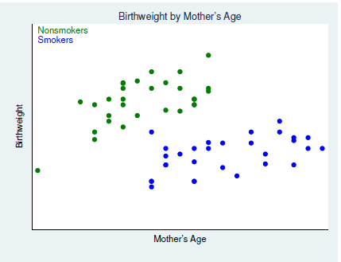
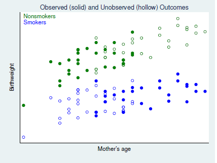
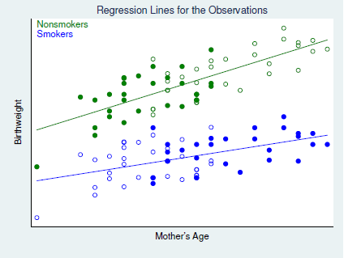
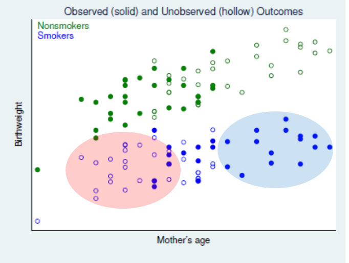
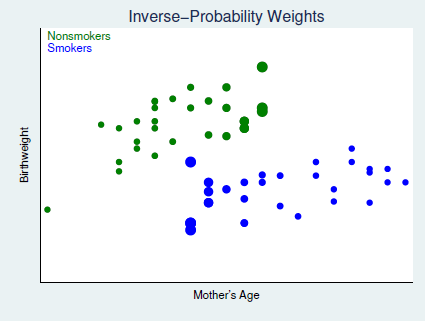
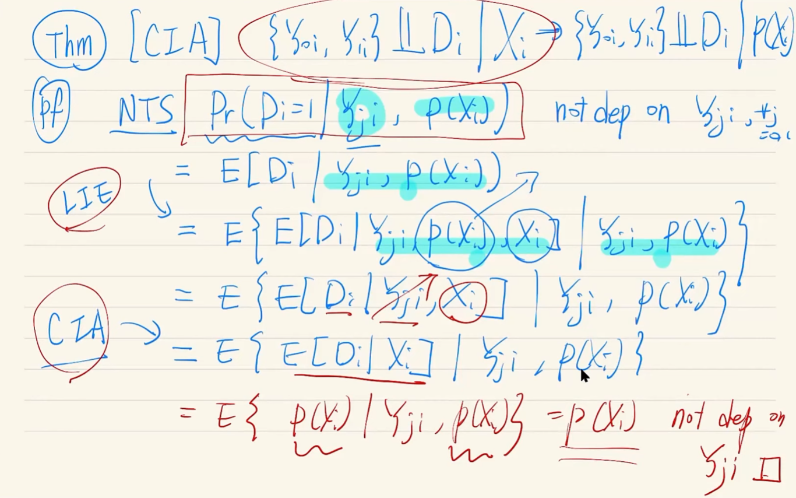
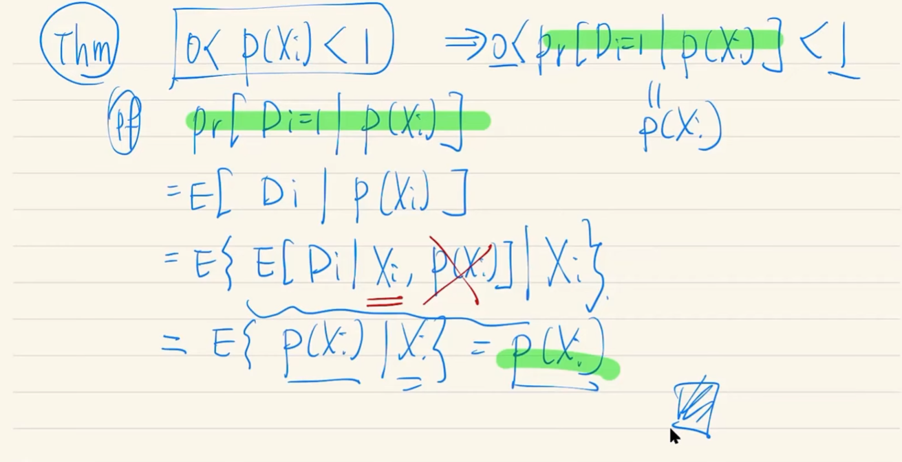

#strong_ignorability #regression_adjustment #IPW #pseudo-counterfactual #nnmatch #PSM

> 아름다운 매칭의 순간이다
>

# Matching

~~Angrist 교수는 Matching을 별로 안 좋아한다~~

Lalonde(1986, AER)에서 시작된 Matching은 연구 상황에서 흔히 발생하는, Control 그룹의 부재 (Treatment 그룹만 있을때) 속에서의 non-experimental estimators를 확인하고자 하는 것으로부터 시작했다.

## Strong Ignorability

***CIA + Overlap = Strong Ignorability***

X를 통제하면, 문제가 해결된다는 approach ~~또~~ CIA와 Overlap을 함께 가정한다. Overlap은 0과 1의 extremes들을 배제한다는 효과가 있다.

$$
\displaylines{\text{CIA : }\;\{Y_{0i},Y_{1i}\}\perp\!\!\!\perp C_i|X_i\\
\text{Overlap: }\; 0<Pr(D_i=1|X_i)<1}
$$

$$
\displaylines{\text{let} \quad \mu_0(x)=E[Y_{0i}|X_i=x], \quad \mu_1(x)=E[Y_{1i}|X_i=x]\\
\text{Then, }\quad \tau_{ate}(x)=E(Y_{1i}-Y_{0i}|X_i=x)\\
=\mu_1(x)-\mu_0(x)\\\\
\text{Then, }\quad ATE= \tau_{p}=E[\tau_{ate}(X_i)]\\
\text{and, }\quad ATT= \tau_{p}=E[\tau_{ate}(X_i)|D_i=1]
}
$$

Strong Ignorability는 아래와 같은 전개가 가능하게 한다.

$$
\displaylines{\mu_d(x)=E[Y_{di}|X_i=x]\\
=E[Y_{di}|D_i=d, X_i=x] \quad \text{by CIA}\\
=E[Y_{i}|D_i=d, X_i=x] \quad \text{by Overlap; *}\\\\

\text{*} \quad Y_i=Y_{1i}D_i+Y_{0i}(1-D_i)}
$$

## Cattaneo. (2010). Smoking and Birthweight

Matching에 대해 알아보기 위한 연구사례로 Cattaneo의 2010년 연구를 살펴보고자 한다. 

본 연구에서 살펴보고자하는 것은 흡연에 따른 출산하는 아기의 birthweight에 얼만큼의 영향을 주는지 확인해보는 것이다.

그는 위의 그래프처럼 산모의 나이와 출산한 아기의 birthweight을 scatter_plot 하였는데, 산모를 흡연자와 비흡연자로 나누어 확인하였다. 

두 manipulation은 그림에서처럼 각기 다른 색으로 구분되었다.

보다시피, 두 manipulated group 간에 가로축 밀도를 보면 흡연자의 경우에는 가로축 상의 좌측의 데이터들이 부족하고, 비흡연자의 산모들 같은 경우에는 가로축 밀도에 있어 우측의 밀도가 부족한 것을 볼 수 있다.

### Regression Adjustment

가장 간단하게 효과를 추정(estimate)하는 방법은 부족한 부분의 포인트들을 regression based 로 추정하여 그 차이를 구하는 것이다.

$$
\displaylines{\hat{ATE}=\frac{1}{N}\Sigma\, [\hat\mu_1(X_i)-\hat\mu_0(X_i)]
\\
\hat{ATT}=\frac{1}{\Sigma D_i}\Sigma\, D_i[\hat\mu_1(X_i)-\hat\mu_0(X_i)]}
$$

위의 사진으로 확인할때, 우리가 조심해야하는 것은 추정되는 Treatment Effect는 각 점 사이의 차이가 아니라, regression adjustment 를 통해 구해진 regression line간의 차이라는 것이다. 위의 식을 잘 확인해보자.

자명하게도, 두 그룹 간의 겹치는 (overlapped) 부분이 적을수록, 오롯이 추정으로만 이루어지는 $\hat{ATE(T)}$로 변하기 때문에, 이 점을 고려해야한다는 *Extrapolating* concern이 있다. 본 상황을 체크할 수 있는 지표로 IR은 아래의 델타 지표를 제안하고 있다.

$$
\Delta_X=\frac{\bar X_1-\bar X_0}{\sqrt{S_1^2+S_0^2}}<0.25
$$

참고로 $\Delta$는 일반적인 가설검정의 t-test p-value (t-statistics)와 다르다.

### Inverse Probability Weight (IPW)

IPW는 말그대로 확률의 역수를 가중치를 곱해주는 것이다.

아래의 수식전개를 보면 ATE가 결과적으로 X에 대한 확률의 역수를 Y에 곱한 값의 expectation을 구하는 것을 알 수 있다.

$$
\displaylines{ATE=E\{\frac{[D_i-p(X_i)]Y_i}{p(X_i)[1-p(X_i)]}\}\\
=E\{\frac{[D_i-D_ip(X_i)+D_ip(X_i)-p(X_i)]Y_i}{p(X_i)[1-p(X_i)]}\}\\
=E\{\frac{[D_i(1-p(X_i))-p(X_i)(1-D_i)]Y_i}{p(X_i)[1-p(X_i)]}\}\\
=E\{\frac{D_i}{p(X_i)}Y_i\}-E\{\frac{[1-D_i]Y_i}{1-p(X_i)}Y_i\} \quad \text{*}\\
=E(Y_{1i})-E(Y_{0i})=E(Y_{1i}-Y_{0i})\equiv ATE
\\\\
ATE=E\{\frac{[D_i-p(X_i)]Y_i}{Pr(D_i=1)[1-p(X_i)]}\}}
$$

IPW의 메커니즘을 위의 그래프와 함께 간단하게 알아보자.

1. 우리의 현재 목표는 unobserved outcomes, 즉 그래프 상 hollow points들에 대한 보정을 해주는 것이다; 이를 통해 최종적으로 각 x값 별 treatment effect를 정교하게 구할 수 있을 것이다.
2. 문제는 현재 그래프 상에선 앞서 언급했듯, 흡연자와 비흡연자 간 x축 상 밀도가 상이하다는 점이다. 흡연자(smokers)들을 중심으로 살펴보았을 때, 좌측의 붉은색 동그라미 영역에는 hollow points가 많고, 우측의 파란색 원 영역은 solid points가 많은 것을 알 수 있다.
3. 따라서 우리가 1의 보정을 하고자 할때, 중점적으로 비중을 두어야하는 것은 hollow points 쪽이다.
4. 따라서 비중을 인위적으로 높이기 위한 IPW 의 방법은, P(X)의 역수를 취해주는 것이다; 붉은색 영역에서의 P(X)는 작기 때문에, 그리고 푸른색 영역에서의 P(X)는 크기 때문에 역수는 곧 반대의 상대적인 크고작은 값이 될 것이다.

곧 regression adjustment 대신, hollow area에 가장 가까운 점들을 대신하여 높은 weight을 부여한다고 할 수 있다.

곧 아래의 그림으로 표현할 수 있다.

$$
\displaylines{\text{*} \quad D_iY_i=D_i(Y_{1i}D_i+Y_{0i}(1-D_i))=Y_{1i}D_i+0
\\\\
\text{Then, }\quad  E\{\frac{D_i}{p(X_i)}Y_i\}=E\{\frac{D_i}{p(X_i)}Y_{1i}\}\\
=E\{\frac{D_i}{p(X_i)}Y_i|X_i\} \quad \text{by LIE}\\
=E\{\frac{E(D_i|X_i)E(Y_{1i}|X_i)}{P(X_i)}\} \quad \text{by CIA}\\
=E\{E(Y_{1i}|X_i)\} \quad (\because E(D_i|X_i) \equiv P(X_i)) \\
=E(Y_{1i})\quad \text{by LIE}\\}
$$

## Matching

### Nearest-Neighbor Match (nnmatch)

Treatment Effect를 구하는 데에 있어 가장 큰 문제는 역시나 Missing Data Problem; D가 0일때는 $Y_{1i}$가 없고, 1일때는 $Y_{0i}$가 없다는 것이다. 우리는 따라서 D=0에서의 $Y_{1i}$ 와 D=1에서의 $Y_{0i}$ 을 구해보고자 시도해볼 수 있다.

nnmatch 방법론은 X가 가장 가까운 다른 포인트들의  D가 0일때는 $Y_{1i}$, 1일때는 $Y_{0i}$ 값들을 빌려와 추정하는 것이다. 

곧 아래와 같은 수식으로 정리할 수 있다.

$$
\displaylines{\hat Y_{0i} \; \begin{cases}
Y_i & \text{if } D_i=0\\
\frac{1}{M}\Sigma\, Y_j & \text{if } D_i=1\\
\end{cases}\\\\

\hat Y_{1i} \; \begin{cases}
\frac{1}{M}\Sigma\, Y_j  & \text{if } D_i=0\\
Y_i & \text{if } D_i=1\\
\end{cases}

\\\\
\text{Thus, }\; \hat{ATE}_M=\frac{1}{N}\Sigma\, \{\hat Y_{1i} -\hat Y_{0i}\}
}
$$

### Propensity Score Matching (PSM)

X가 multi-dimension이라면?!

여러 차원에 대한 X의 값들에 대해 가장 가까운 점을 구하는 것은 어떤 방법일까? 

그것이 Propensity score matching이다.

자, 이제 우리는 PS ($p(X_i)$)를 기준으로 counterfactuals of interest를 추정할 수 있다.

### PSM Estimators

$$
\displaylines{\hat \tau_{att}^{psm}=\frac{1}{n_1}\Sigma\, [Y_{1i}-\hat Y_{0i}] 
\\
\text{with} \quad \hat Y_{0i}=\Sigma\, \hat\omega(i,j) Y_{0j}}
$$

#### Methodology for getting $\hat\omega$ 

$$
\displaylines{\text{Nearest-Neighbor Matching}\\
\hat\omega(i,j)=\begin{cases}
1 & \text{if } j=argmin|\hat p_i-\hat p_k|\\
0 & \text{otherwise}\\
\end{cases}}
$$

\+ Nearest **k** neighbors matching도 있는데, 이는 가까운 순서의 점들 여러개를 구하여 오메가 팩터를 구하는 것이고, **bias가 증가하는대신 variance는 감소하는 tradeoff**가 존재한다.

$$
\displaylines{\text{Caliper Matching}\\
\hat\omega(i,j)=\begin{cases}
\frac{1}{n_i} & |\hat p_i-\hat p_k|<c\\
0 & \text{otherwise}\\
\end{cases}}
$$

Caliper Matching은 특정 거리 c를 정해놓고 c의 반경 내에 있는 모든 점들을 matching을 위해 사용하는 것이다.

$$
\displaylines{\text{Stratification Matching (Blocking on the PS)}\\
\hat\omega(i,j)=\begin{cases}
\frac{1}{n_i} & \hat p_i \in T_i\\
0 & \text{otherwise}\\
\end{cases}\\
\text{where }T_i \text{ denotes the ps strata for observation i}}
$$

Stratification Matching은 Caliper와 유사하나, 특정 거리 범위 내가 아니라 전체 축의 범위를 쪼개어 각 포인트가 속해있는 범위의 모든 점을 matching을 위해 사용하는 것이다. 이는 곧 Caliper 뿐만 아니라 Nearest k neighbors의 성격을 모두 가지고 있다고 할 수 있다.

이외에도 Heckman, Ichimura, and Todd; 1977, 1988 연구의 Kernel 방법론 ([Matching as an Econometric Evaluation Estimator: Evidence from Evaluating a Job Training Programme on JSTOR](https://www.jstor.org/stable/2971733?seq=1)) 도 있다. 

#### Replacement?

Matching은 결국 존재하는 solid points들의 점들을 이용하여 hollow points들의 counterfactual 을 대체하는 것이라고 볼 수 있다.

이때 우리는 각 i번째 점들에 대응하는 matching point들을 replacement를 할 지 안할지에 대해서도 결정할 수 있는데 이때의 tradeoff를 살펴보자.

예상외로, replacement는 bias를 감소시킨다. 그 이유는 예를 들어, i번째와 (i+1)번째 점 모두 대응하는 matching point가 j번째 점이라고 할때, replacement는 이를 통해 j에 쏠리는 bias를 감소시킬 수 있기 때문이다. 

우리는 곧 replacement가 별다른게 아닌 matching points들의 중복을 어떻게 대처하는지 라는 것으로 생각할 수 있다.

물론 더 멀리 있는 points들로 중복된 점들을 대체한다면 variance는 높아질 것이라는 tradeoff를 생각할 수 있을 것이다.

#### Trimming the support region

replacement와 연계하여 우리는 propensity score의 극단성을 조절해주는 케이스도 생각해볼 수 있다.

$$
\alpha < p(X_i) < 1-\alpha
$$

Crump, et al. (2009)에선 $\alpha$를 0.1 정도로 하였을 때 잘 작동한다는 것을 제안하였다.

#### DD + PSM

DD와 PSM은 각각 좋은 연구방법론으로 인정받고 있다. 따라서, 둘이 합치면 더 좋다.(?) 실제로 그렇다.

물론 DD는 Treatment 전후의 데이터를 모두 요하기 때문에, 데이터 상의 제약조건이 일반적인 연구 방법론의 것보다 엄격하지만, 이 조건이 충족될때 둘의 혼용은 매우 좋은 연구방법론으로 제시되고 있다.

#### Conditional Matching

단순히 확률적으로 집행되는 PSM에 일종의 feature learning (or condition)을 다는 것이다.

예를 들어, 지역이나, 학교와 같은 categorical variables들에 대해선 같은 category 내에서만 matching을 진행하는, 어쩌면 일종의 fixed effect application이라고 할수도 있겠다.

### Combining Approaches

~~난 둘다~~

#### IPW + RA (HIR Approach)

Hirano, Imbens and Ridder (2003), Imbens and Wooldridge (2009)

## Imbens & Wooldridge (2009)

Imbens, G.W., & Wooldridge, J.M. (2009). "Recent Developments in the Econometrics of Program Evaluation." Journal of Economic Literature, 47(1), 5-86

