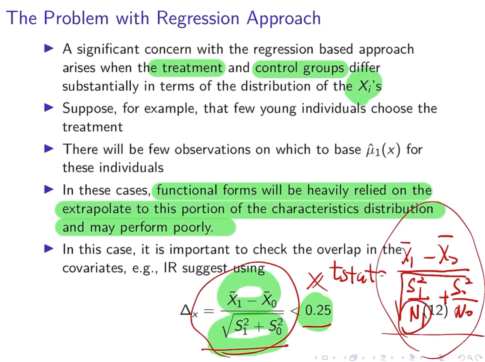

응용계량경제학 필기노트

아름다운 매칭의 순간이다.

# Matching

~~Angrist 교수는 Matching을 별로 안 좋아한다~~

Lalonde(1986, AER)에서 시작된 Matching은 연구 상황에서 흔히 발생하는, Control 그룹의 부재 (Treatment 그룹만 있을때) 속에서의 non-experimental estimators를 확인하고자 하는 것으로부터 시작했다.

## CIA + Overlap = Strong Ignorability

X를 통제하면, 문제가 해결된다는 approach ~~또~~ CIA와 Overlap을 함께 가정한다. Overlap은 0과 1의 extremes들을 배제한다는 효과가 있다.

$$
\displaylines{\text{CIA : }\;\{Y_{0i},Y_{1i}\}\perp\!\!\!\perp C_i|X_i\\
\text{Overlap: }\; 0<Pr(D_i=1|X_i)<1}
$$

$$
\displaylines{\text{let} \quad \mu_0(x)=E[Y_{0i}|X_i=x], \quad \mu_1(x)=E[Y_{1i}|X_i=x]\\
\text{Then, }\quad \tau_{ate}(x)=E(Y_{1i}-Y_{0i}|X_i=x)\\
=\mu_1(x)-\mu_0(x)\\
\text{Then, }\quad ATE= \tau_{p}=E[\tau_{ate}(X_i)]\\
\text{and, }\quad ATT= \tau_{p}=E[\tau_{ate}(X_i)|D_i=1]
}
$$

$$
\mu_d(x)=E[Y_{di}|X_i=x]\\
=E[Y_{di}|D_i=d, X_i=x] \quad \text{by CIA}\\
=E[Y_{i}|D_i=d, X_i=x]
$$

## Regression Approach

## Inverse Probability Weight (IPW)

