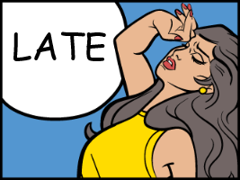

> #external_validity #LATE #Exclusion_restriction #Monotonicity #complier #defier
>

> 늦었다 (*작성당일 기말고사)
>

# Instrumental Variables

## Heterogeneous Effect

앞선 장에서 (constant effect), IV를 통한 treatment effect를 추정해볼수 있었다.

$$
\displaylines{
Y_{0i}=\alpha+\eta_i\\
Y_{1i}-Y_{0i}=\rho\\
Y_i=Y_{0i}+D_i(Y_{1i}-Y_{0i})=\alpha+\rho D_i+\eta_i
\\\\
\rho=\frac{Cov(Y,Z)}{Cov(D,Z)}
}
$$

하지만 $\rho$, 즉 $Y_{1i}-Y_{0i}$가 누구에게나 동일하게 적용되지 않을 수도 있을 것이다. 즉, 각자에게 이질적인 효과 (특히 treatment가 이루어진 subset 그룹에 대해서), Heterogeneous effect를 확인해보는 섹션이 될 것이다.

***External Validity is the predictive value of internally valid causal estimates in contexts beyond those generating the estimates***

## LATE (Local Average Treatment Effect)

heterogeneous한 효과를 측정하는데에 있어 사용되는 프레임워크는 LATE framework이다.

LATE framework는 매우 중요한 4가지의 가정들을 기반으로 하고 있는데 이는 아래와 같다.

$$
\displaylines{
\text{LATE Assumptions}\\
\begin{cases}
\text{1. Independence} & \{Y_i(D_{1i},1), Y_i(D_{0i},0), D_{1i}, D_{0} \}\perp\!\!\!\perp z_i\\
\text{2. Exclusion Restriction} & Y_i(d,0)=Y_i(d,1) \\
\text{3. Existence of First Stage} & E[D_{1i}-D_{0i}]\neq 0\\
\text{4. Monotonicity} & D_{1i}-D_{0i}\geq0\\
\end{cases}
\\\\
\text{Then, }\quad \frac{E[Y_i|Z_i=1]-E[Y_i|Z_i=0]}{E[D_i|Z_i=1]-E[D_i|Z_i=0]}=E[Y_{1i}-Y_{0i}|D_{1i}>D_{0i}]
}
$$

증명 및 유도는 아래와 같다.

$$
\displaylines{
Y=Y(0,z)-[Y(1,z)-Y(0,z)]D\\
=Y_0+(Y_1-Y_0)D \quad \text{by A2}
\\\\
E[Y|z=1]=E[Y_0+(Y_1-Y_0)D |z=1]\\
=E[Y_0+(Y_1-Y_0)D_1] \quad \text{by A1}\\
E[Y|z=0]=E[Y_0+(Y_1-Y_0)D_0]
\\\\
\text{Then, }\quad E[Y|z=1]-E[Y|z=0]=E[(Y_1-Y_0)(D_1-D_0)]
\\\\
\text{by A4, }\quad D_1-D_0 \geq 0
\\\\
\text{Thus, }\quad E[(Y_1-Y_0)(D_1-D_0)]= \\
E[Y_1-Y_0|D_1>D_0]*P[D_1>D_0]\\
+0*E[Y_1-Y_0|D_1=D_0]*P[D_1=D_0]\\
+E[Y_1-Y_0|D_1<D_0]*P[D_1<D_0]\\
=E[Y_1-Y_0|D_1>D_0]*P[D_1>D_0]
\\\\
\text{Thus, }\quad E[D|z=1]-E[D|z=0]=E[D_{1i}|z=1]-E[D_{0i}|z=0]\\
=E[D_{1i}-D_{0i}] \quad \text{by A1} \\
=P[D_1>D_0]*1+P[D_1=D_0]*0+P[D_1<D_0]*(-1) \neq 0 \quad \text{by A4 and A3}
\\\\
\text{Thus, WALD}=\frac{E[Y_1-Y_0|D_1>D_0]*P[D_1>D_0]}{P[D_1>D_0]}=E[Y_1-Y_0|D_1>D_0]
}
$$

위와 같이 $D_1>D_0$이라는 subset의 그룹에 대해서만 treatment effect의 크기를 확인할 수 있는 것이다. 이 그룹을 우리는 ***complier*** 그룹이라 부른다.

## The Compliant Subpopulation

| sub-population | $D_{0i}=0$  | $D_{0i}=1$   |
| -------------- | ----------- | ------------ |
| $D_{1i}=1$     | Complier    | Always-Taker |
| $D_{1i}=0$     | Never-Taker | Defier       |

$$
\displaylines{D_i=D_{0i}+(D_{1i}-D_{0i})Z_i
\\\\
\text{Then,}\quad \{D_i=1\}=\{D_{1i}=D_{0i}=1\} \cup \{\{D_{1i}-D_{0i}=1\}\cap\{Z_i=1\}\}\\
\text{which is,}\quad \{\text{treated}\}=\{\text{always-taker}\} \cup \{\text{compliers assigned }Z_i=1\}\\}
$$

TOT는 위의 treated 그룹에 대한 weighted average of effects라고 할 수 있다.

#### IV in Randomized Trials

실험 상에 도의적인 측면을 고려치 않을때, always-taker를 실험 상에서 control하는 것은 그렇게 어렵지 않기 때문에, 곧 TOT를 구할수 있다고 할 수 있다.

### How many Complier You Got?

$$
\displaylines{P[D_{1i}>D_{0i}|D_i=1]=\frac{P[(D_{1i}>D_{0i})\cap(D_i=1)]}{P[D_{1i}=1]}\\
=\frac{P[(D_i=1)|(D_{1i}>D_{0i})]P[(D_{1i}>D_{0i})]}{P[D_{1i}=1]}\\
=\frac{P(Z_i=1)(E(D_i|Z_i=1)-E(D_i|Z_i=0))}{P[D_{1i}=1]}}
$$
