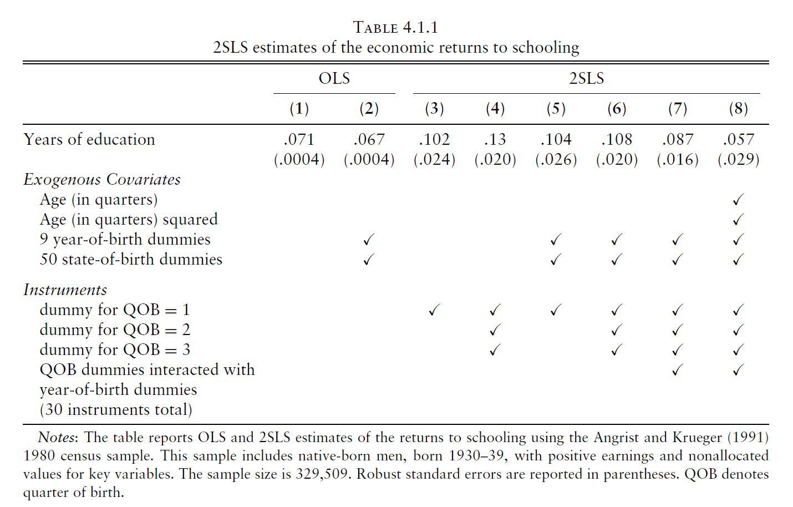
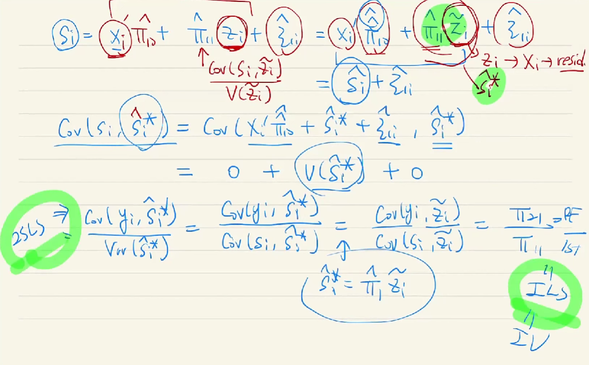

#IV

# Instrumental Variables

## Constant Effect

$$
f_i(s)=\alpha+\rho s+\eta_i
$$

본 Constant Effect 섹션에서는 treatment effect가 개인별에 차등없이 동일하게 적용되는 constant treatment effect 상황을 가정하고 진행하겠다.

흔히 IV를 공부할때 언급되는 케이스 중 하나인 학력과 연봉의 인과추론을 해보고자 한다.

우리가 알고 싶은 것은 학력이 연봉에 얼마나 영향을 주는지에 대한 treatment effect estimate $\rho$이다.

 

만약 s라는 schooling, 학력의 변수 말고도 능력이 연봉(unobserved, hence included at the $\eta$; OVB)에 유의한 상관관계가 존재한다면, OVB가 발생하며, s와 $\eta$ 사이의 correlation이 존재할 것이다. 그렇다면 $\eta$를 decompose 해보자.

$$
\displaylines{\eta_i=A_i'\gamma+v_i\\
Cov(v_i, A_i)=0}
$$

A는 능력에 관한 control variable이고, 남은 항 v는 곧 idiosyncratic error term이 될 것이다.

$$
\displaylines{y_i=\alpha+\rho s+A_i'\gamma+v_i\\
\text{if we control } A_i\;\text{by CIA, we can identify }\rho}
$$

우리는 앞선 장에서 배운 CIA를 통해 A를 통제해주면, v는 $\rho$와는 uncorrelate 되어있기 때문에 다시금 $\rho$를 제대로 구할 수 있다.

하지만 A를 통제하는 것은 매우 어렵다. 사람의 능력이라는 변수를 정량화 내지 측정이 가능한것일까?

### IV

1. Instrument variable, z should be correlated with the causal variable of interest, s
2. z should be uncorrelate iwth potential outcomes
   1. $Cov(\eta, z)=0$

IV 변수 z를 통해 우리는 treatment effect를 y와 z, s와 z 간의 covariance ratio를 통해 구할 수 있다.

$$
\displaylines{\rho=\frac{Cov(y,z)}{Cov(s,z)}\\=\frac{Cov(y,z)/V(z)}{Cov(s,z)/V(z)}\\
\equiv=\frac{\text{reg y on z}}{\text{reg s on z}}=\frac{\text{Reduced Form}}{\text{1st stage}}}
$$

#### Derivation

$$
\displaylines{Cov(y,z)=Cov(\alpha+\rho s+\eta, z)\\
=0+\rho\, Cov(s,z) +0
\\
\text{Hence, }\; \rho=\frac{Cov(y,z)}{Cov(s,z)}}
$$

### 2SLS

2SLS는 covariates를 추가하고, 여러 IV 변수들을 추가할 수 있다는 장점이 있다.

$$
\displaylines{y_i=\alpha' X_i+\rho s_i+\eta_i 
\\\\

\begin{cases}
s_i=X_i'\pi_{10}+\pi_{11}z_i+\zeta_{1i} & \text{1st stage}\\\\
y_i=X_i'\pi_{20}+\pi_{21}z_i+\zeta_{2i} & \text{Reduced Form}
\end{cases}
\\\\

\text{Hence, }\; y_i=\alpha' X_i+\rho(X_i'\pi_{10}+\pi_{11}z_i+\zeta_{1i} )+\eta_i \\
=X_i'(\alpha+\rho \pi_{10})+\rho\pi_{11}z_i+[\rho\zeta_{1i}+\eta_i]\\
\equiv X_i'\pi_{20}+\pi_{21}z_i+\zeta_{2i}
\\\\

\text{Thus, }\\
\begin{cases}
\pi_{20}=\alpha+\rho \pi_{10}\\
\pi_{21}=\rho \pi_{11} & \rho=\frac{\pi_{21}}{\pi_{11}}=\frac{\text{Reduced Form}}{\text{1st stage}}
\end{cases}}
$$

우리는 위의 $\rho$를 구하는 과정을 **Indirect Least Squares (ILS)** 이라고 부른다. 두 개의 estimate를 통해 간접적으로 $\rho$를 구하기 때문이다.

ILS를 통해 estimator들을 통한 수식을 전개하면 아래와 같다.

$$
\displaylines{s_i=X_i'\pi_{10}+\pi_{11}z_i+\zeta_{1i}=\hat s_i+\zeta_{1i} \quad \text{by 1st stage}\\
\text{Thus, }\; y_i=\alpha' X_i+\rho \hat s_i+[\eta_i+\rho\zeta_{1i}]}
$$

지금까지 2SLS의 대략적인 전개를 살펴보았다. 우리는 manually 2SLS를 돌리지 않는데, 이는 두번에 거친 ILS를 진행하는데에 있어 std. error를 제대로 구할 수 없기 때문이고, STATA 등의 통계 패키지 프로그램을 통해 구하는 것이 정확할 것이다.

### Angrist, and Krueger (1991)

Angrist, and Krueger (1991). "Does Compulsory School Attendance Affect Schooling and Earnings?" Quarterly Journal of Economics, 106: pp. 979-1014.

미국의 교육환경 및 의무교육제도 특성상, 같은 해라고 할지라도 4분기(QoB as IV)에 태어난 아이들이 조금 더 years of education(s), 교육연수해가 더 높은것을 알 수 있다.

Y와 Z의 관계를 확인하는 두번째 figure이다.

따라서 우리는 IV인 QoB (이하 z)가 s와 y에 모두 correlation이 있는 것을 확인할 수 있다.

### 2SLS and ILS

	

### Multiple-Instrument 2SLS

$$
\rho_{2SLS}=\phi\rho_1+(1-\phi)\rho_2
$$

## The Wald Estimator

z가 dummy variable일 땐 2sls estimator가 wald estimator로서 매우 심플한 공식을 가지게 된다.

## Weak Instrument

1st stage의 error term과 eta가 correlation 가능성

#### PS5.1.

$$
E[\hat\beta_{2SLS}-\beta]\newline
=E[(X'P_Z X)^{-1} \pi' Z' \eta]+E[(X'P_X X)^{-1}\zeta P_Z \eta]\newline
=E[X'P_Z X]^{-1} E[\zeta P_Z \eta]
$$

$$
\text{for} \quad E[X'P_Z X]^{-1}\\\\
E[X'P_Z X]^{-1}=(E[(\pi'Z'+\eta')P_Z(Z\pi+\eta)])^{-1}\newline
=(E[(\pi'Z'+\eta'P_Z)(Z\pi+\eta)])^{-1}\newline
=(E[\pi'Z'Z\pi]+E[\pi'Z'\eta]+E[\eta'P_Z Z\pi]+E[\eta'P_Z\eta])^{-1}\newline
=(E[\pi'Z'Z\pi]+E[\eta'P_Z\eta])^{-1}
$$

$$
\text{for} \quad E[\eta'P_Z\eta] \\\\
E[\eta'P_Z\eta]=\sigma_\zeta^2 tr(P_Z)  \equiv  \sigma_\zeta^2 Q
$$

$$
\text{for} \quad E[\zeta P_Z \eta] \\\\
E[\zeta P_Z \eta]=\sigma_{\eta\zeta}^2 tr(P_Z)  \equiv  \sigma_{\eta\zeta}^2 Q
$$

$$
\text{Thus, for} \quad E[\hat\beta_{2SLS}-\beta]\\\\
E[\hat\beta_{2SLS}-\beta]=E[X'P_Z X]^{-1} E[\zeta P_Z \eta]\newline
=(E[\pi'Z'Z\pi]+E[\eta'P_Z\eta])^{-1} E[\zeta P_Z \eta]\newline
=(E[\pi'Z'Z\pi]+\sigma_\zeta^2 Q)^{-1} * \sigma_{\eta\zeta}^2 Q\newline
=(\frac{E[\pi'Z'Z\pi]}{\sigma_\zeta^2 Q}+1)^{-1} * \frac{\sigma_{\eta\zeta}^2 Q\newline}{\sigma_\zeta^2 Q}\newline
=\frac{\sigma_{\eta\zeta}^2}{\sigma_\zeta^2}(\frac{E[\pi'Z'Z\pi]/Q}{\sigma_\zeta^2}+1)^{-1}
$$

