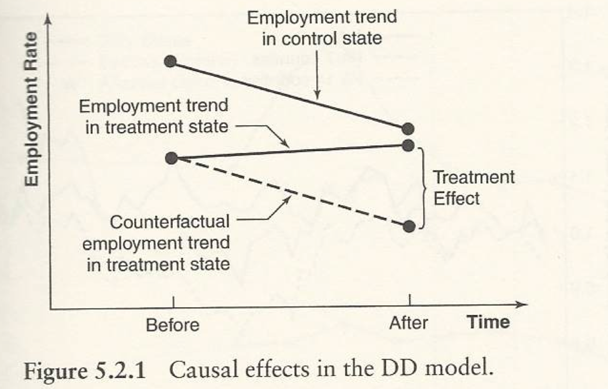

\#Common_trend_assumption #Compound_effect #Ashenfelter's_dip #DDD

본문과 별 관련은 없다

# Differences-in-Differences (DiD)

*The DD estimator can be interpreted as a fixed effect estimator that uses only aggregate (group level) data.*

DiD는 indivdual level이 아닌 group level에서 이루어진다.

따라서 굳이 동일한 individual 의 panel data이 반드시 필요하지는 않다 (물론 random한 assign이 잘 되었을때를 전제함).

예시를 살펴보자!

## Card and Krueger (1994)

Card, D., and A. Krueger (1994), "Minimu Wages and Employment: A Case Study of the Fast Food Industry in New Jersey and Pennsylvania." The American Economic Review 84:772-84

New Jersey(뉴저지) 주는 관찰기간동안 최저임금을 약 20프로 정도 상승시켰고, Pennsylvania(펜실베니아)는 현행유지를 하였다. 

이 때 두 주 간의 고용률 등의 지표를 비교했을때 실제 최저임금 상승이 고용에 어떤 영향을 끼치는지 확인하는 연구라고 할 수 있다.

$$
\displaylines{\begin{cases}
Y_{0st}=\epsilon_{st}\\
Y_{1st}=\epsilon_{st}+\rho
\end{cases}}
$$

여기서 s는 state를 의미한다 (뉴저지 vs 펜실베니아).

$\epsilon$은 아래와 같이 decompose 될 수 있다

$$
\displaylines{\epsilon_{st}
\begin{cases} 
\gamma_s & \text{state fixed effect} \\
\lambda_t & \text{time trend}\\
\eta_{st} & \text{mean zero noise term}\\
\end{cases}}
$$

$$
\displaylines{\text{Then, }\quad Y_{st}=\gamma +\lambda +\rho D_{st}+\eta\\
\text{where }\; E(\eta|s,t,D)=0}
$$

이때 뉴저지는 treatment가 적용이 되었고 (t=1), 펜실베니아는 그렇지 않기 때문에 (t=0) 아래와 같이 두 주의 Y의 차이는 treatment effect라고 설명할 수 있다.

$$
\displaylines{\text{1) } E(Y|s=Penn, t=1) - E(Y|s=Penn, t=0)=\lambda_1-\lambda_0\\
\text{2) } E(Y|s=NJ, t=1) - E(Y|s=NJ, t=0)=\rho + \lambda_1-\lambda_0\\\\

\text{Thus, (2)-(1) equals;}\\
[E(Y|s=NJ, t=1) - E(Y|s=NJ, t=0)]-[E(Y|s=Penn, t=1) - E(Y|s=Penn, t=0)]=\rho}
$$

**단 여기서 매우 중요하게 체크해야하는 것은, 뉴저지와 펜실베니아 두 주의 time trend 차이 $\lambda_1-\lambda_0$가 동일하다는 것이다.**

**이러한 두 그룹 사이에 time varying variables들의 동일한 트렌드 패턴을 가질 것이라 가정하는 것을 Common Trend (Parallel) Assumption 이라고 부른다.**

물론 s에 영향을 안 받기 때문에 수식 상에 문제는 없을 것이다. 하지만 예를 들어 뉴저지와 펜실베니아의 차이가 아닌 한국과 영국 사이의 time trend가 동일하다고 있을까? 고려해보아야 할 것이다.

그림으로 쉽게 이해할 수 있을것이다.

아무튼 DiD를 통해 본 연구에서는 최저임금 상승이 고용을 오히려 늘린다! 라는 counterfact를 도출할 수 있었다. 물론 본 연구에 대한 논쟁은 거셌다.

### Regression Implementation of DiD

또 Regression!? 하지만 앞선 DiD 계산방식보다 회귀식을 이용하면 계산을 (2)-(1)과 같은 이중이 아닌 단일 식으로 $\rho$를 구할 수 있고, std. error를 구하기도 용이할 것이다.

$$
Y_{st}=\alpha+\gamma(NJ)+\lambda d_1+\rho(NJ*d_1)+\eta_{st}
$$

여기서 $(NJ*d_1)$는 일반적인 $D_{st}$와 동일할 것이다.

### Multiple Groups

뉴저지와 펜실베니아 이외에도 코네티컷(Connecticut) 주를 추가해보자. 이때 회귀식은 아래와 같을 것이다.

$$
Y_{st}=\alpha+\pi(CT)+\gamma(NJ)+\lambda d_1+\rho(NJ*d_1)+\eta_{st}
$$

## Differences in Differences in Differences estimator

DiDiD (DDD) estimator도 구할 수 있다. ~~???: 세번 뭐가 어렵겠습니까??~~

예시를 계속해서 이어나간다면, 뉴저지 주 내에서 일괄적용된 것이 아니라 주 내에서도 최저임금 상승에 영향을 받을 affected sector(ex. 일용직, 알바)와 unaffected sector(ex. 회사임원, 교수)으로 나눌 수 있다면, 이때 DDD를 사용할 수 있을것이다.

$$
\displaylines{\text{1) }
DD_A=[E(Y|s=NJ, t=1, \text{affected}) - E(Y|s=NJ, t=0,\text{affected})]\\
-[E(Y|s=Penn, t=1,\text{affected}) - E(Y|s=Penn, t=0,\text{affected})]\\
=rho+[(\lambda_1-\lambda_0)_{NJ}-(\lambda_1-\lambda_0)_{Penn}]
\\\\
\text{2) }
DD_U=[E(Y|s=NJ, t=1, \text{unaffected}) - E(Y|s=NJ, t=0,\text{unaffected})]\\
-[E(Y|s=Penn, t=1,\text{unaffected}) - E(Y|s=Penn, t=0,\text{unaffected})]\\
=[(\lambda_1-\lambda_0)_{NJ}-(\lambda_1-\lambda_0)_{Penn}]
\\\\
\text{Thus, (2)-(1) equals;}\\
DDD=DD_A - DD_U=\rho}
$$

### Regression Implementation of DDD

마않은 dummy variables 들이 생성될 것이다.

$$
\displaylines{Y_{st}=\alpha+\gamma_0(NJ)+\gamma_1(AF)+\gamma_2(NJ*AF)+\lambda_0 d_1\\
+\lambda_1(NJ*d_1)+\lambda_2(AF*d_1)+\rho(d_1*NJ*AF)+ \eta_{st}}
$$

여기서 $(NJ*d_1)$는 일반적인 $D_{st}$와 동일할 것이다.

## Additional Controls

regression의 추가 장점은 Additional Controls가 가능하다는 점이다.

$$
\displaylines{Y_{st}=\gamma_s+\lambda d_1+X'_{st}\beta+\rho(NJ*d_1)+\eta_{st}
\\\\
\text{where:} \begin{cases}
\gamma_s \;\text{is a seperate dummy for each state}\\
X_{st} \;\text{are observables characteristics for each state (e.g. industry structure)}
\end{cases}}
$$

더 많은 time varying control variable 통제를 통해서 common trend assumption을 ~~파워당당~~ 뒷받침할 수 있다.

## Variable Treatment Intensity

최저임금이 오르는 것은 더미 변수 0과 1로 나타낼수 있다.

하지만 주마다 다른 효과의 크기는 어떻게 측정할 수 있을까 (intensity)?

$$
\displaylines{Y_{st}=\gamma_s+\lambda d_1+\rho(FA_s*d_1)+\eta_{st}
\\\\
\text{where:} \begin{cases}
FA_s \;\text{is a variable measuring the fraction of individuals likely to be affected by the change in minimum wage laws}\\
\text{the interaction term}\; FA_s*d_1 \;\text{is the treatment variable that accounts for differing treatment intensities}
\end{cases}}
$$

## More than 2 time periods

2+개의 time periods를 이용하는 것은 두 그룹 사이에 time varying variables들의 동일한 트렌드 패턴을 가질 것이라 가정하는 것을 Common Trend (Parallel) Assumption을 '평가'해볼 수 있다.

Treatment가 발생하는 시점을 기준으로 ***pre-trend***를 확인해볼 수 있을 것이다.

## Validity

### Compound Effect

다시 Card and Krueger 예시로 돌아가보자.

하필, 하필! treatment; 최저시급이 올라가는 시기를 전후로 뉴저지 주의 인구 구성에 변화가 있었다고 가정해보자. 예를 들어 최저시급이 오른 것을 필두로 더 많은 motivated labor가 뉴저지로 향할수도 있는 것이다 (composition change).

즉, observable group의 characteristics가 큰 변화를 겪게 되면, 이 때 계산된 DD estimator가 유효한지, valid한지 고려해보아야할 것이다.

이렇게, treatment 이외에 예상치 못한 다른 변화로 인해 estimated effect가 valid하지 않을 단초를 제공하는 그 변화를 **compound effect**라고 한다.

### Individual level, Ashenfelter's Dip

아니 DD는 individual 말고 group level로 한다매. 

결국, individual level에서의 변화도 영향을 주는가보다.

Ashenfelter's study에서 쟁점이 된 본 validity 문제는, 다음과 같은 상황을 제시하고 있다.

우리가 최저시급 상승을 통한 고용 효과에 긍정적인 영향을 준다고 하는 것이 개인(individual)한테는 어떻게 다가올지 생각해보자.

최저시급 상승에 영향을 받는 사회계층은 job training program에 많이 참여를 하게 되는데, 이 중에는 그동안 근로 및 노동에 참여하지 못했던 일시적인 (transitory) 이유들이 있을 것이다. (부상, 일용직, 이외에도 개인 사정 등)

이때 굳이 이들이 program에 참여하지 않더라도 이러한 일시적인 문제들은 시간에 따라 자연스럽게 해결이 되는 것이다. 이로 인한 treatment effect estimation에 일종의 부스트로서 작용하게 되는 것이다.

Ashenfelter's study에서는 이러한 부스트가 되기 직전, tranisitory한 문제로 인해 생기는 일종의 골을 Dip이라고 이름하였고, **Ashenfelter's Dip**으로 알려져있다. 

$$
\epsilon_{st}=\gamma_s+\lambda_t+\eta_{ist}
$$

즉, $\eta_{ist}$, individual i로 인한 $\epsilon$ term에 Ashenfelter's Dip 이 발생하는 것이라고 할 수 있다.

## Defending the Common Trends Assumption

DD는 어렵지 않다. Defending the Common Trends Assumption 이 문제.

세가지 방법이 있다. 단 모든 방법은 2+의 time periods로 이루어진 데이터가 필요하다.

1. A compelling graph : Naritomi, 2019
2. A falsification test or, analogously, a direct test in panel data : Duflo, 2001
3. Controlling for time trends directly
   1. Drawback: identification comes from functional form assumption
