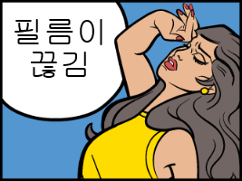
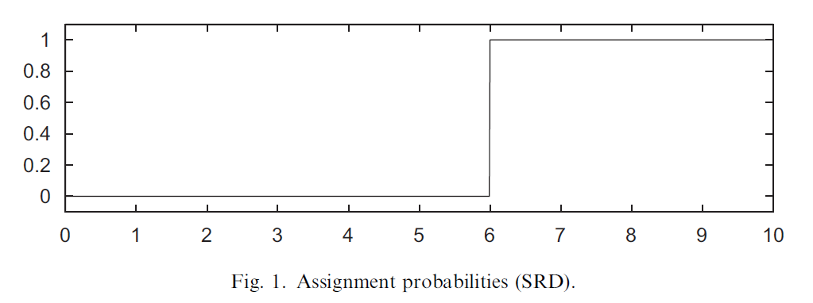
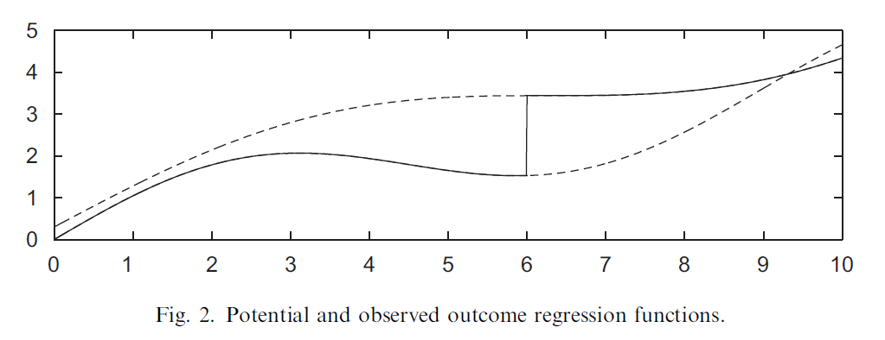
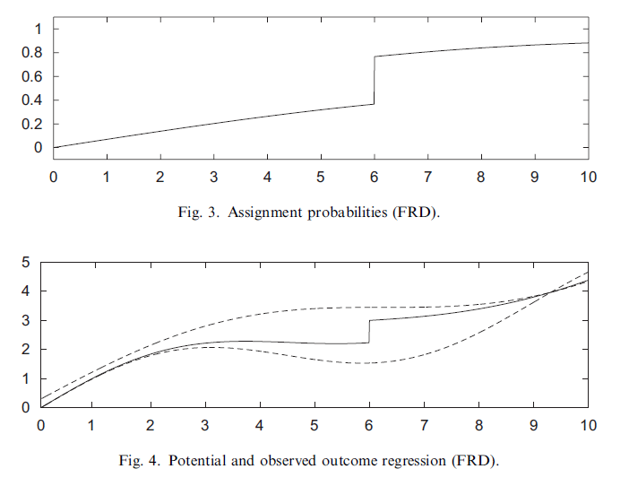

응용계량경제학 필기노트

술로 인한 불연속성

# Regression Discontinuity

~~???: 결이 다르다~~

*RD designs take advantage of the fact that, for some treatments, access to the treatment is a discontinuous function of one or more forcing variables.*

*RD comes in two styles, fuzzy and sharp.*

## Sharp Regression Discontinuity Design (SRD)

$$
Y_i=(1-W_i)Y_{0i}+W_iY_{1i}
$$

여기서 W는 일종의 deterministic function이다. 이는 곧 아래와 같다.

$$
W+i=1\{X_i\geq c\}
$$

c라는 기준을 전후로 W가 다른 값을 갖는 것이며, prob이 아래 그림처럼 c를 기준으로 0과 1로 극단적으로 나뉘는 것을 볼 수 있다.

(이 도식에서 세로축은 W이다.)

이때 가로축을 X, 세로축을 Y로 하는 도식화는 아래와 같을 것이다. 위의 점선은 $E[Y_1\|X=x]$이고, 아래의 점선은 $E[Y_0\|X=x]$이라고 볼 수 있다.

$$
E[Y|X=x]=E[Y|W=0, X=x]Pr(W=0|X=x)+E[Y|W=1, X=x]Pr(W=1|X=x)
$$

c 포인트로 서로 다른 방향으로 접근하는 극한값의 차이가 곧 treatment effect가 되는 것이라고 할 수 있다. RD에서의 treatment effect 변수를 지금부터 $\tau$로 칭하겠다.

$$
\tau_{SRD}=E[Y_{1i}-Y-{0i}|X_i=c]
$$

## Interpretation of $\tau_{SRD}$

 $\tau$를 구하는데에 있어 두가지 조건이 필요하다. 1) Unconfoundness, and 2) Overlap Assumption이다.

$$
\text{Unconfoundness Assumption (CIA): }\; Y_{0i}, Y_{1i}\perp\!\!\!\perp W_i|X_i
$$

W는 deterministic, 즉 randomness 자체가 없는 변수이기 때문에, 위 assumption을 만족하는데 무리가 없다.

문제는 overlap assumption에서 발생한다. 일반적인 overlap assumption은 아래와 같다. W의 특성 상 (위의 그림 참고) c를 기준으로 overlap assumption이 만족되지 않는다.

$$
0<Pr(W_i=1 | X_i=x)<1
$$

overlap assumption에 대한 문제를 해결하기 위해 우리는 일종의 추정(extrapolate)이 필요하다.

### Extrapolate

앞선 문제를 더 클리어하게 보여주는 수식은 아래와 같다.

$$
\tau_{SRD}=E[Y_{1i}-Y_{0i}|X_i=c]=E[Y_{1i}|X_i=c]-E[Y_{0i}|X_i=c]
$$

마지막 전개에서 우측 항을 보면 c를 기점으로 모든 Y는 treatment를 받은 t=1 상태가 되기 때문에, $Y_{0i}$ 를 알 수 없다는 것이다.

하지만 극한을 사용한다며? 그 극한값을 구할 수 있기 위한 조건을 만족시켜야한다는 결론을 알 수 있다.

그 조건은 극한값을 향해가는 분포선(혹은 함수)이 연속이어야한다는 것이다. 우리는 이것을 ***Continuity of Conditional Expectation Functions* Assumption** 이라고 하겠다.

$$
\displaylines{\text{Continuity of Conditional Expectation Functions Assumption}\\
E[Y_{0i}|X_i=x] \text{ and } E[Y_{1i}|X_i=x] \text{ are continuous in x}}
$$
 

### Under this Assumption,

$$
\tau_{SRD}=lim\;E[Y|c<-X]-lim\;E[Y|X->c]
$$

## Fuzzy Regression Discontinuity Design (FRD)

그림으로 쉽게 이해할 수 있다. SRD와 같이 0과 1이라는 값만 가지는 treatment 상황도 존재하지만, 대다수의 일반적인 상황에서는 특정 기준선을 전후로 조그마한 jump 정도만이 존재하는 경우가 많을 것이다. 

예를 들어, 대학교에 입학하는 나이는 일반적으로 20살이라고 할 때, SRD의 경우에는 c=20을 기준으로 대학을 가고 안가고의 차이를 0과1로 나타낼 수 있지만, 현실에서는 후반기 입학생이 있을수도, 재수를 할수도, 조기입학을 할 수도 있기 때문에 FRD가 적합할 수도 있다는 것이다.

즉 discontinuity가 있다는 점에서 SRD와 공통점을 같지만, 그 차이가 0과 1일지, 혹은 서로 다른 두 값일지는 차이가 있을 것이다. 이로 인해, Fig 4를 보면 SRD의 그것(Fig 2)에 비해 점선에 붙어있는 실선이 아니라 그 사이의 값을 갖는 것을 알 수 있다. Prob가 0과 1이 아닌 어느 사이에 존재하기 때문.

SRD의 W의 간극이 1이라면 FRD는 0과 1 사이의 값을 갖기 때문에, FRD의 treatmente effect는 일종의 Wald estimator를 사용하여, 분모에 FRD 상의 W 간극을 보정해주는 과정을 취한다. 아래의 formular와 같다.

$$
\tau_{FRD}=\frac{lim\;E[Y|c<-X]-lim\;E[Y|X->c]}{lim\;E[W|c<-X]-lim\;E[W|X->c]}
$$

## External Validity

예시를 살펴보자!

## Matsudaira. (2007)

Matsudaira. J.D. (2007) "Mandatory Summer School and Student Achievement" Journal of Econometrics 142:829-850.

미국에는 직전 봄학기 성적을 기준으로 여름 보충수업을 강제로 듣는 제도가 있는데, 이러한 기준을 전후로 발생하는 discontinuity를 통해 RD 를 활용한 연구를 진행하였다.

