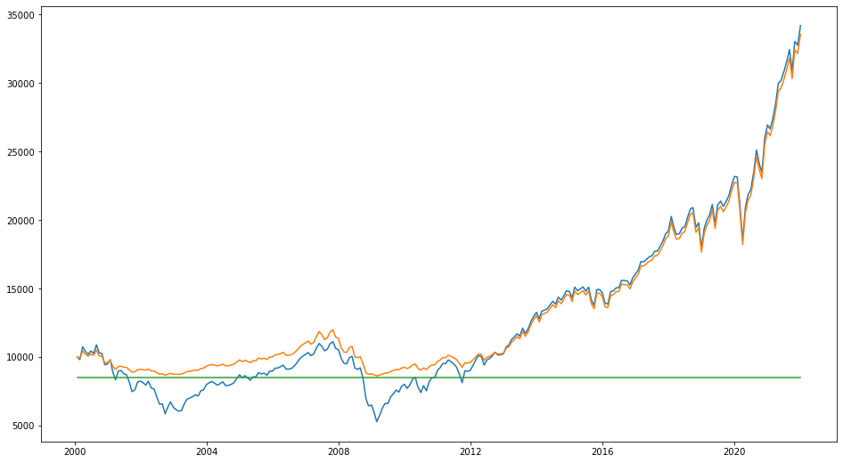
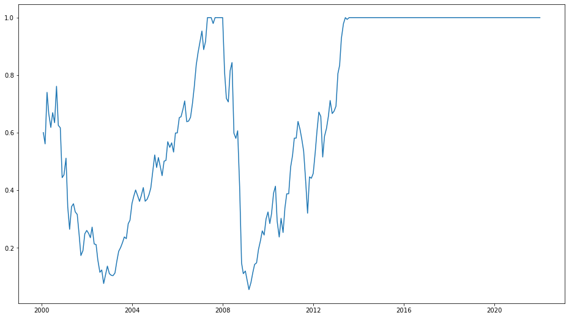

# CPPI 실습 on Python


**변석준 교수님의 강의 엑셀파일 및 직전 기수 py 코드는 아래 링크를 통해 다운 받으실 수 있습니다.**

**ZIP 파일은 암호로 보호받고있으며, 암호는 카이스트 와이파이 비밀번호와 같습니다.**

###### [Excel파일(결과포함)과 py 실습 코드 다운로드](https://www.dropbox.com/s/ze4qd9h74wyfix3/%EB%B3%80%EC%84%9D%EC%A4%80%20%EA%B5%90%EC%88%98%EB%8B%98%20%EA%B0%95%EC%9D%98%EC%8B%A4%EC%8A%B5%EC%9E%90%EB%A3%8C.zip?dl=0)

본 포스팅의 python 코드는 아래 링크를 통해 다운 받으실 수 있습니다.

[Download the notebook](https://github.com/2joonh2/toy-project/blob/main/python-finance-portfolio-CPPI/CPPI-on-python.ipynb)

## 1. Parameter 설정


```python
initial_budget=10000
protection_floor=0.85
m=4 #multiplier
floor=initial_budget*protection_floor
rate=0.02 # yearly
```

변수들을 설정해주는 코드입니다.

initial_budget은 초기 투자금액, rate는 CMA 연간 기준 금리입니다.

## 2. Stock Price 데이터 불러오기 (S&P500)


```python
import pandas as pd
df=pd.read_excel('CPPI(data).xlsx', index_col=0)
df
```

교수님의 실습자료; CPPI(data).xlsx 파일을 불러오는 과정입니다.

데이터를 df라는 변수로 지정하였고, df는 아래와 같습니다.


<div>
<style scoped>
    .dataframe tbody tr th:only-of-type {
        vertical-align: middle;
    }

    .dataframe tbody tr th {
        vertical-align: top;
    }
    
    .dataframe thead th {
        text-align: right;
    }
</style>
<table border="1" class="dataframe">
  <thead>
    <tr style="text-align: right;">
      <th></th>
      <th>sp500</th>
    </tr>
  </thead>
  <tbody>
    <tr>
      <th>2000-01-31</th>
      <td>1394.46</td>
    </tr>
    <tr>
      <th>2000-02-29</th>
      <td>1366.42</td>
    </tr>
    <tr>
      <th>2000-03-31</th>
      <td>1498.58</td>
    </tr>
    <tr>
      <th>2000-04-28</th>
      <td>1452.43</td>
    </tr>
    <tr>
      <th>2000-05-31</th>
      <td>1420.60</td>
    </tr>
    <tr>
      <th>...</th>
      <td>...</td>
    </tr>
    <tr>
      <th>2021-08-31</th>
      <td>4522.68</td>
    </tr>
    <tr>
      <th>2021-09-30</th>
      <td>4307.54</td>
    </tr>
    <tr>
      <th>2021-10-29</th>
      <td>4605.38</td>
    </tr>
    <tr>
      <th>2021-11-30</th>
      <td>4567.00</td>
    </tr>
    <tr>
      <th>2021-12-31</th>
      <td>4766.18</td>
    </tr>
  </tbody>
</table>
<p>264 rows × 1 columns</p>
</div>


## 3. 주식 수익률 계산


```python
stock_profit=[0]
for i in range(1, len(df)):
    stock_profit.append(df['sp500'][i]/ df['sp500'][i-1] -1)
    
df['stock_profit']=stock_profit
```


```python
stock_only_budget=[initial_budget]
for i in range(1, len(df)):
    stock_only_budget.append(stock_only_budget[i-1]*(1+df['stock_profit'][i]))
    
df['stock_only_budget']=stock_only_budget
```


```python
df
```

본 df에서는 S&P500의 월별 인덱스가 나와있고, 월별 수익률을 계산할 수 있습니다.

[기준월 인덱스] / [전월 인덱스]를 구해 1(100%)를 빼주면 손익률(stock_profit)을 구할 수 있습니다.

손익률 리스트를 기반으로 10K 달러에 대해 주식 100% 투자 시의 금액 변동을 확인할 수 있습니다(stock_only_budget).

결과는 아래와 같습니다.


<div>
<style scoped>
    .dataframe tbody tr th:only-of-type {
        vertical-align: middle;
    }

    .dataframe tbody tr th {
        vertical-align: top;
    }
    
    .dataframe thead th {
        text-align: right;
    }
</style>
<table border="1" class="dataframe">
  <thead>
    <tr style="text-align: right;">
      <th></th>
      <th>sp500</th>
      <th>stock_profit</th>
      <th>stock_only_budget</th>
    </tr>
  </thead>
  <tbody>
    <tr>
      <th>2000-01-31</th>
      <td>1394.46</td>
      <td>0.000000</td>
      <td>10000.000000</td>
    </tr>
    <tr>
      <th>2000-02-29</th>
      <td>1366.42</td>
      <td>-0.020108</td>
      <td>9798.918578</td>
    </tr>
    <tr>
      <th>2000-03-31</th>
      <td>1498.58</td>
      <td>0.096720</td>
      <td>10746.668961</td>
    </tr>
    <tr>
      <th>2000-04-28</th>
      <td>1452.43</td>
      <td>-0.030796</td>
      <td>10415.716478</td>
    </tr>
    <tr>
      <th>2000-05-31</th>
      <td>1420.60</td>
      <td>-0.021915</td>
      <td>10187.456076</td>
    </tr>
    <tr>
      <th>...</th>
      <td>...</td>
      <td>...</td>
      <td>...</td>
    </tr>
    <tr>
      <th>2021-08-31</th>
      <td>4522.68</td>
      <td>0.028990</td>
      <td>32433.199948</td>
    </tr>
    <tr>
      <th>2021-09-30</th>
      <td>4307.54</td>
      <td>-0.047569</td>
      <td>30890.380506</td>
    </tr>
    <tr>
      <th>2021-10-29</th>
      <td>4605.38</td>
      <td>0.069144</td>
      <td>33026.261062</td>
    </tr>
    <tr>
      <th>2021-11-30</th>
      <td>4567.00</td>
      <td>-0.008334</td>
      <td>32751.029072</td>
    </tr>
    <tr>
      <th>2021-12-31</th>
      <td>4766.18</td>
      <td>0.043613</td>
      <td>34179.395608</td>
    </tr>
  </tbody>
</table>
<p>264 rows × 3 columns</p>
</div>


## 4. CPPI 계산


```python
budget=[initial_budget]
logs_cushion=[]
logs_stock=[]
logs_cma=[]

for i in range(len(df)):
    cushion=budget[i]-floor
    logs_cushion.append(cushion)
    
    stock_invest=min(budget[i], m*cushion)
    logs_stock.append(stock_invest)
    
    cma_invest=budget[i]-stock_invest
    logs_cma.append(cma_invest)
    
    if i != len(df)-1:
        budget.append(stock_invest*(1+df['stock_profit'][i+1]) + cma_invest*(1+rate/12))
```

CPPI 전략을 통한 포트폴리오 budget 변화를 계산해보겠습니다.

먼저, 리스트를 생성하여 월별 budget, cushion, stock, cma의 추이를 기록할 수 있게 세팅을 하였습니다.

이후 for부터 시작하는 코드는 반복문입니다. 월별로 각 지표들을 계산하는 것인데, 과정은 아래와 같습니다.

1. cushion은 현재의 budget에서 floor를 뺀 값입니다. floor는 초반 코드에서 초기금액(initial_budget)에 protection_floor를 곱한 값입니다.
2. logs_cushion 리스트에 1에서 계산한 cushion 값을 추가(append)해 줍니다.
3. 주식투자금액(stock_invest)은 현재의 budget과 m(multiplier)*cushion의 값 중 작은 값을 선택합니다.
4. 2와 같은 방식으로 logs_stock라는 리스트에 주식투자금액(stock_invest)을 추가해줍니다.
5. CMA 투자금액은 현재 budget에서 주식투자금액을 제외한 나머지 값입니다.
6. 2나 4와 마찬가지로 logs_cma 리스트에 계산된 cma 값을 추가해줍니다.
7. 지금까지 cushion, 주식투자금액, CMA투자금액을 계산하였습니다. 이를 통해 다음 달의 budget을 계산할 수 있습니다.
   1. 남은 코드에 대해 부연설명을 드리자면, 당월 기준 다음월의 budget을 계산하는 것이기 때문에 마지막 행에 대해서는 다음월 계산을 하지 않도록 조건문을 붙여 반복문을 끝내도록 하였습니다.


```python
df['CPPI budget']=budget
df['floor']=floor
df['cusihon']=logs_cushion
df['stock_invest']=logs_stock
df['cma_invest']=logs_cma
df['stock_prop']=df['stock_invest']/df['CPPI budget']
```

반복문 상에서 기록된 logs 리스트들을 표(df)에 저장해줍니다.

추가로 저장된 stock_invest와 CPPI budget 열을 연산시켜 주식투자비중(stock_prop)을 계산하여 저장하겠습니다. (마지막 줄)


## 5. 결과 시각화 및 파일 저장


```python
df # show final calculated data table
```

최종 결과 표(df)는 아래와 같습니다.


<div>
<style scoped>
    .dataframe tbody tr th:only-of-type {
        vertical-align: middle;
    }

    .dataframe tbody tr th {
        vertical-align: top;
    }
    
    .dataframe thead th {
        text-align: right;
    }
</style>
<table border="1" class="dataframe">
  <thead>
    <tr style="text-align: right;">
      <th></th>
      <th>sp500</th>
      <th>stock_profit</th>
      <th>stock_only_budget</th>
      <th>CPPI budget</th>
      <th>floor</th>
      <th>cusihon</th>
      <th>stock_invest</th>
      <th>cma_invest</th>
      <th>stock_prop</th>
    </tr>
  </thead>
  <tbody>
    <tr>
      <th>2000-01-31</th>
      <td>1394.46</td>
      <td>0.000000</td>
      <td>10000.000000</td>
      <td>10000.000000</td>
      <td>8500.0</td>
      <td>1500.000000</td>
      <td>6000.000000</td>
      <td>4000.000000</td>
      <td>0.600000</td>
    </tr>
    <tr>
      <th>2000-02-29</th>
      <td>1366.42</td>
      <td>-0.020108</td>
      <td>9798.918578</td>
      <td>9886.017813</td>
      <td>8500.0</td>
      <td>1386.017813</td>
      <td>5544.071253</td>
      <td>4341.946560</td>
      <td>0.560799</td>
    </tr>
    <tr>
      <th>2000-03-31</th>
      <td>1498.58</td>
      <td>0.096720</td>
      <td>10746.668961</td>
      <td>10429.476385</td>
      <td>8500.0</td>
      <td>1929.476385</td>
      <td>7717.905539</td>
      <td>2711.570846</td>
      <td>0.740009</td>
    </tr>
    <tr>
      <th>2000-04-28</th>
      <td>1452.43</td>
      <td>-0.030796</td>
      <td>10415.716478</td>
      <td>10196.316439</td>
      <td>8500.0</td>
      <td>1696.316439</td>
      <td>6785.265758</td>
      <td>3411.050682</td>
      <td>0.665462</td>
    </tr>
    <tr>
      <th>2000-05-31</th>
      <td>1420.60</td>
      <td>-0.021915</td>
      <td>10187.456076</td>
      <td>10053.302441</td>
      <td>8500.0</td>
      <td>1553.302441</td>
      <td>6213.209764</td>
      <td>3840.092677</td>
      <td>0.618027</td>
    </tr>
    <tr>
      <th>...</th>
      <td>...</td>
      <td>...</td>
      <td>...</td>
      <td>...</td>
      <td>...</td>
      <td>...</td>
      <td>...</td>
      <td>...</td>
      <td>...</td>
    </tr>
    <tr>
      <th>2021-08-31</th>
      <td>4522.68</td>
      <td>0.028990</td>
      <td>32433.199948</td>
      <td>31834.844961</td>
      <td>8500.0</td>
      <td>23334.844961</td>
      <td>31834.844961</td>
      <td>0.000000</td>
      <td>1.000000</td>
    </tr>
    <tr>
      <th>2021-09-30</th>
      <td>4307.54</td>
      <td>-0.047569</td>
      <td>30890.380506</td>
      <td>30320.488751</td>
      <td>8500.0</td>
      <td>21820.488751</td>
      <td>30320.488751</td>
      <td>0.000000</td>
      <td>1.000000</td>
    </tr>
    <tr>
      <th>2021-10-29</th>
      <td>4605.38</td>
      <td>0.069144</td>
      <td>33026.261062</td>
      <td>32416.964783</td>
      <td>8500.0</td>
      <td>23916.964783</td>
      <td>32416.964783</td>
      <td>0.000000</td>
      <td>1.000000</td>
    </tr>
    <tr>
      <th>2021-11-30</th>
      <td>4567.00</td>
      <td>-0.008334</td>
      <td>32751.029072</td>
      <td>32146.810505</td>
      <td>8500.0</td>
      <td>23646.810505</td>
      <td>32146.810505</td>
      <td>0.000000</td>
      <td>1.000000</td>
    </tr>
    <tr>
      <th>2021-12-31</th>
      <td>4766.18</td>
      <td>0.043613</td>
      <td>34179.395608</td>
      <td>33548.825333</td>
      <td>8500.0</td>
      <td>25048.825333</td>
      <td>33548.825333</td>
      <td>0.000000</td>
      <td>1.000000</td>
    </tr>
  </tbody>
</table>
<p>264 rows × 9 columns</p>
</div>

시각화를 해보겠습니다.

python에는 matplotlib라는 시각화를 위한 라이브러리(기능)을 제공합니다.


```python
from matplotlib import pyplot as plt
```


```python
plt.figure(figsize=(16,9))

plt.plot(df.index, df['stock_only_budget'])
plt.plot(df.index, df['CPPI budget'])
plt.plot(df.index, df['floor'])

plt.show()
```


​    

df.index는 표(df)의 세로축에 해당하는 월 간격을 지정하고, 각각 주식100%투자 금액추이(stock_only_budget), CPPI를 통한 금액추이(CPPI_budget), 그리고 floor를 그래프로 그려 위와 같이 시각화하였습니다.


```python
plt.figure(figsize=(16,9))

plt.plot(df.index, df['stock_prop'])

plt.show()
```

 

 

이번 그래프에서는 월별 주식투자비중(stock_prop)을 시각화하였습니다.


```python
df.to_excel('CPPI_calculated.xlsx')
```

마지막으로 최종 결과 표(df)를 CPPI_calculated.xlsx라는 이름의 파일로 저장합니다.

이상으로 CPPI on Python 실습을 마치겠습니다.


## FAQ

본 포스팅의 코드에 대한 질문은 본 포스팅 아래 댓글로 남겨주시면 최대한 답변드릴 수 있도록 하겠습니다.
