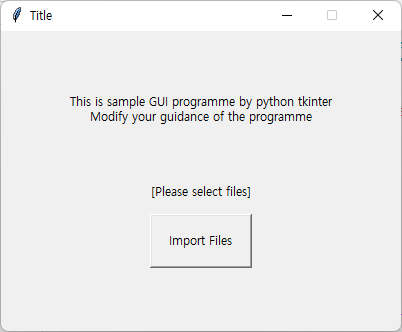

```python
import tkinter
from tkinter import filedialog
from tkinter import *
```


```python
def IMPORT_FILES():
    label1.config(text = "\n[IMPORTING...]")
    
    # select files
    files = filedialog.askopenfilenames(parent=root,initialdir="/"
                                        ,title='Please select files');
#     # select file
#     files = filedialog.askopenfilename(parent=root,initialdir="/"
#                                         ,title='Please select a file');   
    
    if files == '':
        label1.config(text = "\n[Files are not chosen]")
        return
    else: label1.config(text = "[Import Completed]\n")        
    
    try:
        '''
        codes
        '''
    except Exception as ex:
#         f = open("Error Info.txt", 'w')
#         f.write(str(ex))
#         f.close()
        label1.config(text = "\n[Error Occured]\n"+str(ex))        
        
    return
```


```python
root = Tk()
root.title("Title")
root.geometry("400x300")

root.resizable(False,False)

label0 = Label(root, text = "This is sample GUI programme by python tkinter\nModify your guidance of the programme")
label0.place(relx=0.5, rely=0.2, anchor=N)

label1 = Label(root, text = "\n[Please select files]")
label1.place(relx=0.5, rely=0.45, anchor=N)

btn1 = Button(root, text = 'Import Files', padx = 15, pady=15,
              command = IMPORT_FILES)
# should use the function without required input and write in command without "()"
# https://stackoverflow.com/questions/19285907/why-my-python-tkinter-button-is-executed-automatically
btn1.place(relx=0.5, rely=0.7, anchor=CENTER)

root.mainloop()
```





