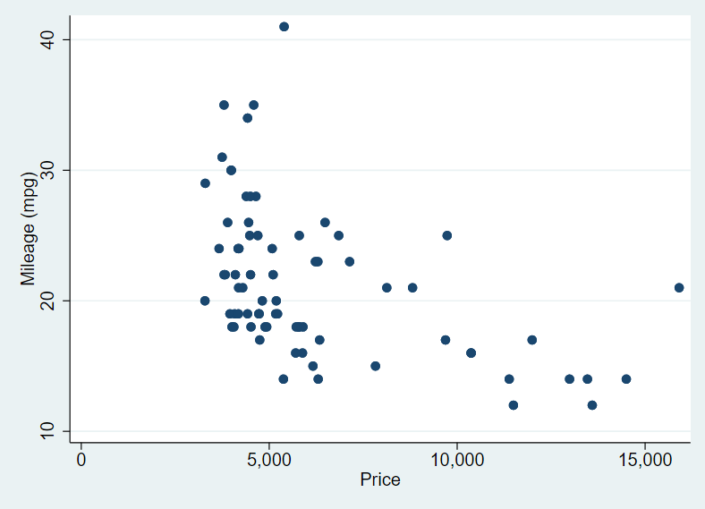

Reference: ***StataCorp LLC*** [Jupyter Notebook with Stata](https://youtu.be/VGRDR3J346M)


# Jupyter Notebook에서 Stata 사용하기

Stata가 설치되어 있어야 한다.


```python
import stata_setup
stata_setup.config("C:/Program Files/Stata17", "se")
```


      ___  ____  ____  ____  ____ ®
     /__    /   ____/   /   ____/      17.0
    ___/   /   /___/   /   /___/       SE—Standard Edition
    
     Statistics and Data Science       Copyright 1985-2021 StataCorp LLC
                                       StataCorp
                                       4905 Lakeway Drive
                                       College Station, Texas 77845 USA
                                       800-STATA-PC        https://www.stata.com
                                       979-696-4600        stata@stata.com
    
    Stata license: Unlimited-user network, expiring 20 Mar 2022
    Serial number: 401709302059
      Licensed to: Joonhee Lee
                   KAIST
    
    Notes:
          1. Unicode is supported; see help unicode_advice.
          2. Maximum number of variables is set to 5,000; see help set_maxvar.


```python
%%stata
sysuse auto, clear
summarize
```


    . sysuse auto, clear
    (1978 automobile data)
    
    . summarize
    
        Variable |        Obs        Mean    Std. dev.       Min        Max
    -------------+---------------------------------------------------------
            make |          0
           price |         74    6165.257    2949.496       3291      15906
             mpg |         74     21.2973    5.785503         12         41
           rep78 |         69    3.405797    .9899323          1          5
        headroom |         74    2.993243    .8459948        1.5          5
    -------------+---------------------------------------------------------
           trunk |         74    13.75676    4.277404          5         23
          weight |         74    3019.459    777.1936       1760       4840
          length |         74    187.9324    22.26634        142        233
            turn |         74    39.64865    4.399354         31         51
    displacement |         74    197.2973    91.83722         79        425
    -------------+---------------------------------------------------------
      gear_ratio |         74    3.014865    .4562871       2.19       3.89
         foreign |         74    .2972973    .4601885          0          1
    
    . 


```python
%stata scatter mpg price
```



    

```python
%stata clear
```


```python
# %%stata -d df -eret myeret
# regress price mpg
```
