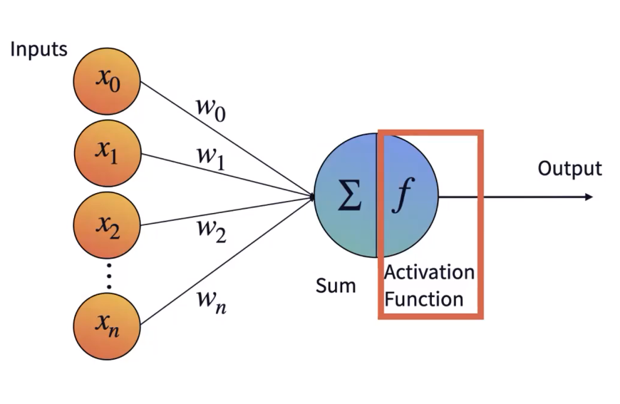
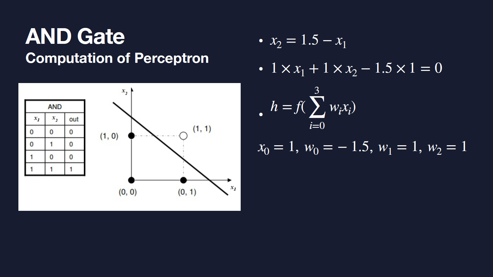
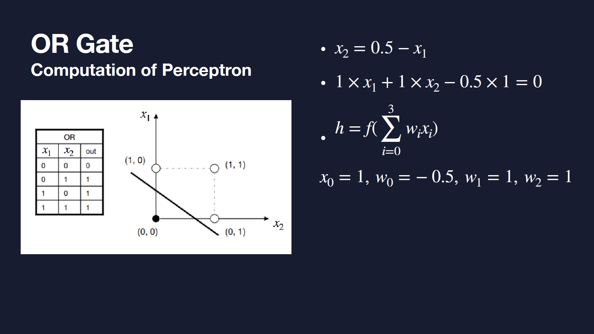
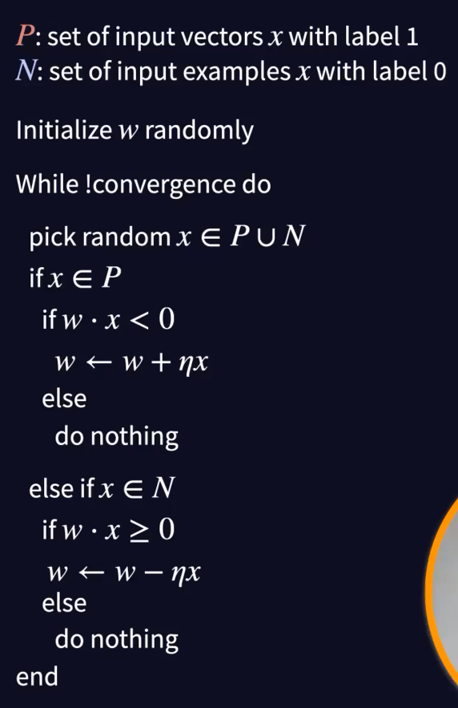
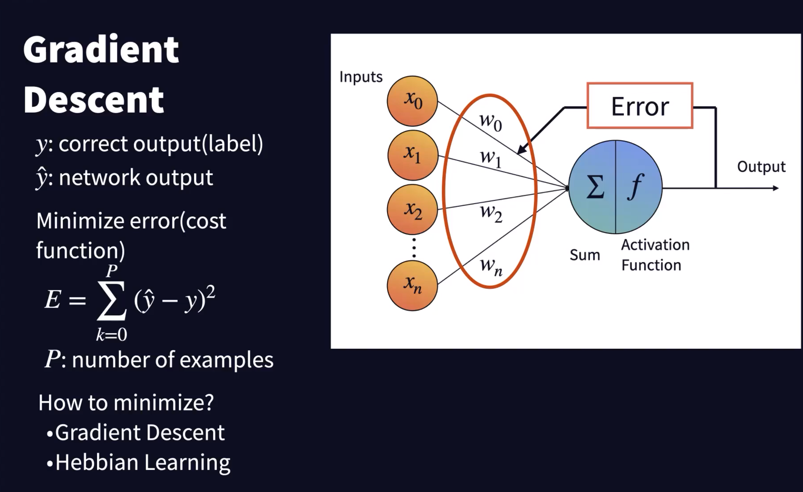
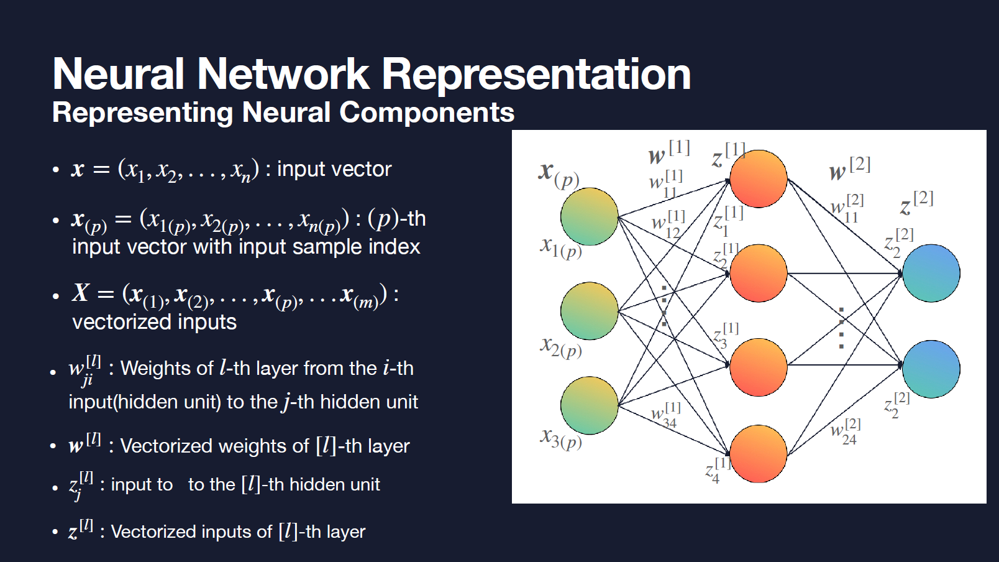
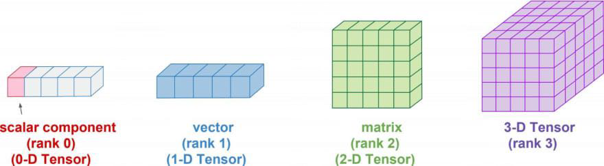
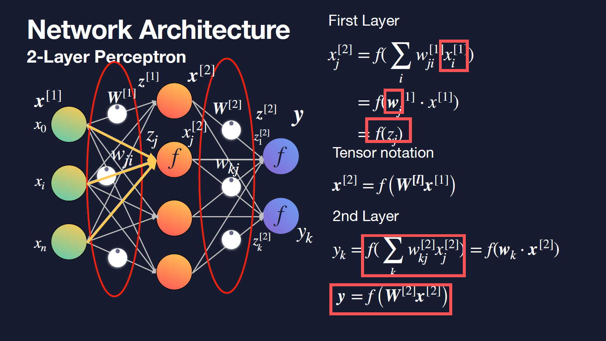
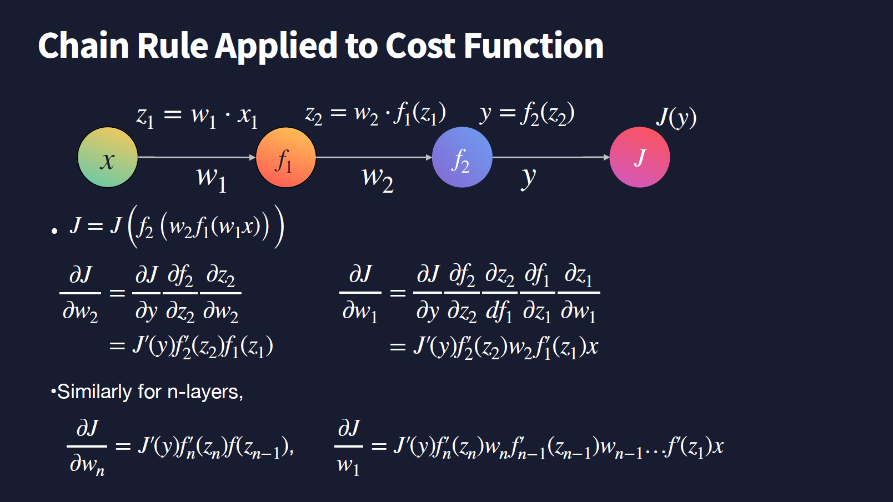

# [경영자를 위한 AI와 딥러닝] 중간고사 공부]

## 2주차

- 신경망

- 구조

  - 700 ~ 1000억(100 BN)개 정도의 신경망 세포들
  - 신경망 세포들 간의 연결 고리
    - Dendrite
    - Axon: 신경세포의 몸체 (soma)
      - 포텐셜을 측정 (voltage) ; 포텐셜의 변화밖에 없음
        - spiking
        - bursting
        - chattering (갈수록 freq 빨라짐)
    - Synapse: 신경세포 간의 연결 (한쪽은 dendrite 한쪽은 axon)
      - neuro transmitter가 이동
      - electric potential을 통해 이동
      - 불확실성이 많은 확률적 프로세스; non-linear
      - connectionism; 연결주의; 모든 정보는 연결에 포함되어있다
    - **Neural Computation**
      - **add/ subtract**
      - **multiplication**
      - **modification**

- Neural Computation을 구현하는 것이 Deep Learning

  - 인공신경망 Artificial Neural Networks
    - **Supervised Learning**
    - **Universal Function Approximator; 비선형적 관계까지 배울 수 있는 가능성**
    - layered structures, deep
  - connectionism by alexander bain (2주차 강의 40분 쯤)
  - Neural Learning (Hebbian Learning Rule) 44분쯤

- Soma에 붙어있는 dendrit로 input

  - w as weight
  - axon을 통해 전달 (긴다리)
  - node가 역치를 기점으로 1 or 0 과 같은 signal 발생

  ### Perceptron

  - simplist neural network
  - computational model of mcculloch-pitts neuron

- activation function
  - step (계단)
  - sigmoid (S자)
- b as bias
  - eventually $y=f(w*x)$
- AND/ OR Gate
  - 
  - 
  - XOR Gate https://youtu.be/Fg00LN30Ezg?t=385
- Perceptron Learning Rule
  - 
  - a. initial learning model setting by setting w_i
  - b. pick random x and check if the current learning model is right
    - b-1. if $wx_1>0$, then do nothing, since it is right
    - b-2. if $wx_2<0$, then w<-w+$\epsilon$; bit change to model
  - c. keep going on until the end (satisfying all condition)
- **Gradient Descent**
  - 
  - control the weight movement under the logistics of minimizing (mean-squared) error

- Summary
  - Perceptron is model for computation of a single neuron
  - Hebbian learning rule can be derived from gradient-descent of the cost function.

## 3주차

- Coding
- Hellow to Tensorflow, Keras

## 4주차

- Tensor Notation for Neural Networks

  - 
  - input as x
  - input vector as $x_{(p)}$
  - $X=(x_{(1)},x_{(2)},x_{(3)}, ...)$ as vectorized inputs
  - $w_{ji}^{[l]}$ as weights of l-th layer from the i-th input to the j-th hidden unit
  - node의 개수는 사용자가 선택하는 것이 아님, 이것을 만들어나가는 과정 자체가 딥러닝
    - hidden layer, hidden node의 역할들 (구조들).. 블라블라

  - **Tensor**Flow
    - Compute Tensors
    - automatically compute the gradient of any differentiable tensors
    - keras 라이브러리에 새로운 function이 contributed
    - Tensorflow는 cpu, gpu,tpu 등을 전방위로 활용하여 matrix calculation 등을 진행 (기반)
    - keras를 통해 텐서플로우 기반의 다양한 함수들 사용 가능

- Matrix Multiplication
  - 
  - Scalar
    - rank 0 tensor (element of list(list is 1D; rank 1))
  - Vector
    - rank 1 tensor
  - Numpy is a commonly used package for mathematical computation of list.
  - Using Numpy we can compute vector and tensor effectively.

## 5주차

- *Neural Network is Universal Function Approximator*
- Understanding Tensor Representation for Deep Neural Networks
  - X is *tensorzied input*
- [퍼셉트론으로 손글씨 인식 - Colaboratory (google.com)](https://colab.research.google.com/drive/1Igay5IFSdV8aLk6V9sD7CU7vfmIR0rMD?utm_campaign=perceptron coding#scrollTo=Z_Dp1RQz9taT)

## 6주차

- 디지털플랫폼 정부
- **Multilayer Perceptron**
  - Training MLP using Back-propagation
  - History: PDP Group
    - Parallel Distributed Procesing
    - **Paul Werbos' Backpropgation Algorithm**
    - it's all about **adjusting weights**
- Signals Propagate Forward
  - input이 weight를 통해 hidden node를 거쳐 output으로 가는 forwarding
  - **Cost Function**
    - 실제 정답과 model로부터의 결과 간의 차이
    - $J=(\hat\y-y)^2$
    - Chain Rule : g'(x)f'(x)
    - output node에 실제 정답(target output)을 기반으로 backpropagation을 통해 weight 조절
- 
  - always, it's all about **adjusting weight**
  - partial derivative (편미분)
    - $w_{t+1} <- w_t -\gamma\Delta _wJ$
- 
  - 

## 7주차

